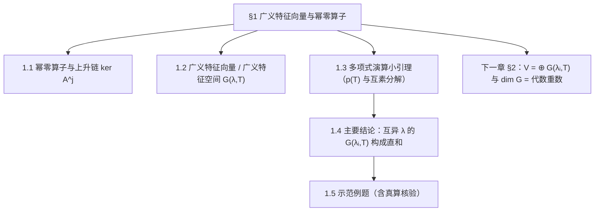
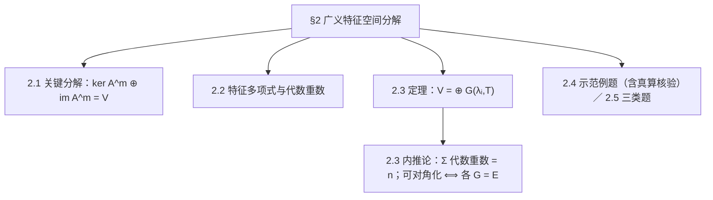
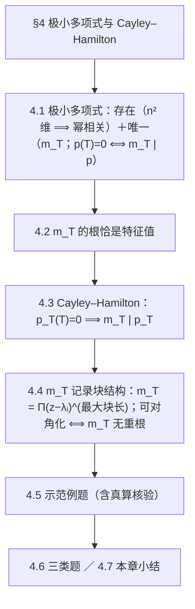
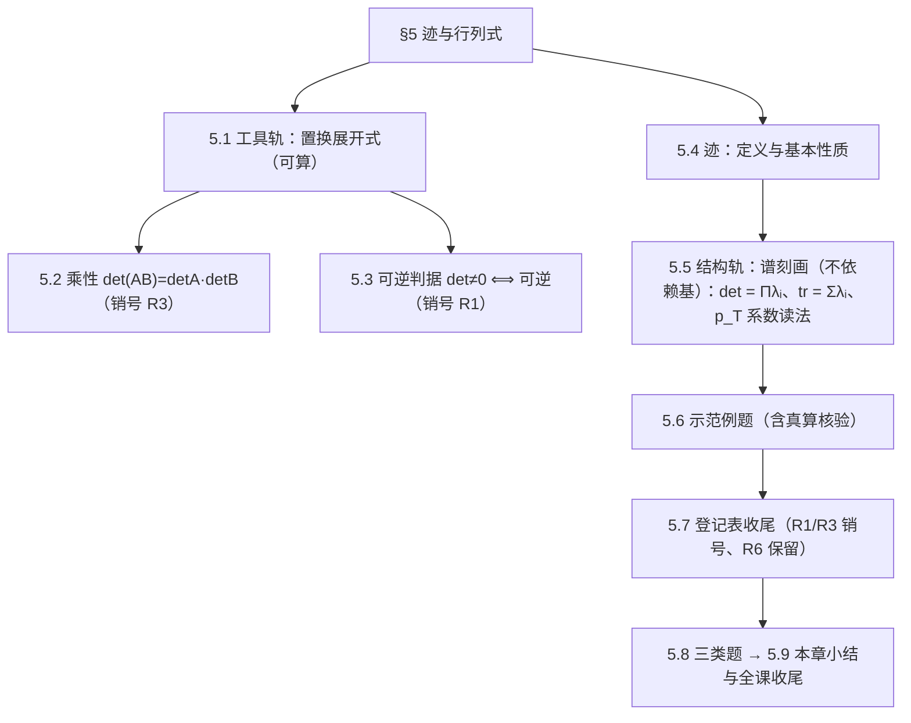

# 高等代数 第五课：算子理论进阶

> **课程**：高等代数（Axler Ch8 复向量空间上的算子 ＋ Ch10 迹与行列式）
> **交付形式**：单一讲义文件（分节写作 → 一次合并；审稿记录见 `lectures/math/review_reports/`）
> **版本**：**v1.6（送审中）** ｜ **更新日期**：2026-09-29 ｜ **未证输入**：仅 R6（代数基本定理）；**R3 已证**（§5.2）、**R1 已证**（§5.3，自足）
> **v1.6 改动清单（v1.5 → v1.6，共 26 项；逐条对照与 diff 见送审信号 `signals/review_request/math/20260929_05_算子理论进阶_v1.6.signal`）**：⑧ 附录 A 补 $\oplus$／$A\oplus B$；⑨ §1.6 独立习题 2 补 $p(T)v=p(\mu)v$ 引理；⑩–⑮ §2.3 证明整体重写（三步骨架／第一步零交／第二步依据更正为"限制可逆"／第三步去冗余并命名因式／尾部引独立习题 2）；⑯⑰ §3.1 引理 1 分段、引理 2 第一式修正；⑱⑲ §3.2 改基扩张引理＋计数与线性无关性重写；⑳ §3.6 引导练习 2 补 $\dim V=2$；㉑＋补强 §4.0／§4.1 的 $n^2$ 三步点名、"线性延拓"合法性、$E_{ij}$ 为基；㉒ §4.0 补 $\mathcal L(V)$ 显式基；㉓ §4.0 无穷维对照扩写；㉔ 附录 A 补"根 vs 子空间"行＋易混提醒 ③；㉕ §4.1 定义 1 补"理想"注；㉖ §4.5 例 3 核验补行；㉗ §4.6 引导练习 2 提示改写；㉘ §4.6 独立习题 4 拆两问＋答案补全；㉙ §5.1 引理 1(2) 取逆重排四步；㉚ §5.4 引理 3 指标与相似不变更正＋反例；㉛ §5.2 引理 2 策略＋五步＋换行变号、定理 1 补"$AB$ 第 $i$ 行 $=r_iB$"；㉜ §5.2 $e_j$ 行向量声明；㉝ §5.6 例 2 求逆改初等变换法。
> **格式**：md 只（同学 2026-09-22 Gate 1 决定；不编译 PDF）
> **勘误**：v1.0 初稿（阶段 3–4 一次写完；含真算核验）；**v1.1 修审稿 2 处阻塞**——① §5.3 的 R1 证明改为**自足**（只用第二课「可逆 $\iff$ 双射／$\iff\ker=\{0\}$」＋本课引理 1 的列版本），**删除**对未讲授的「行线性相关判据」的引用；② §4.1 明确 $n^2$ 维依据（第二课 §5.2 矩阵表示 ＋ $M_n$ 的维数）；**v1.2 三处**——① 补 §4.0「为什么考虑多项式」动机段（有限维 ⟹ 幂序列必线性相关 ⟹ 存在零化多项式）；② **申报** v1.1 合并时的隐性删改（各章首的 `> **本章**：第五课…` 出处行共 5 处已在合并时删除，D1／D3 补记）；③ §5.3 的（⇒）方向改用 §5.2 的乘性 R3 一行（审稿非阻塞建议）；**同日更正**：v1.2 初稿在 §4.0 动机段行首误留一个 `#`（会误渲染为一级标题），已删（三项改动不变）；**v1.3 四处**——① §4.1 标题层级改回 `###`（全文 `##` 仅用于章标题）② §4.0 对照句改为**无穷维算子**例（原"对数 $a$ 幂序列线性无关"仅对**超越数**成立，不严谨）③ 新增「附录 A：本课记号表」（含易混提醒）④ §4 的 $d_i$ 改名 **$L_i$**（消除与 §3 链数 $d_j$ 的字母重载）；**同日修正**：批量改名误伤 `\prod_i` → `\proL_i`（5 处，v1.3 复核发现），已全部改回 `\prod_i`（现 `proL` 计数 0、`\prod` 10 处）；附录 A 列名改为「定义处」并把 $\det$ 标为「§5.1（自 §2.2 起使用）」；**v1.4 讲清"多项式这条线"**——① §4.0 新增「本章路线图」（存在→唯一→根＝特征值→重数＝最大块长→可算与判据，四步一图式列清）② §4.2／§4.3／§4.4 各加一行「这一步在做什么」③ §4.5 补例 4：**由 Jordan 形直接读 $m_T$ 并对照 $p_T$**（同学反馈"多项式那段要讲清楚"）；**同日修正（v1.4）**：① 例 4 核验改为**显式计算** $N(-4I+N)=-4N\neq0$ ② **§4 章首 mermaid 子节编号按实际小节重标**（并顺带校正 §2／§3／§5 章首图的编号与例/题错位）③ **L5 版本字段 → v1.4**（D1 复发，已入送审前自查清单）；**v1.5 七处（同学 2026-09-22 课堂质询逐条发现）**——① **【数学错误·最高优先】§1.5 例 4 解答的核写错**：题干约定右移 $N(x_1,x_2,x_3)=(0,x_1,x_2)$，正确为 $\ker N=\mathrm{span}(e_3)$、$\ker N^2=\mathrm{span}(e_2,e_3)$，原稿误作左移的 $\mathrm{span}(e_1)$、$\mathrm{span}(e_1,e_2)$（维数序列与幂零指数不变）；② §1 引理 2 证明末句补全（广义特征向量集合 $=\bigcup_{k\geqslant1}\ker(T-\lambda I)^k$ 的翻译，并把 $k\leqslant m$ 用单调性、$k>m$ 用稳定性分两段）；③ §1 例 2 补定义域声明并点明 $G(\lambda,T)$ 是 $V$ 的子空间；④ §1.0 补全局约定（矩阵给出算子时默认 $V=\mathbb{R}^n$、$T(x)=Ax$）；⑤ 引理 4 证明残句修正（取 $p_i:=u_iA_i$，由 $u_iA_i=1-v_iB_i$ 得同余）并加注 Bézout／CRT 等价性；⑥ 引理 5 证明末句修正并加注（起作用的是整除而非次数；$B_i$ 的指数须与 $G$ 的定义指数一致）；⑦ §5 章首图补全 5.4／5.6／5.8／5.9 编号。；**v1.6（送审中，2026-09-29）**——⑰ **【数学错误】§3.1 引理 2 的第一式改为 $\dim\ker N^j=\sum_i\min(j,k_i)$**（原稿误把链数 $d_j=\#\{i:k_i\geqslant j\}$ 写成 $\dim\ker N^j$；§3.3 真算核验用的是正确式，二者原本自相矛盾）；⑯ §3.1 引理 1 的两式分段标注范围；⑱ §3.2 构造与证明**改用基扩张引理**，删除对未讲授的「商空间／模」的引用（引用纪律）。；**㉑（同学 2026-09-22 指出"第二课哪来的 §5.2／同构与维数结论"）**：§4.0 与 §4.1 的 $n^2$ 依据改为**逐步点名**——第二课 §5.2 只给"$T$ 由基上的像唯一决定"（**单射**），须补**满射**（任给矩阵可构造算子）与**线性**（得同构），再由**第一课**的 $E_{ij}$ 给出 $\dim M_n=n^2$。（v1.1 曾以"第二课 §5.2 ＋ $M_n$ 的维数"一句带过，两处都不完整。）**其余条目（⑧–⑮、⑳、㉒–㉝）已于 2026-09-29 一并落盘（见上条 v1.6 清单）。**

## 目录

1. §1 广义特征向量与幂零算子
2. §2 广义特征空间分解
3. §3 Jordan 形（存在性 · 构造 · 唯一性）
4. §4 极小多项式与 Cayley–Hamilton
5. §5 迹与行列式（不依赖基的刻画）
附录 A. 本课记号表

***

## §1 广义特征向量与幂零算子

> **四段式**：章引言 → 概念讲解 → 示范例题 → 本章小结（＋三类题）



### 1.0 章引言：本章要解决什么问题

第三课收在"**可对角化** $\iff$ 有足够多线性无关的特征向量"。但很多算子做不到：$T=\begin{pmatrix}1&1\\0&1\end{pmatrix}$ 只有特征值 $1$，而 $\dim E(1,T)=1<2$（几何重数 $<$ 代数重数），故**不可对角化**。

可是细看：$T-I=\begin{pmatrix}0&1\\0&0\end{pmatrix}$ 的**平方为零**——它"几乎"是零算子。于是有一个自然的补救：**放宽"被 $T$ 固定"这一要求**，只要求 $(T-\lambda I)^kv=0$ 对**某个** $k$ 成立。这样的 $v$ 叫**广义特征向量**；它们足够多，能张成整个空间（§2 的分解定理），而 $T$ 在它们上面的形状"几乎是对角"的（§3 的 Jordan 形）。

本章立三根柱子：

1. **幂零算子**（"几乎为零"的算子）：上升链 $\ker A^j$ 与其稳定现象；
2. **广义特征向量与广义特征空间** $G(\lambda,T)$；
3. **互异特征值的 $G(\lambda_i,T)$ 互不干扰**（构成直和）——这是 §2 全空间分解的地基。

> **全局约定（v1.5 补）**：本课凡以**矩阵**给出算子时，一律默认 $V=\mathbb{R}^n$（或 $\mathbb{C}^n$）、取**标准基**、$T(x)=Ax$；此时才把 $G(\lambda,T)$ 写作坐标空间（如 $\mathbb{R}^3$）。若 $V$ 是**抽象空间**而矩阵只是 $T$ 在某组基下的表示，结论应写作 $G(\lambda,T)=V$ 等，**不写坐标空间**——因为 $G(\lambda,T)$ 是 $V$ 的子空间，本身不属于任何坐标系。

### 1.1 幂零算子

**定义 1（幂零算子）**。设 $N\in\mathcal L(V)$。若存在整数 $m\ge1$ 使 $N^m=0$，称 $N$ 是**幂零的**；满足此性质的最小 $m$ 叫 $N$ 的**幂零指数**，记 $m(N)$。约定 $m(0)=1$。

**例 1（标准例：移位）**。在 $\mathbb{R}^n$ 上令
$N(x_1,x_2,\dots,x_n)=(0,x_1,x_2,\dots,x_{n-1})$。
则 $N$ 把每个向量"向右挤一格、丢掉最后一个坐标"，于是 $N^n=0$ 而 $N^{n-1}\neq0$（$N^{n-1}e_n=e_1\neq0$）：**幂零指数 $=n$**。

**引理 1（上升链与其稳定）**。设 $A\in\mathcal L(V)$，$A^0:=I$。则

1. $\{0\}=\ker A^0\subseteq\ker A\subseteq\ker A^2\subseteq\cdots$；
2. 每个 $\dim\ker A^j$ 是**非减**的整数，且 $0\le\dim\ker A^j\le n$；
3. 一旦某一步 $\ker A^j=\ker A^{j+1}$，则**此后永远相等**（链"卡住"）；故链必在 $j\le n$ 步内稳定。

**证明**。
(1) 若 $A^jv=0$，则 $A^{j+1}v=A(A^jv)=0$，故 $\ker A^j\subseteq\ker A^{j+1}$。
(2) 由 (1)，维数非减；上界是 $\dim V=n$。
(3) 设 $\ker A^j=\ker A^{j+1}$，取 $v\in\ker A^{j+2}$。则 $Av\in\ker A^{j+1}=\ker A^j$，故 $A^{j+1}v=A^j(Av)=0$，即 $v\in\ker A^{j+1}$。于是 $\ker A^{j+2}\subseteq\ker A^{j+1}$，与 (1) 合起来得相等。逐次重复即得此后恒等。而链最多只能真增长 $n$ 次（维数从 $0$ 到 $\le n$），故 $j\le n$ 时稳定。$\square$

> **读法**：引理 1 的全部内容是「**这条链只能长高有限次，且一旦不涨就永远不涨**」。它把"某处终将稳定"变成定量的（$\le n$ 步内）。

**注 1**。若 $N$ 幂零且 $N\neq0$，则 $N$ **不可逆**（否则 $N^m=0$ 两边乘 $N^{-m}$ 得 $I=0$，矛盾）；并且 $N$ 的特征值只有 $0$：由 $Nv=\lambda v$ 与 $N^m=0$ 得 $\lambda^m v=0$，故 $\lambda=0$。

### 1.2 广义特征向量与广义特征空间

**定义 2（广义特征向量／广义特征空间）**。设 $T\in\mathcal L(V)$，$\lambda$ 是 $T$ 的特征值。若 $(T-\lambda I)^kv=0$ 对某个 $k\ge1$ 成立，称 $v$ 是 $T$ 的属于 $\lambda$ 的**广义特征向量**。记
$G(\lambda,T):=\ker(T-\lambda I)^m ,$
其中 $m$ 是使 $\ker(T-\lambda I)^j$ 稳定（引理 1）的步数。称 $G(\lambda,T)$ 为属于 $\lambda$ 的**广义特征空间**。

**引理 2（基本性质）**。$G(\lambda,T)$ 是 $V$ 的**子空间**，且是 $T$-不变的；并且它还可以刻画为"**一切**属于 $\lambda$ 的广义特征向量（连同 $0$）的集合"。

**证明**。作为 $\ker(T-\lambda I)^m$，它自然是子空间（核空间总是子空间）。取 $v\in G(\lambda,T)$，则
$Tv=\lambda v+(T-\lambda I)v$，
右端两项都在 $G(\lambda,T)$ 中（$v\in G$，而 $(T-\lambda I)v\in G$ 因 $(T-\lambda I)^{m}(T-\lambda I)v=(T-\lambda I)^{m+1}v=0$，用链已稳定），故 $Tv\in G(\lambda,T)$。最后证明"集合刻画"这一条。记 $A:=T-\lambda I$。按定义 2，"一切属于 $\lambda$ 的广义特征向量（连同 $0$）"就是
$\{v:\ A^kv=0\ \text{对某个}\ k\geqslant1\}=\bigcup_{k\geqslant1}\ker A^k,$
要证它与 $G(\lambda,T)=\ker A^m$ 相等：
- （$\subseteq$）$\ker A^m$ 本身就是并集中 $k=m$ 的那一项，故 $\ker A^m\subseteq\bigcup_{k\geqslant1}\ker A^k$；
- （$\supseteq$）任取 $k\geqslant1$ 与 $v\in\ker A^k$：若 $k\leqslant m$，由引理 1(1) 的**单调性** $\ker A^k\subseteq\ker A^m$；若 $k>m$，由引理 1(3) 的**稳定性** $\ker A^m=\ker A^{m+1}=\cdots=\ker A^k$。两种情形都得 $v\in\ker A^m$。
故二者集合相等。（取 $k=m$ 这一项时用到 $m\leqslant n$，即引理 1(3)；稳定下标不唯一，取更大的仍成立。）$\square$

**例 2**。取 $V=\mathbb{R}^3$、$T(x)=Ax$，其中 $A=\begin{pmatrix}1&1&0\\0&1&1\\0&0&1\end{pmatrix}$（按 §1.0 的全局约定：矩阵即标准基下的算子）：特征值只有 $1$，而 $(T-I)^3=0$、$(T-I)^2\neq0$，故 $G(1,T)=\mathbb{R}^3$，$\dim G(1,T)=3=$ 代数重数（$p_T(z)=(z-1)^3$）。

> **注意（v1.5 补）**：这里能写 $\mathbb{R}^3$，是因为 $V$ 就取作 $\mathbb{R}^3$。若 $V$ 是抽象空间而该矩阵只是 $T$ 在某组基下的表示，结论应写作 $G(1,T)=V$——$G(\lambda,T)$ 是 $V$ 的**子空间**，不是坐标空间。

**注 2**。特征空间总是广义特征空间的子集：$E(\lambda,T)\subseteq G(\lambda,T)$。§2 将证明"$\dim G(\lambda,T)=$ 代数重数"，由此立刻得到
$\text{可对角化}\iff\text{每个}\ G(\lambda,T)=E(\lambda,T).$

### 1.3 多项式演算小引理（为直和性做准备）

**定义 3（多项式作用于算子）**。对 $p(z)=a_0+a_1z+\cdots+a_dz^d$，令
$p(T):=a_0I+a_1T+\cdots+a_dT^d$。

**引理 3（乘法相容）**。$(pq)(T)=p(T)q(T)=q(T)p(T)$，且 $p(T)$ 与 $T$ 可交换。

**证明**：把 $(pq)(T)$ 与 $p(T)q(T)$ 都按定义展开，逐项比较即可；$T$ 的幂之间显然可交换。$\square$

**引理 4（互素分解／插值型多项式）**。设 $\lambda_1,\dots,\lambda_r$ **互异**，$m_1,\dots,m_r\ge1$。令
$B_i(z)=(z-\lambda_i)^{m_i}$，$A_i(z)=\prod_{j\neq i}B_j(z)$。
则存在多项式 $p_i$ 使
$p_i\equiv1\pmod{B_i},\qquad p_i\equiv0\pmod{A_i}.$

**证明（要点）**。$B_i$ 与 $A_i$ **互素**（它们的根互不相交，都是 $(z-\lambda)$ 的幂），故由**带余除法／Euclid 算法**存在多项式 $u_i,v_i$ 使
$u_iA_i+v_iB_i=1$
（互素的两个多项式有 Bézout 表示）。取 $p_i:=u_iA_i$。由 $u_iA_i+v_iB_i=1$ 得 $u_iA_i=1-v_iB_i$；因 $B_i\mid v_iB_i$，故 $u_iA_i\equiv1\pmod{B_i}$，即 $p_i\equiv1\pmod{B_i}$；又 $A_i\mid p_i$，故 $p_i\equiv0\pmod{A_i}$。$\square$

> **注（v1.5 补）**：这与"中国剩余定理（CRT）"是**同一事实的两种说法**——CRT 说同余组 $x\equiv1\pmod{B_i}$、$x\equiv0\pmod{A_i}$ 有解，且**解模 $A_iB_i$ 唯一**（所以讲义只说"存在 $p_i$"）。另注意：本引理是**逐个 $i$** 取的，不需要一次性解整个方程组，也**不需要** $\sum_ip_i=1$——定理 1 只对 $v_1+\cdots+v_r=0$ 两边作用**单个** $p_i(T)$。

> **铺垫说明（本课自足）**：这里只用到"多项式带余除法 ＋ 互素 ⟹ Bézout 表示"这一条中学／第一课层面的代数事实；若需要，可先证：作辗转相除，余式次数严格下降，最后得非零常数——把它除回去即得表示。

**引理 5（$p_i(T)$ 的"挑选"作用）**。沿用引理 4 的记号，则
$p_i(T)\ \text{在}\ G(\lambda_i,T)\ \text{上等于}\ I,\qquad p_i(T)\ \text{在}\ G(\lambda_j,T)\ (j\neq i)\ \text{上等于}\ 0.$

**证明**。$p_i-1$ 被 $B_i=(z-\lambda_i)^{m_i}$ 整除，写成 $p_i-1=B_iq$；对 $v\in G(\lambda_i,T)$ 有 $(T-\lambda_iI)^{m_i}v=0$，故
$p_i(T)v-v=(p_i-1)(T)v=q(T)(T-\lambda_iI)^{m_i}v=0$，即 $p_i(T)v=v$。
又 $A_i\mid p_i$，而 $j\neq i$ 时 $B_j\mid A_i$（**整除**关系，与次数无关），写 $A_i=B_jc$；对 $v\in G(\lambda_j,T)$ 有 $B_j(T)v=0$，故 $A_i(T)v=c(T)B_j(T)v=0$，再由 $p_i=u_iA_i$ 得 $p_i(T)v=u_i(T)A_i(T)v=0$。$\square$

> **注（v1.5 补）**：此处起作用的是**整除**而非"次数够大"（$A_i$ 的次数本就很大）。真正需要"配足"的是：$B_i$ 的指数必须与 $G(\lambda_i,T)$ 的定义指数**一致**，否则挑选会失败——例如 $T=\begin{pmatrix}1&1&0\\0&1&0\\0&0&2\end{pmatrix}$，$G(1,T)=\ker(T-I)^2=\mathrm{span}(e_1,e_2)$，若误取 $B_1=(z-1)$ 则 $p_1=2-z$，而 $(2I-T)e_2=e_2-e_1\neq e_2$。

### 1.4 主结论：互异特征值的广义特征空间构成直和

**定理 1**。设 $\lambda_1,\dots,\lambda_r$ 是 $T$ 的**互异**特征值，$m_i$ 为使 $\ker(T-\lambda_iI)^j$ 稳定的步数。则
$G(\lambda_1,T)+G(\lambda_2,T)+\cdots+G(\lambda_r,T)\ \text{是直和}.$

**证明**。设 $v_1+\cdots+v_r=0$，其中 $v_i\in G(\lambda_i,T)$，$m_i$ 如前。取引理 4 的 $p_i$，对等式两边作用 $p_i(T)$：由引理 5，
$v_i=p_i(T)v_1+\cdots+p_i(T)v_r=p_i(T)(v_1+\cdots+v_r)=p_i(T)0=0 .$
每个 $v_i$ 都是 $0$，故和是直和。$\square$

**推论 1**。$\sum_i\dim G(\lambda_i,T)\le n$。

**证明**：直和的维数等于维数之和，而它不超过 $\dim V=n$。$\square$

> **一句话本质**：**不同的特征值可以用多项式"互相屏蔽"**——$p_i(T)$ 把属于 $\lambda_i$ 的成分原样保留、把其余成分全部杀掉。这就是直和性的全部内容。

### 1.5 示范例题（含真算核验）

**例 3（最小不可对角化例）**。$T=\begin{pmatrix}1&1\\0&1\end{pmatrix}$。求特征空间、广义特征空间与幂零指数。

**解答**。$p_T(z)=(z-1)^2$，唯一特征值 $\lambda=1$（代数重数 $2$）。
特征空间：解 $(T-I)v=0$，即 $\begin{pmatrix}0&1\\0&0\end{pmatrix}\begin{pmatrix}x\\y\end{pmatrix}=\begin{pmatrix}y\\0\end{pmatrix}=0$，得 $y=0$，故 $E(1,T)=\mathrm{span}(e_1)$，$\dim E=1$。
广义特征空间：$T-I=\begin{pmatrix}0&1\\0&0\end{pmatrix}$，$(T-I)^2=0$，故 $G(1,T)=\mathbb{R}^2$，$\dim G=2=$ 代数重数；幂零指数 $m=2$。
**真算核验**：$\begin{pmatrix}0&1\\0&0\end{pmatrix}^2=\begin{pmatrix}0&0\\0&0\end{pmatrix}$ ✓；取 $e_2$：$(T-I)e_2=e_1\neq0$、$(T-I)^2e_2=0$ ✓（$e_2$ 是"$1$ 级广义特征向量"，$e_1$ 是真正的特征向量）。

**例 4（移位算子的上升链，$n=3$）**。$N(x_1,x_2,x_3)=(0,x_1,x_2)$。算 $\ker N^j$。

**解答**。按题干约定（**右移**）$N(x_1,x_2,x_3)=(0,x_1,x_2)$：$\ker N=\{(0,0,x_3)\}=\mathrm{span}(e_3)$；$\ker N^2=\{(0,x_2,x_3)\}=\mathrm{span}(e_2,e_3)$；$\ker N^3=\mathbb{R}^3$。

> **v1.5 勘误**：本条原稿误写作左移算子 $L(x_1,x_2,x_3)=(x_2,x_3,0)$ 的核（$\mathrm{span}(e_1)$、$\mathrm{span}(e_1,e_2)$），与题干约定及下条"真算核验"矛盾；两文的**维数序列**同为 $0,1,2,3$，故幂零指数 $=3$ 的结论未受影响。
维数序列：$0,1,2,3$，**每步都真涨**；幂零指数 $=3$。
**真算核验**：按约定 $N(x_1,x_2,x_3)=(0,x_1,x_2)$，故 $e_1\mapsto e_2$、$e_2\mapsto e_3$、$e_3\mapsto0$；于是 $N^2e_1=e_3\neq0$、$N^3e_1=Ne_3=0$ ✓，幂零指数确为 $3$；且 $G(0,N)=\mathbb{R}^3$（$0$ 是唯一特征值）。

**例 5（幂零指数不是"整个空间的性质"）**。$N=\begin{pmatrix}0&1\\0&0\end{pmatrix}\oplus(0)$（在 $\mathbb{R}^3$ 上）。则 $\ker N=\mathrm{span}(e_1,e_3)$、$\ker N^2=\mathbb{R}^3$，指数 $2$；而零算子指数为 $1$（约定）。同一空间上不同算子的幂零指数可以不同。

### 1.6 三类题

**引导练习**（带提示）：

1. 证明：$N$ 幂零 $\iff$ $N$ 在**某个**基下的矩阵是**严格上三角**（对角全 $0$）。*提示*：由 $N^m=0$ 与引理 1 的链，逐层取 $\ker N^j$ 的基并拼起来。
2. 设 $N$ 幂零、$a\neq0$。证明 $aI+N$ 可逆，并指明其逆的形式。*提示*：几何级数有限项：$(aI+N)\big(a^{-1}I-a^{-2}N+a^{-3}N^2-\cdots\big)=I$（到 $N^m=0$ 截断）。
3. 设 $T=\begin{pmatrix}2&1\\0&2\end{pmatrix}$。写出 $G(2,T)$ 与幂零指数，并说明它与 §1.1 例 1 的联系。*提示*：$T-2I$ 是幂零的。

**独立习题**（无提示）：

1. 证明引理 1 的 (3) 的**逆命题**：若对某 $j$ 有 $\ker A^j=\ker A^{j+1}$，则对一切 $k\ge0$ 有 $\ker A^{j+k}=\ker A^{j}$（即链卡住后不再动）。
2. 设 $V$ 有限维、$T\in\mathcal L(V)$。证明：$G(\lambda,T)$ 是 $T$-不变子空间，且 $T|_{G(\lambda,T)}$ 的唯一特征值是 $\lambda$。
3. 证明：若 $T$ 幂零，则 $\dim\ker T\ge1$；并举例说明 $\dim\ker T$ 可以等于 $1$ 而幂零指数达到 $n$。
4. （接口题）在 $\mathbb{R}^n$ 上设 $N$ 是移位算子（例 1）。求 $\dim\ker N^j$（用 $j$ 与 $n$ 表出），并说明这个序列怎样"编码"了 $N$ 的结构。

**答案与核对**：

1. 引理 1(3) 已证"不涨 ⟹ 永远不涨"；把它逐次应用即得：$\ker A^{j}=\ker A^{j+1}\Rightarrow\ker A^{j+1}=\ker A^{j+2}\Rightarrow\cdots$ ✓。
2. $T$-不变见引理 2。**先备一条引理**：若 $Tv=\mu v$，则对任意多项式 $p$ 有 $p(T)v=p(\mu)v$。*证明*：先对单项式归纳——$T^kv=\mu^kv$（$T^{k+1}v=T(T^kv)=\mu^kTv=\mu^{k+1}v$），再按线性组合即得。$\square$
 现设 $\mu$ 是 $T|_{G(\lambda,T)}$ 的特征值、$0\neq v\in G(\lambda,T)$ 且 $Tv=\mu v$。因 $T-\lambda I$ 在 $G$ 上幂零（指数 $m$），有 $(T-\lambda I)^mv=0$；而由上条引理（取 $p(z)=(z-\lambda)^m$）$(T-\lambda I)^mv=(\mu-\lambda)^mv$，故 $(\mu-\lambda)^m=0$；**域中无幂零元**（$\mathbb K=\mathbb R$ 或 $\mathbb C$ 是域，$x^m=0\Rightarrow x=0$），故 $\mu=\lambda$ ✓。
3. 幂零且 $N\neq0$ ⟹ $N$ 不可逆（注 1）⟹ $\ker N\neq\{0\}$，故 $\dim\ker N\ge1$。$n$ 维移位算子：$\dim\ker N=1$ 而指数 $=n$ ✓（例 4）。
4. $N(x_1,\dots,x_n)=(0,x_1,\dots,x_{n-1})$ 时 $\ker N^j=\{(x_1,\dots,x_{n-j},0,\dots,0)\}$，故 $\dim\ker N^j=\min(j,n)$；序列 $1,2,\dots,n$ 的**差分**全为 $1$ ⟹ 只有**一条**长为 $n$ 的链（对应 §3 的单个 Jordan 块）✓。

### 1.7 本章小结与预告

- **幂零算子**：$N^m=0$；上升链 $\ker N^j$ 非减、$\le n$ 步稳定（引理 1）；
- **广义特征向量／广义特征空间** $G(\lambda,T)=\ker(T-\lambda I)^m$：子空间、$T$-不变、包含特征空间 $E(\lambda,T)$；
- **直和性**（定理 1）：互异特征值的 $G$ 构成直和，依据是**多项式"互相屏蔽"**（引理 4、5）；
- **下一章 §2**：证明全空间分解 $V=\bigoplus_iG(\lambda_i,T)$，并证明 $\dim G(\lambda_i,T)=$ **代数重数**（由此可对角化 $\iff$ 各 $G=E$）。
***

## §2 广义特征空间分解

> **四段式**：章引言 → 概念讲解 → 示范例题 → 本章小结（＋三类题）



### 2.0 章引言：本章要解决什么问题

§1 证明了**互异特征值的广义特征空间构成直和**，但只给了"**不完全占满**空间"的结论（$\sum\dim G_i\le n$）。本章补上另一半：直和**就等于** $V$——即 $V=\bigoplus_iG(\lambda_i,T)$，于是 $\sum_i\dim G_i=n$，并且每个 $\dim G_i$ 恰好等于对应特征值的**代数重数**。这条分解定理是第五课一切内容的地基：§3 在每个 $G_i$ 内做 Jordan 形，§4 用它证 Cayley–Hamilton。

### 2.1 关键分解：$\ker A^m\oplus\operatorname{im}A^m=V$

**定理 1**。设 $A\in\mathcal L(V)$，$m$ 是使 $\ker A^j$ 稳定（引理 1）的步数。则
$V=\ker A^m\oplus\operatorname{im}A^m.$

**证明**。记 $K=\ker A^m$、$I=\operatorname{im}A^m$。

1. **$K\cap I=\{0\}$**：取 $v\in K\cap I$，则 $A^mv=0$，且 $v=A^mw$ 对某 $w$。于是 $A^{2m}w=A^m(A^mw)=A^mv=0$，即 $w\in\ker A^{2m}=\ker A^m$（链已稳定），故 $v=A^mw=0$。
2. **$K+I=V$**：由秩-零化度（第二课），$\dim K+\dim I=\dim\ker A^m+\dim\operatorname{im}A^m=n$（对线性映射 $A^m$ 用秩-零化度公式）。与 1 的 $\dim(K\cap I)=0$ 合起来，$\dim(K+I)=n$，故 $K+I=V$。

两条件合起来即得直和分解。$\square$

**推论 1**。对任意 $\lambda$（不必是特征值）与充分大的 $m$，同样有 $V=\ker(T-\lambda I)^m\oplus\operatorname{im}(T-\lambda I)^m$；特别地，**$\lambda$ 是特征值 $\iff\ker(T-\lambda I)\neq\{0\}\iff\ker(T-\lambda I)^m\neq\{0\}$**。

**证明**：定理 1 用到 $A=T-\lambda I$ 而已，与 $\lambda$ 是否是特征值无关。$\square$

> **为什么这一步关键**：它把 $V$ **劈成两块**——"属于 $\lambda$ 的部分" $\ker A^m$ 与"完全不属于 $\lambda$ 的部分" $\operatorname{im}A^m$，且两块都是 $T$-不变（前者 §1 引理 2；后者因 $T$ 与 $A^m$ 可交换）。本章余下的工作就是**一路劈到底**。

### 2.2 特征多项式与代数重数

**定义 1（特征多项式，第三课已引入）**。$p_T(z):=\det(zI-T)$，是关于 $z$ 的 $n$ 次首一多项式。
（说明：$\det$ 的**不依赖基的定义**与性质在 §5 给出；本节只用到"$p_T$ 是 $n$ 次首一多项式、其根恰为特征值"这两条第三课已用过的性质——§5 会把它补成可自足的证明。）

**定义 2（代数重数）**。设 $\lambda$ 是 $T$ 的特征值，则 $p_T(z)=(z-\lambda)^{a_\lambda}q(z)$ 且 $q(\lambda)\neq0$，其中 $a_\lambda$ 称为 $\lambda$ 的**代数重数**；$\dim E(\lambda,T)$ 称为**几何重数**。

**引理 1**。$E(\lambda,T)\subseteq G(\lambda,T)$，且几何重数 $\le$ 代数重数。

**证明**：第一个包含由 §1 注 2。第二个留到 §2.3（那里证明 $\dim G(\lambda,T)=a_\lambda$）——因为 $E\subseteq G$，故几何重数 $\le\dim G=a_\lambda$。$\square$

### 2.3 分解定理

**定理 2（广义特征空间分解）**。设 $T\in\mathcal L(V)$，$\dim V=n$，$\lambda_1,\dots,\lambda_r$ 是 $T$ 的互异特征值。则

1. $V=G(\lambda_1,T)\oplus\cdots\oplus G(\lambda_r,T)$；
2. $\dim G(\lambda_i,T)=a_{\lambda_i}$（**广义特征空间的维数＝代数重数**）；
3. $p_T(z)=(z-\lambda_1)^{a_{\lambda_1}}\cdots(z-\lambda_r)^{a_{\lambda_r}}$，从而 $\sum_{i=1}^{r}a_{\lambda_i}=n$。（**注意**：真正的内容是第 2 条——"$a_{\lambda_i}=\dim G(\lambda_i,T)$"是**定理**而非定义；第 3 条只是把第 2 条代回 $p_T$ 的因式分解形式与 $\deg p_T=n$，**不含新信息**，列出它是为了与 §2.2 的 $a_\lambda$ 定义对齐。）

**证明（要点，归纳法）**。

> **三步骨架（先看结构）**：① **$r=1$**——用 Fitting 分解 $V=\ker N^m\oplus\operatorname{im}N^m$（$N:=T-\lambda I$）证明"第二块必为零"；② **一般 $r$**——对 $r$ 归纳，把 $\lambda_r$ 的块劈出来，对 $W=\operatorname{im}(T-\lambda_rI)^m$ 上的限制递归；③ **维数与第 3 条**——把 ① 用在每个 $G(\lambda_i,T)$ 上，读出重数。

**第一步（$r=1$）**：设 $T$ 只有特征值 $\lambda$，取 $m$ 为稳定指数，记 $N=T-\lambda I$。由定理 1，$V=\ker N^m\oplus\operatorname{im}N^m$。
**断言 $\operatorname{im}N^m=\{0\}$**：否则它是 $T$-不变的真子空间（$T$ 与 $N^m$ 可交换）；$T|_{\operatorname{im}N^m}$ 的特征值仍是 $T$ 的特征值（第三课），故只能是 $\lambda$。可是在 $\operatorname{im}N^m$ 上 $T-\lambda I=N$ **可逆**：由直和 $\ker N^m\cap\operatorname{im}N^m=\{0\}$，得 $\ker N\subseteq\ker N^m$ 与 $\operatorname{im}N^m$ 零交，故 $N|_{\operatorname{im}N^m}$ 单射，有限维 ⟹ 可逆（第二课）。于是 $T|_{\operatorname{im}N^m}-\lambda I$ 可逆，$\lambda$ 不是 $T|_{\operatorname{im}N^m}$ 的特征值——但有限维非零空间上的算子必有特征值（**R6**），矛盾。故 $\operatorname{im}N^m=\{0\}$，即 $V=G(\lambda,T)$。

**第二步（一般 $r$）**：对 $r$ 归纳。取 $\lambda_r$，令 $K=G(\lambda_r,T)$、$W=\operatorname{im}(T-\lambda_rI)^m$（$m$ 为 $\lambda_r$ 的稳定指数）。由定理 1，$V=K\oplus W$，$W$ 是 $T$-不变的真子空间。
(a) **$W$ 不含 $\lambda_r$ 的特征向量**：否则该向量属于 $E(\lambda_r,T)\subseteq G(\lambda_r,T)=K$，与 $K\cap W=\{0\}$ 矛盾。
(b) **$G(\lambda_i,T)\subseteq W$（$i<r$）**：由 §1 引理 2／§1.6 独立习题 2，$T|_{G(\lambda_i,T)}$ 的唯一特征值是 $\lambda_i\neq\lambda_r$，故 $(T-\lambda_rI)|_{G(\lambda_i,T)}$ 单射、有限维 ⟹ **可逆**（第二课）；于是每个 $v\in G(\lambda_i,T)$ 可写成 $v=(T-\lambda_rI)^mw$（取 $w:=\big((T-\lambda_rI)|_{G(\lambda_i,T)}\big)^{-m}v$），即 $v\in W$ ✓。
由 (a)(b) 与 R6（$W$ 非零时必有特征值）得 $T|_W$ 的特征值集合恰为 $\{\lambda_1,\dots,\lambda_{r-1}\}$。对 $T|_W$ 用归纳假设并代入 (b)：
$W=\bigoplus_{i<r}G(\lambda_i,T|_W)=\bigoplus_{i<r}\big(G(\lambda_i,T)\cap W\big)=\bigoplus_{i<r}G(\lambda_i,T)$。
于是 $V=\bigoplus_{i\le r}G(\lambda_i,T)$，得 1。

**第三步（维数与第 3 条）**：由 1 与**直和的维数可加性**得 $\sum_{i=1}^{r}\dim G_i=n$（这一步只需维数可加，**不必**再引 §1 推论 1）。又 $p_T$ 的根恰为全部特征值（第三课：$\lambda$ 是特征值 $\iff\det(\lambda I-T)=0$），故可写成 $p_T(z)=\prod_{i=1}^{r}(z-\lambda_i)^{b_i}$，且 $\sum_{i=1}^{r}b_i=n$（$p_T$ 为 $n$ 次首一）。对每个 $i$，把第一步用在 $T|_{G(\lambda_i,T)}$ 上：$\dim G_i$ 等于 $\lambda_i$ 在 $p_{T|_{G(\lambda_i,T)}}$ 中的重数；而 $p_T=p_{T|_{G(\lambda_i,T)}}\cdot(\text{其余因子})$，故 $\dim G_i=b_i$；再由 §2.2 定义 2（$a_{\lambda_i}$ 即 $\lambda_i$ 在 $p_T$ 中的重数）得 $\dim G_i=a_{\lambda_i}$，即 2；代回因式分解即 3。$\square$

> **依据点名小结**：第一步 ＝ Fitting 分解（§2 定理 1）＋"零交 ⟹ 该块上 $N$ 可逆"（第二课：单射 ⟺ 可逆）＋ **R6**；第二步 ＝ §1 引理 2／§1.6 独立习题 2（限制算子的唯一特征值）＋归纳；第三步 ＝ 直和维数可加 ＋ 第一步 ＋ $a_\lambda$ 的定义（其中用到"限制算子 $T|_{G(\lambda_i,T)}$ 只有 $\lambda_i$ 一个特征值"，即 §1 引理 2／§1.6 独立习题 2）。**§1.6 独立习题 2 正是第一步所用的那条论证**，可对照阅读。

**推论 1**。$\sum_i\dim E(\lambda_i,T)\le\sum_i\dim G(\lambda_i,T)=n$；且
$T\ \text{可对角化}\iff G(\lambda_i,T)=E(\lambda_i,T)\ \text{对一切}\ i.$

**证明**：第二式：$T$ 可对角化 $\iff\sum\dim E_i=n$（第三课）$\iff$（由上面 $\sum\dim G_i=n$ 且 $E_i\subseteq G_i$）每个 $E_i=G_i$。$\square$

### 2.4 示范例题（含真算核验）

**例 1**。$T=\begin{pmatrix}2&1&0\\0&2&0\\0&0&3\end{pmatrix}$：求分解。

**解答**。$p_T(z)=(z-2)^2(z-3)$。$\lambda=2$：$T-2I=\begin{pmatrix}0&1&0\\0&0&0\\0&0&1\end{pmatrix}$，$(T-2I)^2=\begin{pmatrix}0&0&0\\0&0&0\\0&0&1\end{pmatrix}$，$(T-2I)^3=(T-2I)^2$（稳定），故 $G(2,T)=\ker(T-2I)^2=\{(x_1,x_2,0)\}$，$\dim=2=a_2$ ✓。$\lambda=3$：$T-3I=\begin{pmatrix}-1&1&0\\0&-1&0\\0&0&0\end{pmatrix}$，$\ker=\mathrm{span}(e_3)$，$G(3,T)=\mathrm{span}(e_3)$，$\dim=1=a_3$ ✓。故 $\mathbb{R}^3=G(2,T)\oplus G(3,T)$，维数 $2+1=3$ ✓。
**真算核验**：$(T-2I)^2e_2=0$ 而 $(T-2I)e_2=e_1\neq0$ ✓（$e_2$ 是真正的广义特征向量）；$Te_3=3e_3$ ✓。

**例 2（只有单个特征值）**。$N$ 为 $\mathbb{R}^3$ 上移位算子，$T=I+N$。则 $p_T(z)=(z-1)^3$，$G(1,T)=\mathbb{R}^3$（因 $(T-I)^3=N^3=0$）。
**真算核验**：$(T-I)^3=N^3=0$ ✓；而 $\dim E(1,T)=\dim\ker N=1$ ⟹ 不可对角化（几何重数 $1<$ 代数重数 $3$）✓。

**例 3（可对角化情形）**。$T=\mathrm{diag}(1,2,2)$：$G(1,T)=E(1,T)=\mathrm{span}(e_1)$、$G(2,T)=E(2,T)=\mathrm{span}(e_2,e_3)$，$\dim G_i=a_i$ ✓，且 $G_i=E_i$ ✓（与推论 1 一致）。

### 2.5 三类题

**引导练习**（带提示）：

1. 设 $A\in\mathcal L(V)$、$\ker A^j$ 在第 $m$ 步稳定。验证定理 1 中 $K\cap I=\{0\}$ 的证明只用到 $A^{2m}w=0\Rightarrow A^mw=0$。*提示*：把"链已稳定"翻译成 $\ker A^{2m}=\ker A^m$。
2. 设 $T=\begin{pmatrix}1&1\\0&2\end{pmatrix}$。写出 $G(1,T)$、$G(2,T)$ 并验证 $\dim$ 之和为 $2$。*提示*：$T-1I$ 与 $T-2I$ 各是什么。

**独立习题**（无提示）：

1. 证明：若 $T$ 可对角化，则 $p_T$ 的每个根在 $T$ 的特征向量基下"恰好对应重数个基向量"（即代数重数＝几何重数），并说明反过来也成立。
2. 设 $N$ 幂零、$m(N)=m$。证明 $\dim G(0,N)=n$，并说明为什么此时 $p_N(z)=z^n$。
3. 举例说明：$\dim G(\lambda,T)=a_\lambda$ 对**每个**特征值成立，但仍有 $\lambda$ 使 $E(\lambda,T)\neq G(\lambda,T)$。
4. （接口题）用定理 2 解释：为什么 $\mathrm{tr}$ 与 $\det$（§5）可以只看特征值就写出来。

**答案与核对**：

1. 在某组对角基下 $T$ 的矩阵为 $\mathrm{diag}(\lambda_1,\dots,\lambda_n)$，于是 $p_T(z)=\prod_{i}(z-\lambda_i)$——每个特征值在基中出现的次数正好是它在 $p_T$ 中的重数，即代数重数＝几何重数；反之若代数重数＝几何重数对每个根成立，则 $\sum\dim E_i=\sum a_i=n$，由第三课的判据 $T$ 可对角化 ✓。
2. $N^m=0\Rightarrow G(0,N)=\ker N^m=V$，故 $\dim G=n$；又 $\ker N\neq\{0\}$ ⟹ $0$ 是唯一特征值 ⟹ $p_N(z)=z^n$（由定理 2 第 3 条）✓。
3. 取 §2.4 例 1 的 $T$：$\lambda=2$ 时 $a_2=\dim G(2,T)=2$，而 $\dim E(2,T)=\dim\ker(T-2I)=1$（$\ker(T-2I)=\{(x_1,0,0)\}$）⟹ $E\neq G$ 而维数等式仍成立 ✓。
4. 因为 $V=\bigoplus_iG(\lambda_i,T)$：在每组内把 $T$ 写成 $\lambda_iI+$ 幂零，$T$ 的"谱数据"就是 $\{\lambda_i,\dim G_i\}_i$，重数俱全；故任何"只由特征值与重数决定的量"（如特征值之和／之积）都可以这样写出——§5 将对 $\mathrm{tr}$ 与 $\det$ 落实此事 ✓。

### 2.6 本章小结与预告

- **关键分解**（定理 1）：$V=\ker A^m\oplus\operatorname{im}A^m$，$A=T-\lambda I$；
- **分解定理**（定理 2）：$V=\bigoplus_iG(\lambda_i,T)$，且 $\dim G(\lambda_i,T)=$ **代数重数**，$\sum a_i=n$；
- **可对角化判据**：$G(\lambda_i,T)=E(\lambda_i,T)$ 对一切 $i$；
- **下一章 §3**：在每个 $G(\lambda_i,T)$ 内对幂零算子 $T-\lambda_iI$ 做文章，得到 **Jordan 形**（含构造与唯一性）。
***

## §3 Jordan 形（存在性 · 构造 · 唯一性）

> **四段式**：章引言 → 概念讲解 → 示范例题 → 本章小结（＋三类题）

```mermaid
graph TD
  A["§3 Jordan 形"] --> B["3.1 幂零情形：块结构由 dim ker N^j 决定"]
  B --> C["3.2 构造算法（从高层向下挑向量、逐层回推）"]
  C --> D["3.3 一般算子：在每个 G(λ,T) 内做，拼成 Jordan 基"]
  D --> E["3.4 唯一性：维数序列 {dim ker(T−λI)^j} 决定块大小"]
  A --> F["3.5 示范例题（含"同一特征多项式、不同 Jordan 形"对照例）"]
```

### 3.0 章引言：本章要解决什么问题

§2 把 $V$ 劈成了若干 $G(\lambda_i,T)$。在每一块内 $T=\lambda_iI+N_i$，其中 $N_i=T-\lambda_iI$ 在其上**幂零**。于是问题归结为：**幂零算子在合适基下的矩阵长什么样？** 答案是**块对角**的，每块形如
$J_k(0)=\begin{pmatrix}0&1&&\\&\ddots&\ddots&\\&&\ddots&1\\&&&0\end{pmatrix}$（$k\times k$，对角 $0$、上对角 $1$）。
本章给出三件事：**存在性**（总能找到这样的基）、**构造**（怎么找——块的大小由 $\dim\ker N^j$ 算出）、**唯一性**（这些块的大小不依赖选择，由维数序列唯一决定）。

### 3.1 幂零情形：块结构由 $\dim\ker N^j$ 决定

**定义 1（Jordan 块）**。$k\times k$ 矩阵 $J_k(\lambda):=\lambda I_k+J_k(0)$ 称为一个 **Jordan 块**；块对角地拼起来叫 **Jordan 形**。

**引理 1（单个块的维数序列）**。设 $N=J_k(0)$（幂零指数 $k$）。则
$\dim\ker N^j=j\quad(1\le j\le k),\qquad \dim\ker N^j=k\quad(j\ge k).$

**证明**：$N$ 把 $e_i\mapsto e_{i-1}$（$i\ge2$）、$e_1\mapsto0$。故 $N^j$ 把 $e_i\mapsto e_{i-j}$（$i>j$）、$e_i\mapsto0$（$i\le j$），于是 $\ker N^j=\mathrm{span}(e_1,\dots,e_j)$，维数 $j$。$\square$

**引理 2（多个块的维数序列）**。设 $N$ 是若干块 $J_{k_1}(0),\dots,J_{k_s}(0)$ 的直和，$k_1\ge k_2\ge\cdots\ge k_s\ge1$。则
$\dim\ker N^j=\sum_{i=1}^{s}\min(j,k_i).$
（**注意**：$\#\{i:k_i\ge j\}$ **不是** $\dim\ker N^j$，而是它的**差分**——链数 $d_j$（见下条定义 2）。例：单块 $k=3$、$j=2$ 时 $\dim\ker N^2=2$，而 $\#\{i:k_i\ge2\}=1$。）

**证明**：核在直和下逐块相加（第二课：$\ker$ 与直和相容），每块由引理 1 给出 $\min(j,k_i)$。$\square$

**定义 2（链数）**。令 $d_j:=\dim\ker N^j-\dim\ker N^{j-1}$（$j\ge1$，约定 $\dim\ker N^0=0$）。由引理 2，
$d_j=\#\{i:k_i\ge j\},$
即 **$d_j$ ＝长度至少为 $j$ 的块（链）的个数**。

**关键观察**。$d_1\ge d_2\ge\cdots\ge d_m>0=d_{m+1}=\cdots$，且
$\#\{i:k_i=j\}=d_j-d_{j+1}.$
**块大小的多重集 $\{k_i\}$ 与维数序列 $\{\dim\ker N^j\}_j$ 互相唯一决定**——这就是 §3.4 唯一性的机制。

### 3.2 构造算法（怎么真的把基找出来）

**定理 1（幂零算子的 Jordan 基）**。设 $N$ 幂零、$m=m(N)$。则存在基使 $N$ 的矩阵为 Jordan 形（若干 $J_k(0)$ 的直和），且块的个数与大小由 $d_j=\dim\ker N^j-\dim\ker N^{j-1}$ 给出。

**构造路线（自上而下）**：

1. **顶层**：$\ker N^m$ 与 $\ker N^{m-1}$ 的差维是 $d_m=\#\{k_i\ge m\}=\#\{k_i=m\}$。**由基扩张引理（第二课）**：取 $\ker N^{m-1}$ 的一组基，把它**扩充**为 $\ker N^m$ 的一组基；**新添的 $d_m$ 个向量**记作 $v^{(m)}_1,\dots,v^{(m)}_{d_m}$（它们就是顶层链头）。
2. **回推**：对每个顶层向量 $v$，把链 $v,\ Nv,\ N^2v,\ \dots,\ N^{m-1}v$ 取出来（共 $m$ 个，非零直到最后一步，因为 $N^{m-1}v\ne0$）——这条链给出一个 $m$ 阶块。
3. **逐层下降**：处理 $j=m-1,m-2,\dots,1$：此时 $\ker N^j$ 中已有由上一步回推得到的向量（它们是更长的链落进来的**尾部**，且都落在 $\ker N^{j-1}$ 内）。**仍用基扩张引理，但顺序要注意**：先取 $\ker N^{j-1}$ 的一组基，**使其包含"已构造的、落在 $\ker N^{j-1}$ 内的全部向量"**（由基扩张引理可行，因为它们线性无关——见下面要点②）；再把这一组基**扩充**为 $\ker N^j$ 的一组基，**新添的 $d_j-d_{j+1}$ 个向量**即第 $j$ 层新链头。最后把每个新链头的链 $u,Nu,\dots,N^{j-1}u$（逐项回推）取出。
4. **断言**：如此得到的 $m\cdot d_m+(m-1)(d_{m-1}-d_m)+\cdots+1\cdot(d_1-d_2)=d_1+\cdots+d_m=\dim\ker N^m=n$ 个向量构成 $V$ 的基，且 $N$ 在其上的矩阵恰为 Jordan 形（每个链给出一个块，链上 $N$ 把 $e_{i+1}\mapsto e_i$）。

**证明（要点）**：① **计数**：定义向量的**层数** $\ell(w):=\min\{t:N^tw=0\}$（$w\neq0$）。层数恰为 $k$ 的向量个数 $=d_k=\#\{i:k_i\ge k\}$（每条长度 $\ge k$ 的链恰贡献一个层数 $k$ 的向量），故构造出的向量总数 $=\sum_{k=1}^{m}d_k=\dim\ker N^m=n$，而 $V=\ker N^m$（$m$ 是幂零指数）。**于是只要证它们线性无关，就已经是基**（$n$ 维空间里 $n$ 个无关向量必为基）——不需要再单独证"张成"；② 线性无关性：按"层数"分层——设一条非平凡线性组合 $\sum_{\ell(w)\le k}c_ww=0$，其中最高层数为 $k$，**按层数分组**：层数 $<k$ 的向量全在 $\ker N^{k-1}$ 内，故"第 $k$ 层那部分" $\sum_{\ell(w)=k}c_ww$ 也落在 $\ker N^{k-1}$ 内；而由扩充引理，第 $k$ 层向量**模 $\ker N^{k-1}$ 线性无关**，故 $\sum_{\ell(w)=k}c_ww=0$，即该层系数全为零；把它删去后对 $k-1,k-2,\dots,1$ 逐层重复，得所有 $c_w=0$；③ **矩阵形状**：在每个链上 $N$ 把 $N^{t}u\mapsto N^{t+1}u$（末项 $N^{j-1}u\mapsto0$），按链的次序排基即得一个 $J_j(0)$；各链互不相干，故整体是这些块的直和。由 ① 的计数与 ② 的无关性，这 $n$ 个向量构成 $V$ 的基。$\square$

> **读法**：**$d_j$ 是"长度 ≥ $j$ 的链有多少条"**；知道全部 $d_j$ 就知道要造哪些链，构造只是"从最长层往下，逐层补齐链头"。

### 3.3 一般算子：在每个广义特征空间内做

**定理 2（Jordan 形的存在性）**。设 $T\in\mathcal L(V)$ 且 $p_T$ 在 $\mathbb{K}$ 上分裂（在 $\mathbb{K}=\mathbb{C}$ 时自动成立，用 **R6 代数基本定理**）。则存在 $V$ 的基使 $T$ 的矩阵为 Jordan 形：对每个 $G(\lambda_i,T)$ 取 §3.2 给出的 Jordan 基，再把各 $G$ 的基拼起来。

**证明**：在 $G(\lambda_i,T)$ 上 $N_i:=T-\lambda_iI$ 幂零（§1 定义 2），由定理 1 得该块的 Jordan 基；由 §2 定理 2，$V=\bigoplus_iG(\lambda_i,T)$，各块基拼起来是 $V$ 的基，且 $T$ 的矩阵按块对角排列。$\square$

**推论 1（幂零部分）**。$T$ 的 Jordan 形中，特征值 $\lambda_i$ 的块个数 $=$ $\dim E(\lambda_i,T)$（几何重数）；$\lambda_i$ 的所有块大小之和 $=$ $\dim G(\lambda_i,T)=a_{\lambda_i}$。

**证明**：块个数 $=d_1=\dim\ker N_i=\dim E(\lambda_i,T)$；大小之和 $=\dim\ker N_i^{m}=a_{\lambda_i}$（§2 定理 2）。$\square$

### 3.4 唯一性：维数序列决定 Jordan 形

**定理 3（唯一性）**。设 $T$ 有两组基下的 Jordan 形，则二者只差块的排列顺序。等价地：对每个特征值 $\lambda$，块大小的**多重集**由序列
$j\longmapsto\dim\ker(T-\lambda I)^j\qquad(j=1,2,\dots)$
唯一决定。

**证明**：$d_j=\dim\ker(T-\lambda I)^j-\dim\ker(T-\lambda I)^{j-1}$ 是**由 $T$ 与 $\lambda$ 决定的量**（与所选基无关）。而块大小为 $j$ 的个数 $=d_j-d_{j+1}$（§3.1 关键观察）——故块大小多重集唯一。反过来，两组 Jordan 形给出同一 $T$，故给出同一序列，从而块大小相同；再按块大小排序即得二者只差排列。$\square$

> **与特征多项式的对比（重要）**：特征多项式只记录 $\{a_{\lambda_i}\}$（块大小之**和**），**记录不了**块大小本身。这正是下一节的对照例要说明的事。

### 3.5 示范例题（含真算核验）

**例 1（单个 3×3 块）**。$N=\begin{pmatrix}0&1&0\\0&0&1\\0&0&0\end{pmatrix}$：$d_1=1,d_2=1,d_3=1$ ⟹ 一块 $3\times3$：$k=\{3\}$ ✓。
**真算核验**：$\dim\ker N=1$（解 $Nv=0$ 得 $v=(x,0,0)$）、$\dim\ker N^2=2$、$\dim\ker N^3=3$ ✓，差分 $1,1,1$ ✓。

**例 2（对照：同一特征多项式，两种 Jordan 形）**。考虑 $\mathbb{C}^3$ 上两个算子
$A=\begin{pmatrix}1&1&0\\0&1&0\\0&0&1\end{pmatrix}$（块 $J_2(1)\oplus J_1(1)$），$B=\begin{pmatrix}1&1&0\\0&1&1\\0&0&1\end{pmatrix}$（单块 $J_3(1)$）。
二者 $p(z)=(z-1)^3$ 相同，但**不相似**：$A$：$\dim\ker(A-I)=2$；$B$：$\dim\ker(B-I)=1$。
**真算核验**：$A-I=\begin{pmatrix}0&1&0\\0&0&0\\0&0&0\end{pmatrix}$，核 $\{(x_1,0,x_3)\}$，维数 $2$ ✓；$B-I=\begin{pmatrix}0&1&0\\0&0&1\\0&0&0\end{pmatrix}$，核 $\{(x_1,0,0)\}$，维数 $1$ ✓。故维数序列不同 ⟹ 不相似（定理 3）。

**例 3（由维数序列反解块结构）**。某幂零 $N\in\mathcal L(\mathbb{C}^4)$ 满足
$\dim\ker N=2,\ \dim\ker N^2=3,\ \dim\ker N^3=4,\ \dim\ker N^4=4$。
求块结构。

**解答**。$d_1=2,\ d_2=1,\ d_3=1,\ d_4=0$。块大小为 $j$ 的个数 $=d_j-d_{j+1}$：
$j=1:\ d_1-d_2=1$；$j=2:\ d_2-d_3=0$；$j=3:\ d_3-d_4=1$。
故块大小多重集 $=\{3,1\}$（和为 $4$ ✓，且 $d_1=2$ 表示两条链 ✓）。
**真算核验**：按引理 2，$k=\{3,1\}$ 给出 $\dim\ker N^j=\min(j,3)+\min(j,1)$，即 $2,3,4,4$ ✓ 与题设一致。

> **自洽性检查（做题时先验）**：$d_j$ 必须**非增**（$d_1\ge d_2\ge\cdots$）。若题给数据违反这一点（如 $\dim\ker N=1$ 而 $\dim\ker N^3=2$），则该数据**不可能来自任何幂零算子**。

### 3.6 三类题

**引导练习**（带提示）：

1. 验证 $J_3(0)$ 的 $d_j$ 全为 $1$；$J_2(0)\oplus J_1(0)$ 的 $d_j$ 为 $2,1,0$。*提示*：用引理 2 的 $\sum\min(j,k_i)$。
2. 设 $\dim V=3$、$N$ 幂零、$\dim\ker N=2$、$N^2=0$。写出所有可能的 Jordan 形。*提示*：$d_1=\dim\ker N=2$（共两条链）；$N^2=0$ 故无长度 $\ge3$ 的链；又 $\sum_{j\ge1}d_j=\dim\ker N^m=\dim V=3$ 得 $d_2=1$，于是块大小为 $\{2,1\}$，即 $J_2(0)\oplus J_1(0)$（唯一）。

**独立习题**（无提示）：

1. 证明引理 2 的公式 $\dim\ker N^j=\sum_i\min(j,k_i)$，并由此证明 $d_j$ 非增。
2. 设 $T$ 在 $\mathbb{C}^5$ 上，$p_T(z)=(z-2)^3(z-5)^2$，且 $\dim\ker(T-2I)=2$、$\dim\ker(T-2I)^2=3$、$\dim\ker(T-5I)=2$。求 $\dim\ker(T-2I)^3$ 与全部块结构。

3. 证明：$T$ 可对角化 $\iff$ Jordan 形的每个块都是 $1\times1$。
4. （接口题）把 §1.6 独立习题 4（移位算子的 $\dim\ker N^j=\min(j,n)$）翻译成块结构的语言。

**答案与核对**：

1. 引理 2 已给；单调性：$d_j-d_{j+1}=\#\{i:k_i=j\}\ge0$ ✓。
2. **$\lambda=2$**：$d_1=2$、$d_2=3-2=1$、$d_3=$ ? 由 $p_T$ 知 $\dim G(2,T)=a_2=3$，故 $\dim\ker(T-2I)^3=3$，于是 $d_3=0$；块大小个数：$j=1:2-1=1$、$j=2:1-0=1$ ⟹ 块为 $J_2(2)\oplus J_1(2)$（和 $3$ ✓）。**$\lambda=5$**：$d_1=2$、由 $\dim G=a_5=2$ 得 $d_2=0$ ⟹ 块为 $J_1(5)\oplus J_1(5)$。**总块结构**：$J_2(2)\oplus J_1(2)\oplus J_1(5)\oplus J_1(5)$；且 $\dim\ker(T-2I)^3=3$。
3. 每个块 $J_k(0)$ 阶数 $k=1$ ⟺ $N_i=0$ ⟺ $G(\lambda_i,T)=E(\lambda_i,T)$ ⟺ 可对角化（§2 推论 1）✓。
4. 移位算子的 $\dim\ker N^j=\min(j,n)$ 给 $d_j=1\ (1\le j\le n)$ ⟹ **只有一条长度 $n$ 的链**，即单个 $J_n(0)$ ✓。

### 3.7 本章小结与预告

- **存在性**（定理 2）：复数域上（或用 R6）$T$ 总有 Jordan 形；
- **构造**（§3.2）：$d_j=\dim\ker N^j-\dim\ker N^{j-1}$＝"长度 $\ge j$ 的链数"，从高层向下挑链头、逐层回推；
- **唯一性**（定理 3）：块大小多重集由 $\{\dim\ker(T-\lambda I)^j\}_j$ 唯一决定；特征多项式**不足以**决定 Jordan 形（例 2）；
- **下一章 §4**：极小多项式与 Cayley–Hamilton——把"杀掉算子"的多项式找出来，并说明它如何记录块结构。
***

## §4 极小多项式与 Cayley–Hamilton

> **四段式**：章引言 → 概念讲解 → 示范例题 → 本章小结（＋三类题）



### 4.0 章引言：本章要解决什么问题

前三章把 $T$ 拆成广义特征空间、写成 Jordan 形。本章换一个角度：**找一个多项式把 $T$ "杀掉"**，即求 $p\neq0$ 使 $p(T)=0$。这样的多项式存在（§4.1 用维数论证），其中**次数最小、首一**的那个叫**极小多项式** $m_T$。它有两重意义：

1. **代数身份**：$m_T$ 是"算子满足的最短代数关系"，$p(T)=0$ 的全部解就是 $m_T$ 的倍数；
2. **结构身份**（本章主戏）：$m_T$ 的**重数**记录 Jordan 形中**最大块的长度**——于是"$m_T$ 无重根 $\iff T$ 可对角化"。

顺带完成 **Cayley–Hamilton**：特征多项式 $p_T$ 一定也把 $T$ 杀掉。

**为什么"突然"考虑多项式？**（本节动机，v1.2 补）前面三章对 $T$ 做的都是**块状／几何**描述（广义特征空间、Jordan 形）。本章换上**代数**语言，原因有三：

1. **多项式是"必然"出现的，不是人为搬来的工具**。取定 $V$ 的一组基后：**第二课 §5.2** 的矩阵表示给出「$T$ 由它在基上的像唯一决定」，即 $T\mapsto A$ 是**单射**；再补上"**满射**：任给 $A=(a_{ij})$，先在基上指定 $T(v_j):=\sum_{i=1}^{n}a_{ij}v_i$，再**线性延拓**"——这一步之所以合法，是因为**基下表示的唯一性**（第一课 §5.3）：任何 $v$ 唯一写成 $v=\sum_{j=1}^{n}x_jv_j$，故规定 $T(v):=\sum_{j=1}^{n}x_jT(v_j)$ 是**良定义**的，线性性随即逐项验算；再加"该对应保持加法与数乘"（**线性**），便得**同构** $\mathcal L(V)\cong M_n(\mathbb K)$。至于维数：由**第一课**的基与维数，$E_{ij}$（只有第 $i$ 行第 $j$ 列是 $1$、其余为 $0$）共 $n^2$ 个——**张成**（任意 $A=(a_{ij})=\sum_{i=1}^{n}\sum_{j=1}^{n}a_{ij}E_{ij}$）且**互不表出**（逐位置读元素）——构成 $M_n(\mathbb K)$ 的基，故 $\dim M_n=n^2$；同构保持维数，故 $\dim\mathcal L(V)=n^2$ **有限**。于是 $n^2+1$ 个算子 $I,T,T^2,\dots,T^{n^2}$ 必**线性相关**，即存在不全为零的 $a_0,\dots,a_{n^2}$ 使 $\sum_ia_iT^i=0$——这恰是一个**非零多项式** $p$ 满足 $p(T)=0$。
 换句话说：**"$T$ 的幂只有有限多自由度"这件事本身，就等价于"存在多项式把 $T$ 杀掉"**。**"有限维"这句话用在哪里？两处**：① **计数路**——$\dim\mathcal L(V)=n^2$ 有限，故 $n^2+1$ 个算子必线性相关（上文）；② **单向量路**——对每个基向量各取一个零化多项式 $p_j$ 后，要作**有限**乘积 $\prod_{j=1}^{n}p_j$ 才能零化整个 $V$；这一步用到了"只有 $n$ 个基向量"，**无穷维没有有限基，"无限个 $p_j$ 相乘"没有意义**——这是更本质的卡点。
 **对照：无穷维上就不必然**——在 $\mathbb K[z]$ 上取 $S(p):=z\,p$，则 $\{I,S,S^2,\dots\}$ 线性无关：作用在 $1$ 上得 $S^k(1)=z^k$，而 $1,z,z^2,\dots$ 的任意有限子集线性无关（看最高次项）。**把它截断成有限维立刻成立**：$V_N:=\mathbb K[z]/(z^N)$（$\dim V_N=N$）上取 $S(p):=z\,p$ 且把 $z^N$ 视作 $0$，则链 $1\mapsto z\mapsto\cdots\mapsto z^{N-1}\mapsto 0$ 终止，$S^N=0$，$q(x)=x^N$ 便是零化多项式（这正是幂零块 $J_N(0)$）。**"必有代数关系"是有限维特有的现象。**
2. **它给出最省的"代数身份证"**。在全部零化多项式中取次数最小者 $m_T$：它唯一、首一，且 $m_T\mid p_T$（Cayley–Hamilton），根恰为特征值，重数恰为**最大 Jordan 块长**——于是 §3 的几何块结构被**压缩进一个多项式**。
3. **它可算**。Cayley–Hamilton 把 $T^n$ 用 $I,T,\dots,T^{n-1}$ 线性表示 ⟹ 求 $T^{-1}$、算 $T^k$、解递推 $x_{k+1}=Ax_k$ 都化为多项式运算；并给出极简判据「**可对角化 $\iff m_T$ 无重根**」。

**顺带补上 $\mathcal L(V)$ 自身的显式基**（免得只说"同构"却拿不出基）：固定 $V$ 的基 $v_1,\dots,v_n$，对每对 $(i,j)$ 用"基上指定取值＋线性延拓"（合法性见上条）定义算子 $E_{ij}$：$E_{ij}(v_k)=\delta_{jk}v_i$（$1\le k\le n$）。这 $n^2$ 个算子就是 $\mathcal L(V)$ 的一组基——
**张成**：$T(v_j)=\sum_{i=1}^{n}a_{ij}v_i$ 时 $T=\sum_{i=1}^{n}\sum_{j=1}^{n}a_{ij}E_{ij}$（两边在每个 $v_k$ 上取值相同）；
**无关**：$\sum_{i=1}^{n}\sum_{j=1}^{n}c_{ij}E_{ij}=0$ 代入 $v_k$ 得 $\sum_{i=1}^{n}c_{ik}v_i=0$，由 $v_1,\dots,v_n$ 线性无关得 $c_{ik}=0$。
**注意**：它们正是同构 $\Phi$（取基、写成矩阵）下**矩阵单位 $E_{ij}$ 的原像**，且**依赖所选基**。

**本章路线图（把"多项式这条线"一次说清）**：整章只做四件事，顺序不可换——

1. **它一定存在**（§4.1）：$\dim\mathcal L(V)=n^2$ ⟹ $I,T,\dots,T^{n^2}$ 线性相关 ⟹ 存在非零 $p$ 使 $p(T)=0$；
2. **取最省的那个**（§4.1）：全部零化多项式中次数最小且首一者 $m_T$（唯一）；$p(T)=0\iff m_T\mid p$；
3. **它的根就是特征值**（§4.2），而它的**重数＝最大 Jordan 块长**（§4.4）——于是"几何的块结构"被压进一个多项式；
4. **它可算**（§4.3 Cayley–Hamilton）：$p_T(T)=0$，从而 $m_T\mid p_T$，并给出极简判据「**可对角化 $\iff m_T$ 无重根**」。

> **一句话**：$p_T$（特征多项式）记录"各特征值的**重数和**"，$m_T$（极小多项式）记录"**最大块长**"——这就是本节全部内容的读法。

### 4.1 极小多项式：存在、唯一

**定义 1（零化理想）**。$I_T:=\{p\in\mathbb{K}[z]:p(T)=0\}$。

> **为什么叫"理想"**（术语小注）：$I_T$ 满足两条封闭性——① **对加法封闭**：若 $p(T)=0$、$q(T)=0$，则 $(p+q)(T)=p(T)+q(T)=0$；② **对乘任意多项式封闭**：若 $p(T)=0$，则对任意 $r$ 有 $(rp)(T)=r(T)\,p(T)=0$。满足这两条的集合在环论中称**理想**（"理想／主理想整环"属抽象代数，本课只用这两条）。**关键后果**：由**多项式的带余除法**（中学已学；本课 §1.4 引理 4 亦用），$\mathbb K[z]$ 中每个理想都是**主理想** $(g)$，有唯一首一生成元——**下面的引理 2（$p(T)=0\iff m_T\mid p$）正是在说 $I_T=(m_T)$**。

**引理 1（存在非零零化多项式）**。$I_T$ 含非零多项式；更精确地，存在次数 $\le n^2$ 的非零 $p$ 使 $p(T)=0$。

**证明**。取 $V$ 的一组基，把每个算子 $S$ 对应到它在**这组基下**的矩阵 $S\mapsto A$。**三步说明这是同构**：①（**单射**，第二课 §5.2 矩阵表示）$S$ 由它在基上的像唯一决定；②（**满射**）任给 $A=(a_{ij})$，令 $S(v_j):=\sum_ia_{ij}v_i$ 并线性延拓，所得算子的矩阵恰为 $A$；③（**线性**）$S\mapsto A$ 对加法与数乘逐项对应。故
$\mathcal L(V)\longrightarrow M_n(\mathbb K)$
是**线性同构**；又由**第一课**的基与维数，$E_{ij}$（$1\le i,j\le n$）共 $n^2$ 个——张成由 $A=\sum_{i=1}^{n}\sum_{j=1}^{n}a_{ij}E_{ij}$，互不表出由逐位置读元素——构成 $M_n(\mathbb K)$ 的基，故 $\dim M_n=n^2$，从而 $\dim\mathcal L(V)=n^2$。于是 $n^2+1$ 个算子
$I,T,T^2,\dots,T^{n^2}$
必**线性相关**：存在不全为零的 $a_0,\dots,a_{n^2}$ 使 $\sum_ia_iT^i=0$。取 $p(z)=\sum_ia_iz^i\neq0$ 即得。$\square$

**定义 2（极小多项式）**。$I_T$ 中**次数最小**且**首一**的多项式记作 $m_T$，称为 $T$ 的**极小多项式**。

**引理 2（唯一性与整除判据）**。$m_T$ 唯一，且对任意 $p\in\mathbb{K}[z]$：
$p(T)=0\iff m_T\mid p.$

**证明**。设 $p(T)=0$，作带余除法 $p=m_Tq+r$，$\deg r<\deg m_T$。则 $0=p(T)=m_T(T)q(T)+r(T)=r(T)$。若 $r\neq0$，把 $r$ 除以它的首项系数即得次数更小、首一的零化多项式，与 $m_T$ 的最小性矛盾；故 $r=0$，即 $m_T\mid p$。反之 $m_T\mid p\Rightarrow p(T)=0$。唯一性：若 $m,m'$ 都满足定义，则 $m\mid m'$ 且 $m'\mid m$，两者首一且同次，故 $m=m'$。$\square$

### 4.2 $m_T$ 的根恰是特征值

> **这一步在做什么**：确认 $m_T$ 的**根集**与 $T$ 的特征值**完全一致**（一个不多、一个不少）——这是"用多项式读谱"的第一步。

**定理 1**。$\lambda$ 是 $T$ 的特征值 $\iff m_T(\lambda)=0$。

**证明**。
（$\Rightarrow$）设 $0\neq v$、$Tv=\lambda v$。则 $0=m_T(T)v=m_T(\lambda)v$，故 $m_T(\lambda)=0$。
（$\Leftarrow$）设 $m_T(\lambda)=0$，写 $m_T=(z-\lambda)q$，其中 $\deg q=\deg m_T-1$。由 $m_T$ 的最小性，$q(T)\neq0$，故存在 $w$ 使 $q(T)w\neq0$。令 $u:=q(T)w$，则
$(T-\lambda I)u=(T-\lambda I)q(T)w=m_T(T)w=0$
（末步用 §1.3 引理 3：多项式乘法相容），故 $u\neq0$ 是 $\lambda$ 的特征向量。$\square$

### 4.3 Cayley–Hamilton 定理

> **这一步在做什么**：证明 $p_T$ 也零化 $T$，从而 $m_T\mid p_T$——它给出**免费的零化多项式**（不必解方程就能写出一个）。

**定理 2（Cayley–Hamilton）**。$p_T(T)=0$。等价地（引理 2）：$m_T\mid p_T$。

**证明**。由 §2 定理 2，$V=\bigoplus_iG(\lambda_i,T)$，且 $p_T(z)=\prod_i(z-\lambda_i)^{a_i}$，$a_i=\dim G(\lambda_i,T)$。在每个 $G(\lambda_i,T)$ 上，$N_i=T-\lambda_iI$ 幂零、稳定指数 $m_i\le a_i$（因为 $\ker N_i^j$ 的维数随 $j$ 增长、到 $a_i$ 为止最多 $a_i$ 步稳定——由 §1 引理 1 的定量版本），故
$(T-\lambda_iI)^{a_i}\big|_{G(\lambda_i,T)}=0$。
于是 $p_T(T)=\prod_i(T-\lambda_iI)^{a_i}$（因子两两可交换）在每个 $G(\lambda_i,T)$ 上为 $0$（它含因子 $(T-\lambda_iI)^{a_i}$），从而在整个 $V$ 上为 $0$。$\square$

**推论 1**。$m_T$ 与 $p_T$ **有相同的根**（即相同的特征值），且 $\deg m_T\le\deg p_T=n$。

### 4.4 $m_T$ 怎样记录 Jordan 形

> **这一步在做什么**：把 $m_T$ 的**重数**与 §3 的 **Jordan 块长**对应起来——这一步是整章的"收获步"。

**定理 3**。设 $\lambda_1,\dots,\lambda_r$ 是 $T$ 的特征值，$L_i$ 表示 Jordan 形中属于 $\lambda_i$ 的**最大块长**（等价地：使 $\ker(T-\lambda_iI)^j$ 稳定的最小 $j$）。则
$m_T(z)=\prod_{i=1}^{r}(z-\lambda_i)^{L_i}.$

**证明**。
（$\supseteq$）令 $q(z):=\prod_i(z-\lambda_i)^{L_i}$。在每个 $G(\lambda_i,T)$ 上 $(T-\lambda_iI)^{L_i}=0$（$L_i$ 是稳定指数），故 $q(T)=0$，于是 $m_T\mid q$（引理 2）。
（$\subseteq$）反过来，$m_T\mid p_T$（C-H）且 $m_T$ 的重数不能小于 $L_i$：在属于 $\lambda_i$ 的最大块上，$(T-\lambda_iI)^{L_i-1}\neq0$，故任何零化多项式在 $\lambda_i$ 处的重数至少为 $L_i$。两者合起来得 $m_T=q$。$\square$

**推论 2（可对角化的"最小多项式判据"）**。对特征值分裂的 $T$：
$T\ \text{可对角化}\iff m_T\ \text{无重根}\iff m_T=\prod_i(z-\lambda_i).$

**证明**：$m_T$ 无重根 $\iff$ 所有 $L_i=1$ $\iff$ 所有块长 $1$ $\iff$ 可对角化（§3.6 独立习题 3）。$\square$

### 4.5 示范例题（含真算核验）

**例 1**。$N=J_3(0)$：$N^3=0,N^2\neq0$ ⟹ $m_N(z)=z^3=p_N(z)$。
**真算核验**：$N^2e_3=e_1\neq0$ ✓、$N^3e_3=0$ ✓。

**例 2**。$N=J_2(0)\oplus J_1(0)$（$\mathbb{C}^3$ 上）：$N^2=0$ ⟹ $m_N(z)=z^2$，而 $p_N(z)=z^3$。
故 $m_T\neq p_T$ 完全可能；**$m_T$ 记录了"最大块长"，$p_T$ 记录"块长之和"**。
**真算核验**：$N^2=0$ ✓（两块各自平方为零），$N\neq0$ ⟹ 次数不能更低 ✓。

**例 3（可对角化判据）**。$T=\mathrm{diag}(1,2,2)$：$p_T=(z-1)(z-2)^2$，$m_T=(z-1)(z-2)$（无重根）⟹ 可对角化 ✓。
而 $A=\begin{pmatrix}1&1&0\\0&1&0\\0&0&1\end{pmatrix}$（§3.5 例 2）：$p_A=(z-1)^3$，$m_A=(z-1)^2$（有重根）⟹ 不可对角化 ✓。
**真算核验**：① $A-I=\begin{pmatrix}0&1&0\\0&0&0\\0&0&0\end{pmatrix}\neq0$、$(A-I)^2=0$ ✓（故 $m_A=(z-1)^2$ 有重根）；② $\mathrm{diag}$ 情形**逐项看**：$T-I=\mathrm{diag}(0,1,1)$、$T-2I=\mathrm{diag}(-1,0,0)$；对角阵相乘＝逐项相乘，而每个对角位置恰有一个因子为 $0$（第 $1$ 位 $(T-I)_{11}=0$，第 $2,3$ 位 $(T-2I)_{ii}=0$），故 $(T-I)(T-2I)=\mathrm{diag}(0,0,0)=0$ ✓。

**例 4（由 Jordan 形直接读 $m_T$，并对照 $p_T$）**。设 $T$ 的 Jordan 形为 $J_2(1)\oplus J_1(1)\oplus J_1(5)$（$\mathbb C^4$ 上）。

**解答**。块的分布：属 $\lambda=1$ 的块长 $2,1$（最大 $L_1=2$），属 $\lambda=5$ 的块长 $1$（$L_5=1$）。于是
$p_T(z)=(z-1)^{3}(z-5)$（重数之和 $=2+1+1=4=\dim V$），$\qquad m_T(z)=(z-1)^{2}(z-5)$（取**最大块长**）。
**核验**：① $(T-I)^2(T-5I)=0$ ✓（$(T-I)^2$ 在 $J_2(1)$、$J_1(1)$ 两块上均为 $0$）；② 次数不能再低：在 $J_2(1)$ 块上记 $N=T-I$，则 $N^2=0$、$N\neq0$，于是 $(T-I)(T-5I)=N(-4I+N)=-4N\neq0$ ✓（**显式计算**，不能只凭"$T-I\neq0$"推断，乘积可能被 $(T-5I)$ 的核吃掉）。
**判据检验**：$m_T$ 有重根（$z-1$ 的重数为 $2$）$\iff$ 不可对角化（确实有 $2\times2$ 的 $1$ 块）✓。

### 4.6 三类题

**引导练习**（带提示）：

1. 写出 $m_T$ 的两种极端情形：$T=I$；$T$ 是 $n$ 维移位算子（幂零指数 $n$）。*提示*：分别是 $z-1$ 与 $z^n$。
2. 设 $T$ 可逆。证明 $m_T$ 的常数项 $\neq0$，并说明 $T^{-1}$ 是 $T$ 的多项式。*提示*：把 $m_T$ 写成 $m_T(z)=z\,q(z)+c_0$（$q$ 是**多项式**，$c_0$ 是常数项），**代入算子**得 $m_T(T)=T\,q(T)+c_0I=0$；**若 $c_0=0$** 则 $T\,q(T)=0$，$T$ 可逆 ⟹ 左乘 $T^{-1}$ 得 $q(T)=0$，而 $\deg q<\deg m_T$，与 $m_T$ 的次数最小性矛盾，故 $c_0\neq0$；于是 $T^{-1}=-\dfrac{1}{c_0}q(T)$。（注意：**多项式** $m_T$ 与**算子** $T$ 不能直接相加减乘，一切代入都要写成 $m_T(T)$。）

**独立习题**（无提示）：

1. 证明引理 2 的"$m_T\mid p\Rightarrow p(T)=0$"方向，并说明为什么 $I_T$ 恰好是 $m_T$ 的全体倍数。
2. 设 $p_T(z)=(z-1)^2(z-3)$，$m_T=(z-1)(z-3)$。求 $T$ 的 Jordan 形（两种可能中的哪一种？）。
3. 证明：$\deg m_T=n\iff$ Jordan 形中每个特征值只对应一个块（即 $T$ 是"单个特征值一个最大块"）——对 $\mathbb{C}$ 上的 $T$。
4. （接口题，**两小问**）(a) 证明"对称矩阵一定可对角化"时，为什么**不必**依赖"$m_T$ 无重根"这条判据？(b) 为什么"幂零＋对称 $\Rightarrow$ 零"反而**可以**由该判据推出？（读法提示："用不到"＝该证明不依赖该判据；"直接"＝只需判据＋"根＝特征值"两条现成结论，不做构造。）

**答案与核对**：

1. $p=m_Tq\Rightarrow p(T)=m_T(T)q(T)=0$ ✓。$I_T=\{p:p(T)=0\}=\{m_Tq:q\in\mathbb{K}[z]\}$ 由引理 2 双向成立 ✓。
2. $m_T$ 的重数为 $1,1$ ⟹ 最大块长都是 $1$ ⟹ 全是 $1$ 阶块 ⟹ $T$ 相似于 $\mathrm{diag}(1,1,3)$（唯一可能）✓（因为 $m_T$ 已排除 $J_2(1)\oplus J_1(3)$）。
3. $\deg m_T=\sum_iL_i=\sum_i$（各特征值的最大块长）；而 $\deg p_T=\sum_ia_i=\sum_i$（块长之和）。两者相等 $\iff$ 每个 $i$ 只有一个块 ✓。
4. **(a)** 对称矩阵走的是**正交对角化**（第四课 §7 谱定理；完整证明见 §7.3），那是**构造性**结论——直接给出正交基，证明过程中**不出现** $m_T$，所以"用不到"。$m_T$ 无重根判据（本章定理 3 的推论）**也能**判定对称矩阵可对角化，但那只是"能判定"，不是"非它不可"。
 **(b)** 由第四课 §7 谱定理，对称 $T$ 可对角化；再由判据"可对角化 $\iff m_T$ 无重根"得 $m_T$ **无重根**。又幂零 $\Rightarrow$ 特征值只有 $0$（$T^kv=0$、$Tv=\lambda v$（$v\neq0$）$\Rightarrow\lambda^kv=0\Rightarrow\lambda=0$），由"$m_T$ 的根恰是特征值"（本章定理 1）知 $m_T$ 的根只有 $0$，故 $m_T=z^{s}$；结合无重根得 $s=1$，即 $m_T(z)=z$。**再代入**：$m_T(T)=T=0$，故 $T=0$ ✓。
 **更短的路（对照）**：对称 $\Rightarrow$ 可对角化；幂零 $\Rightarrow$ 特征值全 $0$；故 $T$ 相似于零矩阵，直接得 $T=0$——这条完全不用 $m_T$。可见"用不用 $m_T$"取决于选哪套工具，与结论强弱无关。

### 4.7 本章小结与预告

- **极小多项式** $m_T$：存在（维数论证）、唯一、首一、次数最小；$p(T)=0\iff m_T\mid p$；
- **根＝特征值**（定理 1）；**Cayley–Hamilton** $p_T(T)=0$（定理 2），故 $m_T\mid p_T$；
- **结构意义**（定理 3）：$m_T=\prod_i(z-\lambda_i)^{L_i}$，$L_i=$ **最大块长**；**可对角化 $\iff m_T$ 无重根**；
- **下一章 §5**：迹与行列式——把"特征值之和／之积"写成不依赖基的不变量，并**销号 R1／R3**。
***

## §5 迹与行列式（不依赖基的刻画）

> **四段式**：章引言 → 概念讲解 → 示范例题 → 本章小结（＝全课收尾）
> **本章是"还债章"**：第三课曾以登记方式**借用** $\det$ 的两条性质（**R1** $\det\neq0\iff$ 可逆、**R3** $\det(AB)=\det A\det B$）——本章给出证明，故 R1／R3 在本课**销号**。



### 5.0 章引言：为什么需要两条轨

"不依赖基"是硬要求：行列式若只作为"矩阵的展开式"被引进，就只是一个**依赖于所选基**的算式，看不出它到底是什么。本章并行两条轨：

- **工具轨（可算）**：**置换展开式**给定义与计算；乘性、可逆判据等代数性质由此**直接得到**（纯代数、自足）⟹ 销号 **R3／R1**；
- **结构轨（不依赖基）**：证明它与**谱数据**一致——$\det T=\prod_i\lambda_i$、$\mathrm{tr}T=\sum_i\lambda_i$（计重数）⟹ 这才兑现标题里的"不依赖基的刻画"。

（顺序说明：§2–§4 用到特征多项式 $p_T(z)=\det(zI-T)$；那里只用到"$p_T$ 是 $n$ 次首一多项式、根为特征值"，本章把它补成可自足的证明。）

### 5.1 置换展开式：定义与三条基本性质

**定义 1（行列式）**。设 $A=(a_{ij})$ 是 $n\times n$ 矩阵，$S_n$ 是 $n$ 元置换群，$\mathrm{sgn}$ 为置换的符号。令
$ \det A:=\sum_{\sigma\in S_n}\mathrm{sgn}(\sigma)\,a_{1,\sigma(1)}a_{2,\sigma(2)}\cdots a_{n,\sigma(n)} .$

**例 1**。$n=2$：$\det\begin{pmatrix}a&b\\ c&d\end{pmatrix}=ad-bc$。$n=3$ 有 $6$ 项（三个偶置换项取 $+$、三个奇置换项取 $-$）。

**引理 1（三条基本性质）**。

1. $\det I=1$；
2. $\det(A^{\mathsf T})=\det A$；
3. **行视角**：$\det$ 是每一**行**的**多线性**函数，且是**交错**的（两行相同 $\Rightarrow\det A=0$）。

**证明（要点）**。(1) 只有 $\sigma=\mathrm{id}$ 一项非零，且 $\mathrm{sgn}(\mathrm{id})=1$。(2) **转置不变**（四步写全）：记 $A^{\mathsf T}=(b_{ij})$，则 $b_{ij}=a_{ji}$。① **代入定义**：$\det(A^{\mathsf T})=\sum_{\sigma\in S_n}\mathrm{sgn}(\sigma)\prod_{i=1}^{n}b_{i,\sigma(i)}=\sum_{\sigma\in S_n}\mathrm{sgn}(\sigma)\prod_{i=1}^{n}a_{\sigma(i),i}$；② **乘积重排**：令 $j:=\sigma(i)$（即 $i=\sigma^{-1}(j)$），得 $\prod_{i=1}^{n}a_{\sigma(i),i}=\prod_{j=1}^{n}a_{j,\sigma^{-1}(j)}$；③ **符号不变**：$\mathrm{sgn}(\sigma^{-1})=\mathrm{sgn}(\sigma)$（因 $\mathrm{sgn}(\sigma)\cdot\mathrm{sgn}(\sigma^{-1})=\mathrm{sgn}(\sigma\sigma^{-1})=\mathrm{sgn}(\mathrm{id})=1$，而两者取值 $\pm1$）；④ **哑指标替换** $\tau:=\sigma^{-1}$——$\sigma\mapsto\sigma^{-1}$ 是 $S_n$ 的**双射**（单射：$\sigma^{-1}=\rho^{-1}$ 两边取逆得 $\sigma=\rho$；满射：任一 $\tau=(\tau^{-1})^{-1}$ 都在像里），于是 $\det(A^{\mathsf T})=\sum_{\tau\in S_n}\mathrm{sgn}(\tau)\prod_{j=1}^{n}a_{j,\tau(j)}=\det A$。
 （**别混**：引理 1(3) 用的是**左乘换位** $\sigma\mapsto\tau\sigma$，它**改符号**；这里用的是**取逆** $\sigma\mapsto\sigma^{-1}$，它**不改符号**。）(3) 多线性：把某一行写成 $u+v$，展开式按该行的每个因子线性拆开；交错性：交换两行相当于把每个 $\sigma$ 换成 $\tau\sigma$（$\tau$ 为相应换位），符号取反，故总和 $=-\,$总和 $=0$。$\square$

### 5.2 乘性：$\det(AB)=\det A\det B$（销号 R3）

**引理 2**。设 $D:M_n\to\mathbb{K}$ 是"行的多线性 ＋ 交错"函数。则对一切 $A$，
$D(A)=\det(A)\cdot D(I).$

> **这一步在做什么（为什么先讲这条）**：直接展开 $\det(AB)$ 会得到难整理的二重和。改走**刻画式**路线——先把行列式的性质抽象成"对每一行多线性 ＋ 交错"，再证**满足这两条的函数只有一个方向**（本引理：$D(A)=\det(A)D(I)$，即只差常数 $D(I)$）。于是只要验证 $A\mapsto\det(AB)$ 也满足这两条，就自动得到乘性。
> **记号声明**：这里 $e_j$ 指**标准行向量**（$1\times n$，第 $j$ 位为 $1$）——与本课前文表列向量的 $e_i$ 不同（严格可写 $e_j^{\mathsf T}$）。

**证明**。

1. **逐行拆成标准行**：第 $i$ 行 $r_i=(a_{i1},\dots,a_{in})=\sum_{j=1}^{n}a_{ij}e_j$（这就是行向量沿坐标轴的分解；逐坐标验证：第 $k$ 个坐标 $=\sum_{j=1}^{n}a_{ij}\delta_{jk}=a_{ik}$）。
2. **用行多线性逐行展开**：每次只在一个自变量上拆，得
 $D(A)=\sum_{j_1=1}^{n}\sum_{j_2=1}^{n}\cdots\sum_{j_n=1}^{n}a_{1j_1}a_{2j_2}\cdots a_{nj_n}\,D(e_{j_1},e_{j_2},\dots,e_{j_n})$，共 $n^n$ 项。
3. **重复下标为 $0$**：若 $j_p=j_q$（$p\neq q$），则 $D$ 有两行相同，由交错性为 $0$。故只剩 $j_1,\dots,j_n$ **互异**的项，即 $j_i=\sigma(i)$（$\sigma\in S_n$ 唯一）。
4. **算出 $D(e_{\sigma(1)},\dots,e_{\sigma(n)})$**：先把 $\sigma$ 分解成 $t$ 个换位。**交换两行变号**这一步须用多线性补出（交错性只给"两行相同为 $0$"）：在两行处代入 $r+s$，
 $0=D(\dots,r+s,\dots,r+s,\dots)=\underbrace{D(\dots,r,\dots,r,\dots)}_{=0}+D(\dots,r,\dots,s,\dots)+D(\dots,s,\dots,r,\dots)+\underbrace{D(\dots,s,\dots,s,\dots)}_{=0}$，
 故 $D(\dots,s,\dots,r,\dots)=-D(\dots,r,\dots,s,\dots)$。于是 $D(e_{\sigma(1)},\dots,e_{\sigma(n)})=(-1)^tD(I)=\mathrm{sgn}(\sigma)D(I)$。
5. **收拢**：$D(A)=D(I)\sum_{\sigma\in S_n}\mathrm{sgn}(\sigma)\prod_{i=1}^{n}a_{i,\sigma(i)}=D(I)\det A$。$\square$

**定理 1（乘性）**。$\det(AB)=\det A\det B$。

**证明**。固定 $B$，令 $D(A):=\det(AB)$。
① **"$AB$ 的第 $i$ 行 $=r_iB$"**（由定义逐坐标）：记 $r_i=(a_{i1},\dots,a_{in})$，则 $(AB)_{ij}=\sum_{k=1}^{n}a_{ik}b_{kj}=(r_iB)_j$（对每个 $j$ 都成立，故两个行向量相等）。
② **$D$ 对第 $i$ 行线性**：$r_i\mapsto r_iB$ 线性（加法与数乘逐坐标验证：$((r+s)B)_j=\sum_{k=1}^{n}(r_k+s_k)b_{kj}=(rB)_j+(sB)_j$；$((\lambda r)B)_j=\lambda(rB)_j$）。
③ **$D$ 交错**：$A$ 两行相同 $\Rightarrow AB$ 那两行相同 $\Rightarrow D(A)=0$。
于是 $D$ 是"行的多线性 ＋ 交错"函数，由引理 2，
$\det(AB)=\det(A)\cdot\det(IB)=\det A\det B .\ \square$

### 5.3 可逆判据：$\det A\neq0\iff A$ 可逆（销号 R1）

**定理 2**。$A$ 可逆 $\iff\det A\neq0$。

**证明**。
（$\det A\neq0\Rightarrow A$ 可逆，用反证）设 $A=(c_1,\dots,c_n)$ **不可逆**（$c_j$ 为列向量）。
1. 由**第二课**的「$A$ 可逆 $\iff A$ 是双射 $\iff\ker A=\{0\}$」（$A$ 为方阵），存在 $0\neq x=(x_1,\dots,x_n)^{\mathsf T}$ 使 $Ax=0$，即
 $x_1c_1+x_2c_2+\cdots+x_nc_n=0$ ——**列向量的一个非平凡线性组合为零**。
2. 由引理 1 的**转置版**（引理 1(2)：$\det(A^{\mathsf T})=\det A$），$\det$ 对**列**同样是**多线性**且**交错**的。
3. 取 $x_i\neq0$ 的那一列，解出 $c_i=-\sum_{j\neq i}\dfrac{x_j}{x_i}c_j$，代入 $\det A=\det(c_1,\dots,c_n)$：由列的多线性拆成若干项，每项都出现**重复的列**（原 $c_i$ 的位置换成某个 $c_j$，与已在场的 $c_j$ 重合），由交错性每项为 $0$，故 $\det A=0$，与 $\det A\neq0$ 矛盾。

**依据盘点**：第二课「可逆 $\iff$ 双射／$\iff\ker=\{0\}$」＋ 本课 §5.1 引理 1（含其转置版）——**不引用未讲授的「行线性相关判据」**。$\square$
（$\Rightarrow$，一行，用 §5.2 的**乘性 R3**）$A$ 可逆时 $AA^{-1}=I$，两边取 $\det$ 并用乘性：
$\det A\cdot\det A^{-1}=\det I=1$，故 $\det A\neq0$（顺带得 $\det A^{-1}=1/\det A$）。

**推论 1**。$\det A=\det(P^{-1}AP)$（**相似不变量**）：由乘性，$\det(P^{-1}AP)=\det P^{-1}\det A\det P=\det A$。于是"$\det(T)$"对**算子**有定义，不依赖基。

### 5.4 迹：定义与基本性质

**定义 2（迹）**。$\mathrm{tr}A:=\sum_{i}a_{ii}$。

**引理 3**。$\mathrm{tr}(AB)=\mathrm{tr}(BA)$；由此 $\mathrm{tr}(P^{-1}AP)=\mathrm{tr}A$，故 $\mathrm{tr}T$ 对**算子**有定义，不依赖基。

**证明（指标写全）**。记 $(AB)_{ij}=\sum_{k=1}^{n}a_{ik}b_{kj}$、$\mathrm{tr}A=\sum_{i=1}^{n}a_{ii}$。则
$\mathrm{tr}(AB)=\sum_{i=1}^{n}(AB)_{ii}=\sum_{i=1}^{n}\sum_{k=1}^{n}a_{ik}b_{ki}$，
而 $\mathrm{tr}(BA)=\sum_{k=1}^{n}\sum_{i=1}^{n}b_{ki}a_{ik}=\sum_{k=1}^{n}\sum_{i=1}^{n}a_{ik}b_{ki}$（域中乘法交换）——两者是**同一批项**（指标 $(i,k)$ 跑遍 $\{1,\dots,n\}\times\{1,\dots,n\}$），只差**求和次序**，有限和可换序，故相等。
**相似不变性**（用引理 3 自身，**不能**照搬推论 1 的算法——那条路依赖 $\det$ 的**乘性**，而**迹不是乘性的**：$A=B=I_2$ 时 $\mathrm{tr}(AB)=2\neq4=\mathrm{tr}A\cdot\mathrm{tr}B$）：
$\mathrm{tr}(P^{-1}AP)=\mathrm{tr}\big((P^{-1}A)P\big)=\mathrm{tr}\big(P(P^{-1}A)\big)=\mathrm{tr}\big((PP^{-1})A\big)=\mathrm{tr}A$（第一步用结合律写成"两矩阵之积"，第二步用引理 3 交换两者）。
**顺带**：$\mathrm{tr}(ABC)=\mathrm{tr}(BCA)$（把 $BC$ 当一个矩阵用引理 3）——迹对**循环置换**不变；但**任意置换不成立**：取 $A=E_{12}$、$B=E_{21}$、$C=E_{11}$，则 $\mathrm{tr}(ABC)=\mathrm{tr}(E_{11}E_{11})=1$，而 $\mathrm{tr}(ACB)=\mathrm{tr}(0)=0$。$\square$

### 5.5 结构轨：与谱数据一致

**引理 4（复上三角化）**。任何 $A\in M_n(\mathbb{C})$ 相似于上三角矩阵。

**证明（要点）**。对 $n$ 归纳：由 **R6（代数基本定理）**，$A$ 有特征值 $\lambda$ 与非零特征向量 $v$；把 $v$ 扩成 $\mathbb{C}^n$ 的基，则 $A$ 在这组基下形如 $\begin{pmatrix}\lambda&*\\ 0&B\end{pmatrix}$（第一列是 $\lambda e_1$）。对 $B$ 用归纳假设，得块上三角。$\square$

**定理 3（谱刻画）**。设 $T$ 在 $\mathbb{C}$ 上（或特征值全在 $\mathbb{K}$ 内），特征值按重数记为 $\lambda_1,\dots,\lambda_n$。则
$\mathrm{tr}T=\sum_{i=1}^{n}\lambda_i,\qquad \det T=\prod_{i=1}^{n}\lambda_i,\qquad \det T=(-1)^np_T(0).$

**证明**。取一组基使 $T$ 的矩阵为上三角 $U$（引理 4）。上三角矩阵的特征值就是对角元（$p_U(z)=\prod_i(z-u_{ii})$），故 $\{u_{ii}\}=\{\lambda_i\}$（计重数）。由展开式定义，$\det U=\prod_iu_{ii}=\prod_i\lambda_i$；由相似不变性（推论 1）$\det T=\det U$ ✓。迹：$\mathrm{tr}U=\sum_iu_{ii}=\sum_i\lambda_i$，同理 ✓。最后一式：$p_T(z)=\det(zI-T)=\prod_i(z-\lambda_i)$ 在 $z=0$ 处取值 $\prod_i(-\lambda_i)=(-1)^n\prod_i\lambda_i=(-1)^n\det T$ ✓。$\square$

**推论 2（系数读法）**。把 $p_T$ 展开：
$p_T(z)=z^n-(\mathrm{tr}T)z^{n-1}+(\text{二阶对称函数})-\cdots+(-1)^n\det T .$
特别地：**$z^{n-1}$ 的系数 $=-\mathrm{tr}T$，常数项 $=(-1)^n\det T$**。

### 5.6 示范例题（含真算核验）

**例 2**。$A=\begin{pmatrix}1&2\\3&4\end{pmatrix}$：$\det=1\cdot4-2\cdot3=-2\neq0$ ⟹ 可逆；$\mathrm{tr}=5$，特征值满足 $\lambda^2-5\lambda-2=0$，故 $\lambda_1+\lambda_2=5=\mathrm{tr}$ ✓、$\lambda_1\lambda_2=-2=\det$ ✓。
**求逆（初等变换法；依据见下）**：对 $[A\,|\,I]$ 只做**行**变换化为 $[I\,|\,A^{-1}]$：
$\left(\begin{array}{cc|cc}1&2&1&0\\3&4&0&1\end{array}\right)\xrightarrow{R_2-3R_1}\left(\begin{array}{cc|cc}1&2&1&0\\0&-2&-3&1\end{array}\right)\xrightarrow{-\frac12R_2}\left(\begin{array}{cc|cc}1&2&1&0\\0&1&\frac32&-\frac12\end{array}\right)\xrightarrow{R_1-2R_2}\left(\begin{array}{cc|cc}1&0&-2&1\\0&1&\frac32&-\frac12\end{array}\right)$
故 $A^{-1}=\begin{pmatrix}-2&1\\ \frac32&-\frac12\end{pmatrix}$。**真算核验**：$AA^{-1}=\begin{pmatrix}1&2\\3&4\end{pmatrix}\begin{pmatrix}-2&1\\ \frac32&-\frac12\end{pmatrix}=\begin{pmatrix}-2+3&1-1\\-6+6&3-2\end{pmatrix}=I$ ✓。
**依据点名**：初等行变换＝左乘**可逆**矩阵——三类逐一验证：交换两行 $=$ 左乘**置换矩阵**、第 $i$ 行加第 $j$ 行的 $c$ 倍 $=$ 左乘 $I+cE_{ij}$（可逆，逆为 $I-cE_{ij}$）、第 $i$ 行乘非零 $\lambda=$ 左乘可逆对角阵（本课不展开这些矩阵的构造，只按此形式使用）；若一串行变换把 $A$ 化为 $I$（即 $PA=I$），则 $P=A^{-1}$（第二课可逆定义／本课 §5.3 定理 2）；对 $[A\,|\,I]$ 整体做同一串行变换时，左块变 $I$、右块即 $P$ ✓。**本路径不需要伴随矩阵公式**（后者要用 Laplace 展开，本课未讲）。

**例 3**。$J_k(\lambda)$：$\det=\lambda^k$、$\mathrm{tr}=k\lambda$，特征值 $\lambda$ 重 $k$ ⟹ 三者一致 ✓。
**真算核验（$k=2$）**：$J_2(\lambda)=\begin{pmatrix}\lambda&1\\0&\lambda\end{pmatrix}$，$\det=\lambda^2$ ✓、$\mathrm{tr}=2\lambda$ ✓、$p(z)=(z-\lambda)^2$，常数项 $\lambda^2=(-1)^2\det$ ✓。

**例 4（乘性用一次）**。$A=\begin{pmatrix}1&2\\3&4\end{pmatrix}$、$B=\begin{pmatrix}0&1\\1&0\end{pmatrix}$：$\det B=-1$，$AB=\begin{pmatrix}2&1\\4&3\end{pmatrix}$，$\det(AB)=6-4=2=(-2)(-1)=\det A\det B$ ✓。

### 5.7 登记表收尾（全课终账）

| 登记项 | 内容 | 状态（本课处置） |
| :--- | :--- | :--- |
| **R1** | $\det\neq0\iff$ 可逆 | ✅ **本课 §5.3 已证** ⟹ 销号 |
| **R3** | $\det(AB)=\det A\det B$ | ✅ **本课 §5.2 已证** ⟹ 销号 |
| **R6** | 代数基本定理 | ⏳ **保留**（本课唯一非构造输入：用于特征值存在） |
| R11 | 谱定理（实情形） | 已由第四课 §7 销号 |

（按 T1.5：销号将在本课**审稿通过后**在 `lectures/math/unproven_registry.md` 更新记录留痕。）

### 5.8 三类题

**引导练习**（带提示）：

1. 用展开式算 $\det\begin{pmatrix}1&2&3\\0&1&4\\0&0&1\end{pmatrix}$ 与 $\det\begin{pmatrix}0&1&0\\1&0&0\\0&0&1\end{pmatrix}$。*提示*：上三角＝对角元之积；第二个是置换矩阵。
2. 验证 $\mathrm{tr}(AB)=\mathrm{tr}(BA)$（取 $2\times2$ 一般矩阵逐项展开）。*提示*：两边都等于 $\sum_{i,k}a_{ik}b_{ki}$。

**独立习题**（无提示）：

1. 证明：$\det(A^{-1})=1/\det A$（$A$ 可逆），并说明为什么 $A$ 与 $A^{-1}$ 的迹一般**不**互为倒数。
2. 用引理 2 的思想证明：若 $D$ 是行的多线性交错函数且 $D(I)=1$，则 $D=\det$（即**行列式的唯一性**）。
3. 证明 $\det$ 是相似不变量但 $\mathrm{tr}$ 与 $\det$ **不能**决定相似类（给一个反例）。
4. （接口题）设 $A$ 是 $n\times n$ 实矩阵、$\mathrm{tr}A=0$ 且 $\det A=0$。能否断定 $A$ 幂零？给证明或反例。

**答案与核对**：

1. 由乘性 $1=\det I=\det(AA^{-1})=\det A\det A^{-1}$ ⟹ $\det A^{-1}=1/\det A$ ✓。迹：$A=\mathrm{diag}(1,2)$ 时 $A^{-1}=\mathrm{diag}(1,\frac12)$，$\mathrm{tr}A=3$、$\mathrm{tr}A^{-1}=1.5$——不是倒数（迹不是乘性的）✓。
2. 引理 2 已证"任何行的多线性交错 $D$ 满足 $D(A)=D(I)\det A$"；取 $D(I)=1$ 即 $D=\det$ ✓。
3. $\det/\mathrm{tr}$ 不足：$A=\begin{pmatrix}1&1\\0&1\end{pmatrix}$、$B=I$：$\det A=\det B=1$、$\mathrm{tr}A=\mathrm{tr}B=2$，但 $A$ 不可对角化而 $B$ 可（不相似）✓。
4. **不能断定。** $n=2$ 时**成立**：$p_A(z)=z^2-(\mathrm{tr}A)z+\det A=z^2$，故 $m_A\mid z^2$（§4 定理 3）⟹ $A$ 幂零。$n\ge3$ 时**有反例**：$A=\mathrm{diag}(1,-1,0)$，$\mathrm{tr}A=0$、$\det A=0$，但 $A^2=I\neq0$，不幂零 ✓。

### 5.9 本章小结与全课收尾

- **工具轨**：置换展开式 ⟹ $\det I=1$、转置不变、行（列）的多线性/交错 ⟹ **乘性**（销号 **R3**）与**可逆判据**（销号 **R1**，§5.3 为自足证明）；
- **结构轨**：$\mathrm{tr}T=\sum_i\lambda_i$、$\det T=\prod_i\lambda_i=(-1)^np_T(0)$，且 $p_T(z)=z^n-(\mathrm{tr}T)z^{n-1}+\cdots+(-1)^n\det T$；
- **全课主线回顾**：单点结构（§1）→ 全空间分解（§2）→ 最简形状（§3）→ 代数不变量（§4）→ 数值不变量与结账（§5）；
- **未证输入盘点（全课终账）**：本课唯一非构造输入是 **R6（代数基本定理）**，用于特征值存在（§2 用其保证 $p_T$ 有根、§5.5 用于上三角化）；**R1／R3 在本课销号**；
- **下一课（第六课）**：复内积空间与正规算子——📋 预告，本课未作引用。

***

## 附录 A：本课记号表

| 记号 | 含义 | 定义处 |
| :--- | :--- | :--- |
| $\mathcal L(V)$ | $V$ 上**全体线性算子**构成的空间（$\dim=n^2$） | §1.1 |
| $M_n(\mathbb K)$ | $n\times n$ 矩阵全体；$\mathbb K$ 为基域（$\mathbb R$ 或 $\mathbb C$） | §4.1 |
| $I$ | **恒等算子** $Iv=v$（上下文里也指单位矩阵）；约定 $T^0=I$ | §1.1 |
| $T^k$ | **迭代复合**（$T^2=T\circ T$） | §1.1 |
| $p(T)$ | **多项式代入算子**：$p=\sum_ia_iz^i\Rightarrow p(T)=\sum_ia_iT^i$ | §1.3 |
| $p_T$ | **特征多项式** $\det(zI-T)$（$n$ 次首一） | §2.2 |
| $I_T$ | **零化理想** $\{p\in\mathbb K[z]:p(T)=0\}$ | §4.1 |
| $m_T$ | **极小多项式**（$I_T$ 中次数最小且首一者；唯一） | §4.1 |
| $N$、$m(N)$ | 幂零算子；**幂零指数**（最小 $m$ 使 $N^m=0$；约定 $m(0)=1$） | §1.1 |
| $E(\lambda,T)$、$G(\lambda,T)$ | 特征空间 $\ker(T-\lambda I)$；**广义特征空间** $\ker(T-\lambda I)^m$ | §1.2 |
| $a_\lambda$ | **代数重数**；已证 $a_\lambda=\dim G(\lambda,T)$ | §2.2 |
| $d_j$ | **链数** $\dim\ker N^j-\dim\ker N^{j-1}$（＝长度 $\ge j$ 的块数） | §3.1 |
| $L_i$ | 属 $\lambda_i$ 的**最大 Jordan 块长**（$m_T=\prod_i(z-\lambda_i)^{L_i}$） | §4.4 |
| $J_k(\lambda)$ | **Jordan 块**（对角 $\lambda$、上对角 $1$，$k\times k$） | §3.1 |
| **根**（$p_T$ 的零点）＝**特征值** $\lambda$ | **一个标量**（不是子空间！）；对应子空间另记 $E(\lambda,T)\subseteq G(\lambda,T)$ | §2.2／§4.2 |
| $\oplus$ | **直和**：$V=W_1\oplus W_2$（每一向量唯一写成 $w_1+w_2$） | §1.4（§1 定理 1） |
| $A\oplus B$ | **算子的直和** $A\oplus B=\begin{pmatrix}A&0\\0&B\end{pmatrix}$（先分解 $V=W_1\oplus W_2$ 再分块给算子）；且 $m(N_1\oplus N_2)=\max\{m(N_1),m(N_2)\}$ | §3（§1.5 例 5） |
| $\mathrm{tr}A$、$\det A$ | **迹**（对角元之和）；**行列式**（置换展开式，**不依赖基**） | §5.1（$\det$ 自 §2.2 起使用） |
| $S_n$、$\mathrm{sgn}$ | $n$ 元**置换群**；置换**符号** | §5.1 |

> **易混提醒**：① $p_T$（多项式）与 $p_T(T)$（把 $p_T$ 代进算子）；② §3 的 $d_j$（链数）与 §4 的 $L_i$（最大块长）——v1.3 起已用不同字母区分；③ **"根"与"特征空间／广义特征空间"不是一类东西**：前者是**数**（$p_T$ 的零点＝特征值），后两者是**子空间**；口头讨论请说全，勿把"每个特征值一个块"说成"每个根子空间一个块"。
