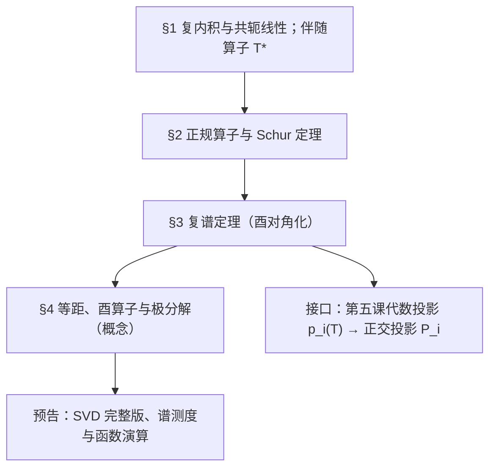
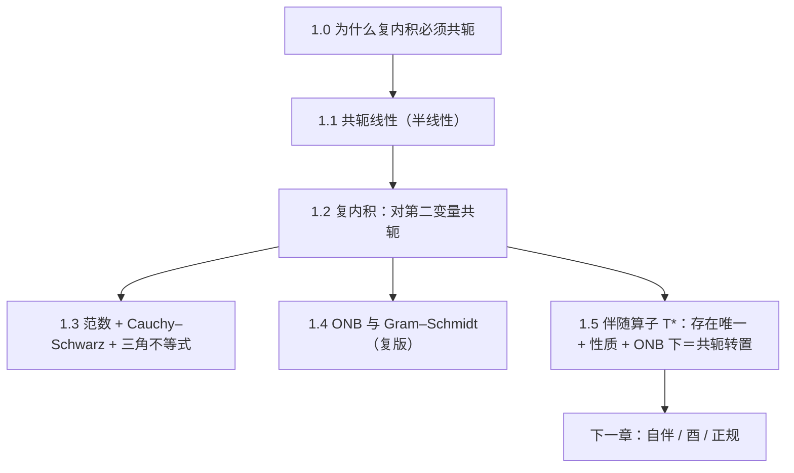
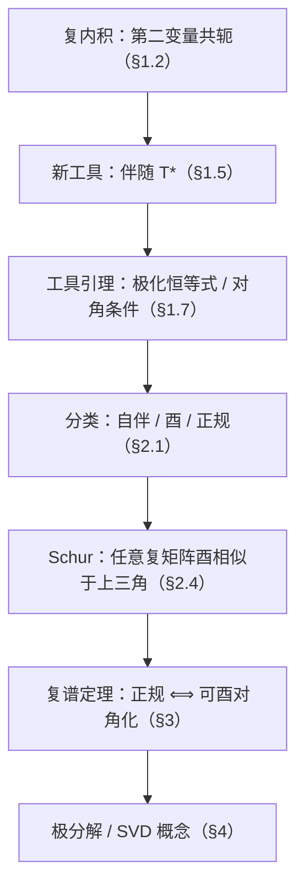
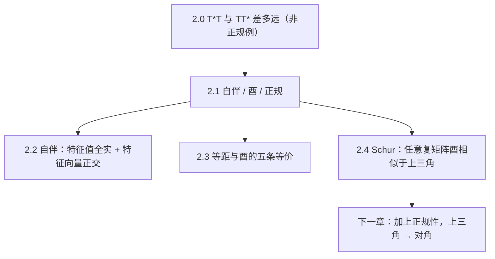
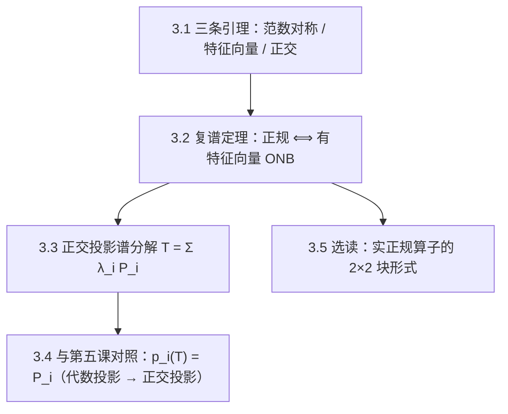
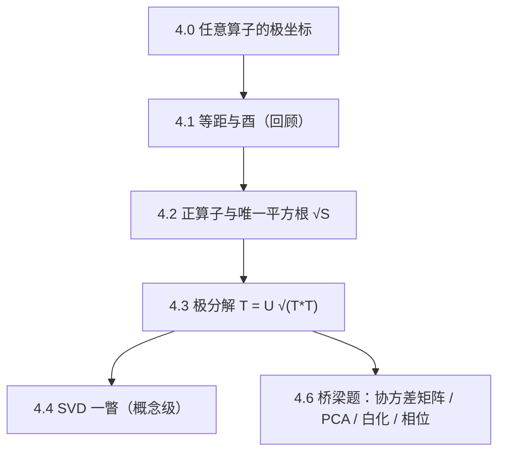

# 高等代数 第六课：复内积空间与正规算子

> **课程**：高等代数 MA103（Axler Ch7 后半 ＋ Ch9 选） ｜ **讲师**：数学教授 Prof-Math-V2 ｜ **课程日期**：2026-09-23 ｜ **版本**：**v1.2-fix1（已归档，2026-10-08）**
> **交付形式**：单一讲义文件（审稿记录见 `lectures/math/review_reports/`）

> **勘误**：v1.0 初稿（一次成稿；每章含章引言／概念讲解／示范例题＋**真算核验**／小结预告，并配三类题）；**v1.1 修审稿**（2026-09-29，5 处必改 ＋ 8 条建议全采纳）——A1 §1.7 习题 1 答案符号（$\mp\to\pm$，并换成 $\operatorname{Im}\neq0$ 的核验例）、B1 §1.3 定理 1 补"等号 $\iff$ 线性相关"两行、B2 §4.3 第 3 步改走极化恒等式（删去不适用引用）、B3 T3.1 删去不实的"第五课 $\det(zI-AB)$"引用并改自足一行证、C1 §4.3 第 4 步表述矛盾（"仍等距"改为"在 $\operatorname{im}R$ 上仍保持等距"）；并入建议：例 10 补代数核验、例 11 点名引理 15、§1.4／§1.5／§3.7 三处小节号更正、**四章章首各补一张 mermaid**。**遵循第五课口径**：公式一律单美元配对；求和下标一律写全上下限；**未经审稿不得定稿**；引用一律点名到已学课程的节次。**登记口径**：R6（代数基本定理）为登记表的**原始输入**，照第五课口径使用并点名。
>
> **v1.2 勘误（2026-10-08，三项）**：① §1.5 定理 5 的证明改为显式的"**必要性 → 充分性 → 唯一性**"三步（原稿只给构造，未展示"形式被迫"）；② §1.7 前补**工具引理动机段 ＋ 主线图**，独立习题 1 改写为**一般半双线性型**版本（使习题 3 成为直用）；③ §2.1 定义 5 的"酉"改为 **"可逆的等距"，等价地 $T^{-1}=T^*$**（原双边写法 $T^*T=TT^*=I$ 在有限维冗余，且使推论 5 与定理 11 的 $(d)\Leftrightarrow(e)$ 沦为同义反复），并同步 §2 本章概述、推论 4／5、例 5、§2.7 小结与附录记号表。

> **全局约定（承第四课 §7 与第五课 §1.0）**：本课 $V$ 指 $\mathbb{C}$ 上的有限维内积空间（$\dim V=n$）；凡以**矩阵**给出算子时，一律默认 $V=\mathbb{C}^n$、取**标准基**、$T(x)=Ax$；$\mathbb{C}^n$ 的标准内积为 $\langle x,y\rangle=\sum_{i=1}^{n}x_i\overline{y_i}$。

## 目录

1. §1 复内积与共轭线性；伴随算子 $T^*$
2. §2 正规算子与 Schur 定理
3. §3 复谱定理（酉对角化）
4. §4 等距、酉算子与极分解（概念）
5. 自测 T1／T2／T3
6. 附录 A 本课记号表

***

## §1 复内积与共轭线性；伴随算子 $T^*$

> **本章**：第四课把内积做成**实**的，本章把它复化；新增的"共轭"带来一个新对象——**伴随算子 $T^*$**，它是后面正规性与谱定理的全部工具。

### 1.0 章引言：为什么复内积必须"共轭"

第四课的实内积是**对称双线性**的：$\langle u,v\rangle=\langle v,u\rangle$，且对每个变量都线性。若照抄到复空间并要求正定，立刻矛盾：取 $v\neq0$，

$\langle iv,iv\rangle=i\cdot\bar i\,\langle v,v\rangle=|i|^2\langle v,v\rangle=\langle v,v\rangle$ ——**只有在对第二变量取共轭时**才等于 $\langle v,v\rangle$；若两个变量都"线性"（即 $\langle iv,iv\rangle=i\cdot i\langle v,v\rangle=-\langle v,v\rangle$），就与正定性冲突。

**症结**：复数不能像实数那样"两个线性只带来平方"。**补救**：让内积只对**一个**变量线性，对另一个**共轭线性**——于是

$\langle v,w\rangle=\overline{\langle w,v\rangle}$（**共轭对称**），$|i|^2=1$ 使长度不受相位影响。

**代价与收益**：代价是内积只对一个变量线性；收益是第四课的**几何**（范数、正交、标准正交基、正交补、正交投影、最近点）**逐字保留**，且多出一个新工具 $T^*$。

### 1.1 复向量空间与共轭线性

第一课已把数域写成 $\mathbb{F}$（原文："设 $\mathbb{F}$ 是数域（本课程中通常是 $\mathbb{R}$ 或 $\mathbb{C}$）"），故 $\mathbb{C}$ 上的向量空间无需另建。

**定义 1（共轭线性／半线性）**。设 $S:V\to W$ 满足 (1) 加性 $S(v_1+v_2)=S(v_1)+S(v_2)$；(2) **共轭齐性** $S(\lambda v)=\bar\lambda S(v)$，则称 $S$ 是**共轭线性**的。

**例 1**。$\mathbb{C}^n\to\mathbb{C}^n$，$x\mapsto\bar x=(\bar x_1,\dots,\bar x_n)$：加性显然；$S(\lambda x)=\overline{\lambda x}=\bar\lambda\bar x=\bar\lambda S(x)$ ✓。**它一般不是线性映射**：取 $\lambda=i$、$x=(1)$，则 $S(ix)=S(i)=\overline{i}=-i\neq i=iS(x)$。

> **易混**：共轭线性 ≠ 线性。"取共轭"这个最基本的操作本身就是共轭线性的。

### 1.2 复内积（Hermite 内积）

**定义 2（复内积）**。映射 $\langle\cdot,\cdot\rangle:V\times V\to\mathbb{C}$ 若满足

1. **对第一变量线性**：$\langle\lambda u+\mu v,w\rangle=\lambda\langle u,w\rangle+\mu\langle v,w\rangle$；
2. **共轭对称**：$\langle v,w\rangle=\overline{\langle w,v\rangle}$；
3. **正定**：$\langle v,v\rangle>0$ 对一切 $v\neq0$，

则称其为 $V$ 上的**复内积**，$(V,\langle\cdot,\cdot\rangle)$ 称**复内积空间**。

**推论 1**。$\langle v,v\rangle$ 是**实数**（由 2 取 $w=v$），故 3 中的"$>0$"有意义。

**推论 2（对第二变量共轭线性）**。$\langle u,\lambda v+\mu w\rangle=\bar\lambda\langle u,v\rangle+\bar\mu\langle u,w\rangle$。
*证明*：由 2 与 1，$\langle u,\lambda v+\mu w\rangle=\overline{\langle\lambda v+\mu w,u\rangle}=\overline{\lambda\langle v,u\rangle+\mu\langle w,u\rangle}=\bar\lambda\langle u,v\rangle+\bar\mu\langle u,w\rangle$。$\square$

**例 2（$\mathbb{C}^n$ 标准内积）**。$\langle x,y\rangle=\sum_{i=1}^{n}x_i\overline{y_i}$，三条逐条可验。

**真算核验**：取 $x=(1,i)$、$y=(1,1)$。
① 共轭对称：$\langle x,y\rangle=1\cdot\bar1+i\cdot\bar1=1+i$；$\langle y,x\rangle=1\cdot\bar1+1\cdot\bar i=1-i=\overline{1+i}$ ✓。
② 正定：$\langle x,x\rangle=1\cdot\bar1+i\cdot\bar i=1+|i|^2=2>0$ ✓。
③ 第二变量共轭：取 $iy=(i,i)$，逐项算 $\langle x,iy\rangle=1\cdot\overline{i}+i\cdot\overline{i}=(-i)+1=1-i$；而 $\bar i\langle x,y\rangle=-i(1+i)=-i-i^2=1-i$ ✓ 两式相等。

### 1.3 范数与两条不等式

**定义 3（范数）**。$\|v\|:=\sqrt{\langle v,v\rangle}$（由推论 1 良定义）。

**定理 1（Cauchy–Schwarz）**。$|\langle u,v\rangle|\le\|u\|\,\|v\|$，等号成立 $\iff u,v$ 线性相关。

*证明*。$v=0$ 时两边为 $0$。设 $v\neq0$。对任意 $\lambda\in\mathbb{C}$ 有
$0\le\|u-\lambda v\|^2=\|u\|^2-\bar\lambda\langle u,v\rangle-\lambda\langle v,u\rangle+|\lambda|^2\|v\|^2$。
取 $\lambda=\dfrac{\langle u,v\rangle}{\|v\|^2}$，则 $\bar\lambda\langle u,v\rangle=\dfrac{|\langle u,v\rangle|^2}{\|v\|^2}=\lambda\langle v,u\rangle$，代入得
$0\le\|u\|^2-\dfrac{|\langle u,v\rangle|^2}{\|v\|^2}$，即 $|\langle u,v\rangle|^2\le\|u\|^2\|v\|^2$（**"$\le$"部分完成**）。

**等号情形**（补全陈述中的"$\iff$"）：仍取 $\lambda=\langle u,v\rangle/\|v\|^2$。
（$\Rightarrow$）若 $|\langle u,v\rangle|=\|u\|\,\|v\|$，则上述不等式取等，故 $\|u-\lambda v\|^2=0$，即 $u=\lambda v$——$u,v$ 线性相关。
（$\Leftarrow$）若 $u=\mu v$（$u=0$ 时取 $\mu=0$），直接代入：$|\langle u,v\rangle|=|\mu|\,\|v\|^2=\|\mu v\|\,\|v\|=\|u\|\,\|v\|$ ✓。
（$v=0$ 时两边同为 $0$，亦线性相关。）$\square$

> **与实版唯一的差别**：左端必须取**模** $|\langle u,v\rangle|$——因为 $\lambda$ 是复数，不取模连"代入"都写不下去。

**定理 2（三角不等式）**。$\|u+v\|\le\|u\|+\|v\|$。
*证明要点*：$\|u+v\|^2=\|u\|^2+2\operatorname{Re}\langle u,v\rangle+\|v\|^2\le\|u\|^2+2|\langle u,v\rangle|+\|v\|^2\le(\|u\|+\|v\|)^2$，末步用定理 1。$\square$

### 1.4 标准正交基与 Gram–Schmidt（复版）

**定义 4（标准正交组）**。$\langle e_i,e_j\rangle=\delta_{ij}$（$1\le i,j\le m$）；$m=n$ 时称**标准正交基**（ONB）。

**定理 3（Fourier 展开与 Parseval）**。设 $e_1,\dots,e_n$ 是 ONB，则

$v=\sum_{i=1}^{n}\langle v,e_i\rangle e_i,\qquad \|v\|^2=\sum_{i=1}^{n}|\langle v,e_i\rangle|^2$。

> **顺序的坑**：系数是 $\langle v,e_i\rangle$（第一个变量放 $v$）。因共轭，$\langle e_i,v\rangle=\overline{\langle v,e_i\rangle}$ 一般与之**不等**——实情形看不出来，复情形会算错。

**真算核验**：$V=\mathbb{C}^2$、ONB $e_1=(1,0)$、$e_2=(0,1)$、$v=(1,i)$。
$\langle v,e_1\rangle=1\cdot\bar1+i\cdot\bar0=1$；$\langle v,e_2\rangle=1\cdot\bar0+i\cdot\bar1=i$。
Fourier：$1\cdot e_1+i\cdot e_2=(1,i)=v$ ✓。Parseval：$|1|^2+|i|^2=2$，而 $\|v\|^2=\langle v,v\rangle=1+|i|^2=2$ ✓。

**定理 4（Gram–Schmidt）**。任一线性无关组可化为标准正交组 $e_1,\dots,e_m$，且 $\operatorname{span}(e_1,\dots,e_k)=\operatorname{span}(v_1,\dots,v_k)$（$1\le k\le m$）。算法：$e_1=\dfrac{v_1}{\|v_1\|}$；$k\ge2$ 时先取

$w_k=v_k-\sum_{i=1}^{k-1}\langle v_k,e_i\rangle e_i$，再令 $e_k=\dfrac{w_k}{\|w_k\|}$。

*复情形为何逐字可用*：第四课的证明只用到"内积对**第一**变量线性"（减法与系数都作用在 $v_k$ 上）＋正定性；共轭只作用在第二个变量，故每步验算与实版完全相同。$\square$

**推论 3**。第四课 §4.2／§4.3 与 §5.1 的 $V=U\oplus U^\perp$、正交投影 $P_U$、最近点定理逐字成立（证明只用内积公理）。

### 1.5 伴随算子 $T^*$

**定理 5（存在唯一性）**。设 $T\in\mathcal{L}(V)$，则存在**唯一**的 $T^*\in\mathcal{L}(V)$ 使

$\langle Tv,w\rangle=\langle v,T^*w\rangle\qquad(v,w\in V)$。

*证明（按"必要性 → 充分性 → 唯一性"三步；用 ONB 显式构造，自足）*。

**必要性（形式被迫）**。设 $T^*$ 已满足刻画等式。取 ONB $e_1,\dots,e_n$。对任意 $w$ 与任意 $v$（写 $v=\sum_{i=1}^{n}\langle v,e_i\rangle e_i$）：
$\langle v,T^*w\rangle=\langle Tv,w\rangle=\sum_{i=1}^{n}\langle v,e_i\rangle\langle Te_i,w\rangle=\sum_{i=1}^{n}\langle v,e_i\rangle\overline{\langle w,Te_i\rangle}=\Big\langle v,\ \sum_{i=1}^{n}\langle w,Te_i\rangle e_i\Big\rangle .$
该式对一切 $v$ 成立。令 $u:=T^*w-\sum_{i=1}^{n}\langle w,Te_i\rangle e_i$，则 $\langle v,u\rangle=0$ 对一切 $v$；取 $v=u$，由**正定性**得 $\|u\|^2=0$，故 $u=0$。于是
$T^*w=\sum_{i=1}^{n}\langle w,Te_i\rangle e_i$
——**$T^*$ 若存在，只能长这样**（这一步同时已给出唯一性）。

**充分性（该形式确实可用）**。定义 $T^*w:=\sum_{i=1}^{n}\langle w,Te_i\rangle e_i$。

- **线性**：$\langle w,Te_i\rangle$ 对 $w$ 线性，故系数线性，$T^*(\lambda w_1+w_2)=\lambda T^*w_1+T^*w_2$ ✓。
- **刻画等式**：写 $v=\sum_{i=1}^{n}\langle v,e_i\rangle e_i$，则 $Tv=\sum_{i=1}^{n}\langle v,e_i\rangle Te_i$，故
  $\langle Tv,w\rangle=\sum_{i=1}^{n}\langle v,e_i\rangle\langle Te_i,w\rangle$；
  另一方面 $\langle v,T^*w\rangle=\sum_{i=1}^{n}\overline{\langle w,Te_i\rangle}\langle v,e_i\rangle=\sum_{i=1}^{n}\langle Te_i,w\rangle\langle v,e_i\rangle$（用共轭对称）——两式相同 ✓。
- **唯一性**：若 $T^*,T'$ 都满足，则 $\langle v,(T^*-T')w\rangle=0$ 对一切 $v$ 成立；取 $v=(T^*-T')w$ 得 $\|(T^*-T')w\|^2=0$，由正定性得 $(T^*-T')w=0$，对一切 $w$ 成立故 $T^*=T'$。$\square$

**定理 6（基本性质）**。$I^*=I$；$(T+S)^*=T^*+S^*$；$(\lambda T)^*=\bar\lambda T^*$；$(TS)^*=S^*T^*$；$T^{**}=T$。

*证明要点*（全部靠唯一性）：以 $(TS)^*=S^*T^*$ 为例，对一切 $v,w$，
$\langle TSv,w\rangle=\langle Sv,T^*w\rangle=\langle v,S^*T^*w\rangle$，故 $S^*T^*$ 满足 $(TS)^*$ 的刻画。**$(\lambda T)^*=\bar\lambda T^*$ 的共轭别漏。**

**定理 7（核与像配对）**。$\ker T^*=(\operatorname{im}T)^\perp$；$\operatorname{im}T^*=(\ker T)^\perp$；$\operatorname{rank}T^*=\operatorname{rank}T$。

*证明要点*：$w\in\ker T^*\iff T^*w=0\iff\langle v,T^*w\rangle=0\ (\forall v)\iff\langle Tv,w\rangle=0\ (\forall v)\iff w\perp\operatorname{im}T$。第二式由 $U=(U^\perp)^\perp$（第四课 §4.2，有限维）取正交补得，第三式由第二式取维数。$\square$

**定理 8（ONB 下矩阵＝共轭转置）**。设 $T$ 在 ONB 下的矩阵为 $A=(a_{ij})$，则 $T^*$ 在同一 ONB 下的矩阵为 $A^*:=\bar A^{\mathsf T}$，即 $[T^*]_{ij}=\overline{a_{ji}}$。

*证明*：设 $T^*e_j=\sum_{i=1}^{n}b_{ij}e_i$。则 $b_{ij}=\langle T^*e_j,e_i\rangle=\overline{\langle e_i,T^*e_j\rangle}=\overline{\langle Te_i,e_j\rangle}=\overline{a_{ji}}$。$\square$

> **条件不可去（反例）**：一般基下 $[T^*]\neq\bar A^{\mathsf T}$。取 $\mathbb{R}^2$ 上到 $\operatorname{span}((1,1))$ 的**正交投影** $T$（第四课 §4.3，它是自伴算子），取基 $f_1=(1,1)$、$f_2=(0,1)$：由 $Tf_1=f_1$、$Tf_2=\frac12f_1$ 得
> $[T]_f=\begin{pmatrix}1&\frac12\\0&0\end{pmatrix}$，而它的转置 $\begin{pmatrix}1&0\\\frac12&0\end{pmatrix}\neq[T]_f$。
> **结论**：只有**标准正交基**下才有"伴随＝共轭转置"。

### 1.6 示范例题（含真算核验）

**例 3**。$V=\mathbb{C}^2$、标准内积，$T$ 的矩阵 $A=\begin{pmatrix}1&i\\0&2\end{pmatrix}$。求 $[T^*]$ 并用两组 $v,w$ 核验影响。

*解答*：$A^*=\bar A^{\mathsf T}=\begin{pmatrix}1&0\\-i&2\end{pmatrix}$，即 $[T^*]_{ij}=\overline{A_{ji}}$。

**真算核验**：
① 取 $v=e_1$、$w=e_2$：$Tv=Ae_1=(1,0)^{\mathsf T}$，故 $\langle Tv,w\rangle=1\cdot\bar0+0\cdot\bar1=0$；$T^*w=A^*e_2=(0,2)^{\mathsf T}$，故 $\langle v,T^*w\rangle=1\cdot\bar0+0\cdot\bar2=0$ ✓。
② 取 $v=e_2$、$w=e_1$：$Tv=Ae_2=(i,2)^{\mathsf T}$，故 $\langle Tv,w\rangle=i\cdot\bar1+2\cdot\bar0=i$；$T^*w=A^*e_1=(1,-i)^{\mathsf T}$，故 $\langle v,T^*w\rangle=0\cdot\bar1+1\cdot\overline{(-i)}=i$ ✓。
③ 脚标核对：$[T^*]_{12}=\overline{A_{21}}=\bar0=0$（与 $A^*$ 的第 1 行第 2 列 $0$ 一致）；$[T^*]_{21}=\overline{A_{12}}=\bar i=-i$（与 $A^*$ 的第 2 行第 1 列 $-i$ 一致）✓。

**例 4**。证明：$T$ 可逆 $\iff T^*$ 可逆；此时 $(T^{-1})^*$ 满足 $(T^{-1})^*T^*=T^*(T^{-1})^*=I$。

*解答*：由第二课，$V$ 有限维时 $T$ 可逆 $\iff\ker T=\{0\}$。由定理 7，$\ker T^*=(\operatorname{im}T)^\perp$；而 $T$ 可逆 $\iff\operatorname{im}T=V\iff(\operatorname{im}T)^\perp=\{0\}\iff\ker T^*=\{0\}\iff T^*$ 可逆 ✓。两边恒等式：由 $TT^{-1}=I$ 与定理 6 取伴随得 $(T^{-1})^*T^*=I^*=I$，同理由 $T^{-1}T=I$ 得 $T^*(T^{-1})^*=I$ ✓（写法只用到可逆的定义与伴随的性质）。

### 1.7 三类题

> **为什么这一段先做这两个"工具"**（动机段，2026-10-08 补：同学 2026-09-29 反馈"这里开始感觉抽象，跟前面有个小断层，动机也不清楚、缺一条主线"）。下面独立习题 1、3 不是零散技巧，而是**把"对角信息"升级为"全部信息"的两把扳手**：
> - **极化恒等式**（习题 1）：手上只有 $\langle u,u\rangle$ 型的量（同一个向量在两边）时，用它把**全部** $\langle u,v\rangle$ 还原出来；
> - **$\langle Tv,v\rangle\equiv0\Rightarrow T=0$**（习题 3）：手上只有"对角"条件时，用它逼出算子为零。
>
> **它们后面用在哪里（点名）**：§1.5 定理 5 的**唯一性步**（取 $v=(T^*-T')w$，用正定性收口）；§2.3 定理 11 的 $(b)\Rightarrow(d)$（经习题 3）与 $(d)\Leftrightarrow(e)$；推论 5 的"有限维单侧即够"（同一手法）；本题答案 3（取 $w=Tu$）；§3 复谱定理里"正规性通勤"的计算同型。

**引导练习**（带提示）：

1. 证明平行四边形法则：$\|u+v\|^2+\|u-v\|^2=2\|u\|^2+2\|v\|^2$。*提示*：展开两式，注意 $\langle u,v\rangle+\langle v,u\rangle=2\operatorname{Re}\langle u,v\rangle$。
2. 证明 $T=0\iff T^*=0$。*提示*：一个方向由 $T^{**}=T$（定理 6）立得。

**独立习题**（无提示）：

1. 设 $[\cdot,\cdot]:V\times V\to\mathbb C$ 对**第一变量线性**、对**第二变量共轭线性**（一般半双线性型；取 $[\cdot,\cdot]=\langle\cdot,\cdot\rangle$ 即本课内积，即通常的极化恒等式）。证明**极化恒等式**
$[u,v]=\frac14\big([u+v,u+v]-[u-v,u-v]+i[u+iv,u+iv]-i[u-iv,u-iv]\big).$
再设 $S\in\mathcal L(V)$、令 $[u,v]:=\langle Su,v\rangle$（它对 $u$ 线性、对 $v$ 共轭线性 ✓）：证明若 $[v,v]=0$ 对一切 $v$ 成立，则 $S=0$。（这即下面的习题 3。）最后说明实情形为何只剩前两项。
2. 设 $T$ 在某组**非标准正交基**下的矩阵是实对称阵。问 $T$ 是否自伴？给证明或反例。
3. 复情形证明：若 $\langle Tv,v\rangle=0$ 对一切 $v$ 成立，则 $T=0$；并说明实情形为何**不**成立（给反例）。

**答案与核对**：

1. **一般形式**：把下面各式中的 $\langle\cdot,\cdot\rangle$ 换成任一"上半线性、下共轭线性"的 $[\cdot,\cdot]$ 后，展开与结论逐字相同（因为用到的只有这两条线性性质与 $[v,v]=\overline{[v,v]}\in\mathbb R$）；取 $[u,v]=\langle Su,v\rangle$ 时，$[u,v]$ 对 $u$ 线性、对 $v$ 共轭线性 ✓，故一般形式直接给出习题 3 的"$[v,v]\equiv0\Rightarrow S=0$"。**下面按内积写出以便核对**：展开四式 $\|u\pm v\|^2=\|u\|^2\pm2\operatorname{Re}\langle u,v\rangle+\|v\|^2$；又由第二变量共轭线性 $\langle u,iv\rangle=\bar i\langle u,v\rangle=-i\langle u,v\rangle$，故 $\operatorname{Re}\langle u,iv\rangle=\operatorname{Im}\langle u,v\rangle$，于是 $\|u\pm iv\|^2=\|u\|^2\pm2\operatorname{Re}\langle u,iv\rangle+\|v\|^2=\|u\|^2\pm2\operatorname{Im}\langle u,v\rangle+\|v\|^2$（**两处符号同为 $\pm$**）。代入右端得 $\frac14\big(4\operatorname{Re}\langle u,v\rangle+2i\cdot2\operatorname{Im}\langle u,v\rangle\big)=\operatorname{Re}\langle u,v\rangle+i\operatorname{Im}\langle u,v\rangle=\langle u,v\rangle$ ✓。
 **核验（取 $\operatorname{Im}\neq0$ 之例，方能钉住符号）**：$u=(1,0)$、$v=(i,1)$，则 $\langle u,v\rangle=1\cdot\bar i+0\cdot\bar1=-i$（$\operatorname{Im}=-1$）。逐项算：$\|u+v\|^2=\|(1+i,1)\|^2=1+1+1=3$、$\|u-v\|^2=\|(1-i,-1)\|^2=2+1=3$、$\|u+iv\|^2=\|(0,i)\|^2=1$（因 $iv=(-1,i)$）、$\|u-iv\|^2=\|(2,-i)\|^2=4+1=5$。代入右端：$\frac14\big(3-3+i\cdot1-i\cdot5\big)=\frac14(-4i)=-i=\langle u,v\rangle$ ✓（若误写成 $\mp$，此例得 $+i\neq-i$，故该例可检出原错）。实情形 $iv$ 不在实空间中，后两项无定义，只剩前两项 ✓。
2. **不一定自伴**。反例：取基 $f_1=(1,1)$、$f_2=(0,1)$ 与对称阵 $B=\begin{pmatrix}1&2\\2&3\end{pmatrix}$，令 $T$ 在这组基下矩阵为 $B$。$P=\begin{pmatrix}1&0\\1&1\end{pmatrix}$（列为 $f_1,f_2$），则 $T$ 在标准基（ONB）下的矩阵
 $A=PBP^{-1}=\begin{pmatrix}1&2\\3&5\end{pmatrix}\begin{pmatrix}1&0\\-1&1\end{pmatrix}=\begin{pmatrix}-1&2\\-2&5\end{pmatrix}$，**不对称** ⟹ $T$ 不自伴（在 ONB 下自伴 $\iff$ 矩阵对称，见 §2 定理 9）。
 **核验**：$PBP^{-1}$ 逐项：$(1,1)$ 元 $=1\cdot1+2\cdot(-1)=-1$ ✓；$(1,2)$ 元 $=1\cdot0+2\cdot1=2$ ✓；$(2,1)$ 元 $=3\cdot1+5\cdot(-1)=-2$ ✓；$(2,2)$ 元 $=3\cdot0+5\cdot1=5$ ✓。
3. 复情形：由习题 1 的极化恒等式，$\langle Tu,w\rangle=\frac14\big(\langle T(u+w),u+w\rangle-\langle T(u-w),u-w\rangle+i\langle T(u+iw),u+iw\rangle-i\langle T(u-iw),u-iw\rangle\big)=0$ 对一切 $u,w$；取 $w=Tu$ 得 $\|Tu\|^2=0$，故 $T=0$ ✓。
 实情形反例：$T=\begin{pmatrix}0&-1\\1&0\end{pmatrix}$（旋转 $90^\circ$），则 $\langle Tv,v\rangle=0$ 对一切 $v\in\mathbb{R}^2$（因为 $v\perp Tv$），但 $T\neq0$ ✓。

### 1.8 本章小结与预告

- **复内积**＝对第二变量共轭的内积；正定性由此才可能（§1.0）。
- **共轭线性**是与线性并列的新类型；"取共轭"本身就是它（§1.1）。
- **几何照旧**：范数、Cauchy–Schwarz（右端取模）、三角不等式、ONB、Gram–Schmidt、正交补与正交投影全部逐字成立（§1.3–§1.4）。
- **新工具**：伴随算子 $T^*$（存在唯一、性质、核像配对、**ONB 下矩阵＝共轭转置**）——§1.5。
- **下一章**：用 $T^*$ 给算子分类（自伴／酉／正规），并证明**任何复矩阵都酉相似于上三角**（Schur 定理）。

***

## §2 正规算子与 Schur 定理

> **本章**：用 $T^*$ 给算子分类——**自伴**（$T=T^*$）、**酉**（$T$ **可逆**且 $T^{-1}=T^*$，即"可逆的等距"；有限维下等价于 $T^*T=I$）、**正规**（$T^*T=TT^*$）。核心结论：任何复矩阵都能通过**酉**相似化成**上三角**（Schur 定理），而"能否化成对角"恰好等价于**正规**（留给 §3）。

### 2.0 章引言：$T^*T$ 与 $TT^*$ 差多远

$T^*$ 是我们新造的算子，它与 $T$ 不一定"和睦"：$T^*T$ 与 $TT^*$ 一般**不相等**。例如 $A=\begin{pmatrix}1&1\\0&1\end{pmatrix}$，

$A^*A=\begin{pmatrix}1&0\\1&1\end{pmatrix}\begin{pmatrix}1&1\\0&1\end{pmatrix}=\begin{pmatrix}1&1\\1&2\end{pmatrix}$，而 $AA^*=\begin{pmatrix}1&1\\0&1\end{pmatrix}\begin{pmatrix}1&0\\1&1\end{pmatrix}=\begin{pmatrix}2&1\\1&1\end{pmatrix}$（不等 ✓）。

**这两个乘积的差别，正是本课全部内容的控制开关**：差别为零（**正规**）时 $T$ 可以被一组**标准正交**的特征向量对角化；差别不为零时只能退而求其次——上三角（Schur）。

### 2.1 三个定义

**定义 5**。设 $T\in\mathcal{L}(V)$，$T^*$ 为其伴随（§1.5）。

1. **自伴**（Hermitian）：$T=T^*$；
2. **酉**（unitary）：$T$ **可逆**且 $T^{-1}=T^*$（等价地说：$T$ 是**可逆的等距**）。
   > **为何不定义成 $T^*T=TT^*=I$**：在**有限维**复内积空间里 $T^*T=I$ **单独即够**（等距 ⟹ 单射 ⟹ 有限维双射 ⟹ $T^{-1}=T^*$ ⟹ $TT^*=I$），双边写法在此冗余，且会把推论 5 与定理 11 的 $(d)\Leftrightarrow(e)$ 压成同义反复；而**无穷维**下双边并不等价（单侧移位 $S^*S=I$ 但 $SS^*\neq I$）——双边写法唯一的用处是不依赖有限维。本课统一按"可逆的等距"定义。
3. **正规**（normal）：$T^*T=TT^*$。

**推论 4**。自伴算子与酉算子都是正规的（前者 $T^*T=T^2=TT^*$；后者 $T^*T=T^{-1}T=I=TT^{-1}=TT^*$）。

**推论 5（有限维下"单侧即够"）**。在有限维，$T$ 酉 $\iff T^*T=I\iff TT^*=I$——**一个单侧等式已强制另一侧**。*证明*。$T^*T=I$ 时 $\|Tv\|^2=\langle T^*Tv,v\rangle=\|v\|^2$，故 $T$ 单射；有限维 ⟹ $T$ 双射 ⟹ 存在逆 $T^{-1}$（第二课）。于是 $T^*=T^*(TT^{-1})=(T^*T)T^{-1}=T^{-1}$，故 $T$ 酉，且 $TT^*=T(T^{-1})=I$ ✓；反方向由 $TT^{-1}=I$、$T^{-1}T=I$ 直接代入 ✓。（定理 11 的 $(d)\Leftrightarrow(e)$ 即此内容。）

**例 5（在 ONB 下的样子）**。设 $T$ 在 **ONB** 下矩阵为 $A$。由定理 8，$T^*$ 的矩阵是 $A^*=\bar A^{\mathsf T}$。于是

- $T$ 自伴 $\iff A=A^*$（**Hermite 矩阵**，实情形即对称阵）；
- $T$ 酉 $\iff A^*=A^{-1}$；在有限维这等价于 $A^*A=AA^*=I$（**酉矩阵**，实情形即正交阵）；
- $T$ 正规 $\iff A^*A=AA^*$。

> **再次强调**：这三条翻译**只在标准正交基下**成立（§1.5 的反例）。

### 2.2 自伴算子的两条基本性质

**定理 9（特征值全实）**。$T$ 自伴、$Tv=\lambda v$（$v\neq0$）$\Rightarrow\lambda\in\mathbb{R}$。

*证明*。由自伴，$\langle Tv,v\rangle=\langle v,Tv\rangle$，而

$\lambda\|v\|^2=\langle Tv,v\rangle=\langle v,Tv\rangle=\overline{\lambda}\|v\|^2$，

故 $\lambda=\bar\lambda$，即 $\lambda$ 为实数。$\square$

**定理 10（不同特征值的特征向量正交）**。$T$ 自伴，$v\in E(\lambda,T)$、$w\in E(\mu,T)$、$\lambda\neq\mu$ $\Rightarrow\langle v,w\rangle=0$。

*证明*。由自伴与 $Tw=\mu w$（定理 9 保证 $\mu$ 是实数，故 $\bar\mu=\mu$）：

$\lambda\langle v,w\rangle=\langle Tv,w\rangle=\langle v,Tw\rangle=\mu\langle v,w\rangle$，

即 $(\lambda-\mu)\langle v,w\rangle=0$，而 $\lambda\neq\mu$，故 $\langle v,w\rangle=0$。$\square$

**真算核验**：$T=\begin{pmatrix}2&1\\1&2\end{pmatrix}$（实对称 ⟹ 自伴）。$p_T(z)=(z-2)^2-1=(z-3)(z-1)$，特征值 $3,1$ 全实 ✓。特征向量 $v_1=\frac{1}{\sqrt2}(1,1)$（$\lambda=3$）、$v_2=\frac{1}{\sqrt2}(1,-1)$（$\lambda=1$）：$\langle v_1,v_2\rangle=\frac12(1\cdot1+1\cdot(-1))=0$ ✓ 正交。

### 2.3 等距与酉算子的等价刻画

**定义 6（等距）**。$T$ 称**等距**，若 $\|Tv\|=\|v\|$ 对一切 $v$ 成立。

**定理 11（五条等价）**。对 $T\in\mathcal{L}(V)$（有限维复内积空间），以下等价：

(a) $\langle Tu,Tv\rangle=\langle u,v\rangle$ 对一切 $u,v$；
(b) $\|Tu\|=\|u\|$ 对一切 $u$（即 $T$ 是等距）；
(c) $T$ 把某一组 ONB 映成 ONB（此时把**任意** ONB 映成 ONB）；
(d) $T^*T=I$；
(e) $T$ 可逆且 $T^{-1}=T^*$（即 $T$ 酉）。

*证明（按 $(a)\Rightarrow(b)\Rightarrow(d)\Rightarrow(a)$、$(a)\Leftrightarrow(c)$、$(d)\Leftrightarrow(e)$ 绕一圈）*。

- $(a)\Rightarrow(b)$：取 $u=v$。
- $(b)\Rightarrow(d)$：$\langle T^*Tu,u\rangle=\langle Tu,Tu\rangle=\|u\|^2=\langle u,u\rangle$，故 $\langle(T^*T-I)u,u\rangle=0$ 对一切 $u$。由 **§1 独立习题 3**（复情形：$\langle Sv,v\rangle\equiv0\Rightarrow S=0$）得 $T^*T-I=0$，即 (d)。
- $(d)\Rightarrow(a)$：$\langle Tu,Tv\rangle=\langle T^*Tu,v\rangle=\langle u,v\rangle$。
- $(d)\Leftrightarrow(e)$：若 $T^*T=I$，则 $Tu=0\Rightarrow\|u\|^2=\langle T^*Tu,u\rangle=0\Rightarrow u=0$，故 $T$ 单射；有限维 ⟹ $T$ 双射 ⟹ 存在 $B$ 使 $TB=BT=I$（第二课）。于是 $T^*=T^*(TB)=(T^*T)B=B$，即 $T^{-1}=T^*$ ✓。反之 $(e)\Rightarrow T^*T=T^{-1}T=I$ ✓。
- $(a)\Leftrightarrow(c)$：设 $e_1,\dots,e_n$ 是 ONB。若 (a) 成立，则 $\langle Te_i,Te_j\rangle=\langle e_i,e_j\rangle=\delta_{ij}$，故 $\{Te_i\}$ 是 ONB；反之若某组 ONB 的像仍是 ONB，则对 $u=\sum_{i=1}^{n}a_ie_i$、$v=\sum_{j=1}^{n}b_je_j$ 有 $\langle Tu,Tv\rangle=\sum_{i=1}^{n}\sum_{j=1}^{n}a_i\bar b_j\langle Te_i,Te_j\rangle=\sum_{i=1}^{n}a_i\bar b_i=\langle u,v\rangle$。$\square$

**真算核验**：$R=\frac{1}{\sqrt2}\begin{pmatrix}1&-1\\1&1\end{pmatrix}$（实正交阵）。
① $R^{\mathsf T}R=\frac12\begin{pmatrix}1&1\\-1&1\end{pmatrix}\begin{pmatrix}1&-1\\1&1\end{pmatrix}=\frac12\begin{pmatrix}2&0\\0&2\end{pmatrix}=I$ ✓。
② 保范数：取 $x=(1,2)$，$\|x\|^2=5$；$Rx=\frac{1}{\sqrt2}(1-2,\ 1+2)=\frac{1}{\sqrt2}(-1,3)$，$\|Rx\|^2=\frac{1+9}{2}=5$ ✓。
③ ONB ↦ ONB：$Re_1=\frac{1}{\sqrt2}(1,1)$、$Re_2=\frac{1}{\sqrt2}(-1,1)$，两者内积 $=\frac12(-1+1)=0$、范数各为 $1$ ✓。

### 2.4 Schur 定理

**引理 12（$T^*$ 的特征向量给出 $T$-不变的正交补）**。若 $T^*w=\mu w$（$w\neq0$），则 $\{w\}^\perp$ 是 $T$-不变的。

*证明*。取 $v\perp w$，则

$\langle Tv,w\rangle=\langle v,T^*w\rangle=\langle v,\mu w\rangle=\bar\mu\langle v,w\rangle=0$，

故 $Tv\perp w$，即 $Tv\in\{w\}^\perp$。$\square$

**定理 13（Schur）**。设 $A\in M_n(\mathbb{C})$，则存在**酉**矩阵 $Q$ 与**上三角**矩阵 $U$ 使

$A=QUQ^*$。

*证明（对 $n$ 归纳）*。$n=1$ 显然。设 $n\ge2$，把 $A$ 看作 $\mathbb{C}^n$（标准内积）上的算子 $T$。

1. **取 $T^*$ 的特征向量**：由 **R6（代数基本定理）**，$T^*$ 的特征多项式在 $\mathbb{C}$ 上必有一根，故 $T^*$ 有特征值 $\mu$ 与特征向量 $w\neq0$；单位化使 $\|w\|=1$。
2. **正交补不变**：由引理 12，$W:=\{w\}^\perp$ 是 $T$-不变的，且 $\dim W=n-1$（第四课 §4.2 的维数公式）。
3. **归纳**：对 $T|_W$ 用归纳假设，得 $W$ 的 ONB $e_1,\dots,e_{n-1}$，使 $[T|_W]$ 在这组基下**上三角**。
4. **拼基**：$e_n:=w$，则 $e_1,\dots,e_{n-1},e_n$ 是 $V$ 的 ONB（正交直和 $W\oplus\mathbb{C}w=V$）。对 $j\le n-1$ 有 $Te_j\in W=\operatorname{span}(e_1,\dots,e_{n-1})$，即第 $j$ 列在对角线以下的元素为 $0$；第 $n$ 列无限制。故 $T$ 在此 ONB 下的矩阵 $U$ 是**上三角**。
5. **回到矩阵**：以该 ONB 的向量为列作 $Q$（由 (c) 知 $Q$ 酉），则 $A=QUQ^*$。$\square$

**真算核验（一个"不平凡但可算"的例子）**：$A=\begin{pmatrix}1&1\\0&2\end{pmatrix}$。

- $A^*=\begin{pmatrix}1&0\\1&2\end{pmatrix}$，其特征值 $1,2$。取 $\mu=2$ 的特征向量：$(A^*-2I)v=\begin{pmatrix}-1&0\\1&0\end{pmatrix}v=0\Rightarrow v=(0,1)$，故 $w=e_2$ ✓（核验 $A^*e_2=(0,2)=2e_2$ ✓）。
- $W=\{e_2\}^\perp=\operatorname{span}(e_1)$，且 $Ae_1=(1,0)\in W$ ✓（引理 12 的实际体现）。
- 归纳用于 $W$（一维）得 $e_1$；故 ONB 就是标准基，$Q=I$，$U=A$ ——它本来就上三角 ✓。
- **再核一个非三角的例子**：$A=\begin{pmatrix}2&1\\1&2\end{pmatrix}$ 的特征向量 $\frac{1}{\sqrt2}(1,1)$、$\frac{1}{\sqrt2}(1,-1)$ 已正交，取 $Q=\frac{1}{\sqrt2}\begin{pmatrix}1&1\\1&-1\end{pmatrix}$（酉/实正交），则 $AQ$ 的第 1 列 $=A\cdot\frac{1}{\sqrt2}(1,1)^{\mathsf T}=\frac{1}{\sqrt2}(3,3)^{\mathsf T}=3\cdot\frac{1}{\sqrt2}(1,1)^{\mathsf T}$ ✓、第 2 列 $=A\cdot\frac{1}{\sqrt2}(1,-1)^{\mathsf T}=\frac{1}{\sqrt2}(1,-1)^{\mathsf T}=1\cdot(\dots)$ ✓，故 $Q^*AQ=\mathrm{diag}(3,1)$ ——**上三角（此处还是对角）** ✓。

### 2.5 示范例题（含真算核验）

**例 6**。判断 $A=\begin{pmatrix}1&1\\0&1\end{pmatrix}$ 的自伴性、酉性、正规性。

*解答*：$A^*=\begin{pmatrix}1&0\\1&1\end{pmatrix}\neq A$ ⟹ 非自伴；$A^*A=\begin{pmatrix}1&1\\1&2\end{pmatrix}\neq I$ ⟹ 非酉；$A^*A\neq AA^*$（见 §2.0）⟹ **非正规**。

**真算核验**：$A^*A-AA^*=\begin{pmatrix}1&1\\1&2\end{pmatrix}-\begin{pmatrix}2&1\\1&1\end{pmatrix}=\begin{pmatrix}-1&0\\0&1\end{pmatrix}\neq0$ ✓；且特征值只有 $1$，而 $\dim E(1,A)=1<2$ ⟹ 不可对角化，与"非正规"相符（§3 将证明正规必可酉对角化）。

**例 7**。设 $T$ 酉，证明 $T$ 的特征值满足 $|\lambda|=1$。

*解答*：由定理 11(b)，$\|Tv\|=\|v\|$；设 $Tv=\lambda v$（$v\neq0$），则 $|\lambda|\,\|v\|=\|\lambda v\|=\|Tv\|=\|v\|$，故 $|\lambda|=1$ ✓。**真算核验**：$R=\frac{1}{\sqrt2}\begin{pmatrix}1&-1\\1&1\end{pmatrix}$，$zI-R=\begin{pmatrix}z-\frac{1}{\sqrt2}&\frac{1}{\sqrt2}\\-\frac{1}{\sqrt2}&z-\frac{1}{\sqrt2}\end{pmatrix}$，故
$p_R(z)=\Big(z-\frac{1}{\sqrt2}\Big)^2+\frac{1}{2}=z^2-\sqrt2\,z+1$，
根 $=\frac{\sqrt2\pm\sqrt{2-4}}{2}=\frac{1\pm i}{\sqrt2}=e^{\pm i\pi/4}$，模均为 $1$ ✓。

### 2.6 三类题

**引导练习**（带提示）：

1. 证明：$T$ 自伴 $\Rightarrow\langle Tv,v\rangle\in\mathbb{R}$ 对一切 $v$。*提示*：$\overline{\langle Tv,v\rangle}=\langle v,Tv\rangle$。
2. 证明：$S,T$ 都自伴 $\Rightarrow ST$ 自伴 $\iff ST=TS$。*提示*：$(ST)^*=T^*S^*=TS$。

**独立习题**（无提示）：

1. 证明：$T$ 正规 $\iff\|Tv\|=\|T^*v\|$ 对一切 $v$。
2. 证明 Schur 定理的"下三角版"：任何 $A\in M_n(\mathbb{C})$ 酉相似于下三角矩阵。
3. 设 $T$ 正规且 $T^2=0$，证明 $T=0$。

**答案与核对**：

1. $\|Tv\|^2=\langle Tv,Tv\rangle=\langle T^*Tv,v\rangle$，$\|T^*v\|^2=\langle TT^*v,v\rangle$。正规时两者相等 ✓。反之若两范数恒等，则 $\langle(T^*T-TT^*)v,v\rangle=0$ 对一切 $v$，由 §1 独立习题 3 得 $T^*T-TT^*=0$ ✓。
 **核验**：$A=\begin{pmatrix}1&1\\0&1\end{pmatrix}$，取 $v=e_2$：$\|Av\|=\|(1,1)\|=\sqrt2$，$\|A^*v\|=\|(0,1)\|=1$，不等 ⟹ 非正规 ✓（与例 6 一致）。
2. 对 $A^*$ 用定理 13：存在酉 $Q$ 与上三角 $U$ 使 $A^*=QUQ^*$。取伴随得 $A=QU^*Q^*$，而 $U^*$ 是**下**三角 ✓。
3. 由习题 1，$\|T^*v\|=\|Tv\|$ 对一切 $v$。任取 $v$，令 $u=Tv$。由 $T^2=0$ 得 $Tu=0$，于是 $\|T^*u\|=\|Tu\|=0$，即 $T^*Tv=T^*u=0$。故
 $\|Tv\|^2=\langle Tv,Tv\rangle=\langle T^*Tv,v\rangle=0$，即 $Tv=0$；对一切 $v$ 成立，故 $T=0$ ✓。
 **核验**：$A=\begin{pmatrix}0&1\\0&0\end{pmatrix}$ 满足 $A^2=0$；$A^*A=\mathrm{diag}(0,1)$、$AA^*=\mathrm{diag}(1,0)$，不等 ⟹ 非正规（与"正规 + 平方零 ⟹ 零"的假设条件匹配）✓

### 2.7 本章小结与预告

- **三个定义**：自伴 $T=T^*$、**酉（可逆的等距：$T$ 可逆且 $T^{-1}=T^*$；有限维等价于 $T^*T=I$）**、正规 $T^*T=TT^*$；自伴与酉都是正规（§2.1）。
- **自伴的两条性质**：特征值全实；不同特征值的特征向量正交（定理 9、10）。
- **等距＝保内积＝保范数＝把 ONB 送到 ONB＝$T^*T=I$**；酉＝可逆的等距（定理 11）。
- **Schur 定理**：复矩阵必酉相似于上三角（定理 13）；证明只用"$T^*$ 的特征向量给出 $T$-不变的正交补"这一条引理（引理 12）。
- **下一章**：加上**正规性**，Schur 的上三角就变成**对角**——**复谱定理**；并给出正交投影谱分解，与第五课的代数投影对照。

***

## §3 复谱定理（酉对角化）

> **本章**：§2 的 Schur 定理只保证"上三角"。本章证明：**上加正规性，上三角就变成对角**——即 $T$ 有由特征向量组成的**标准正交基**。这是本课的主定理，也是第五课"代数直和"升级为"正交直和"的那一步。

### 3.0 章引言：正规性刚好够

Schur 定理对**任何**复矩阵成立，但上三角里那些对角线上方的 $*$ 一般不能消掉。要消掉它们，需要一个额外条件——而这个条件恰好就是 §2.1 的**正规性**（$T^*T=TT^*$）。理由预告：正规性给出

$\|Tv\|=\|T^*v\|\qquad(v\in V)$，

于是"按 Schur 的路子逐步降维"时，被消掉的不再是"任意一个不变子空间"，而是**正交补**——这正是正交性的来源。

### 3.1 三条引理

**引理 14（范数对称）**。$T$ 正规 $\iff\|Tv\|=\|T^*v\|$ 对一切 $v$。

*证明*。$\|Tv\|^2=\langle T^*Tv,v\rangle$，$\|T^*v\|^2=\langle TT^*v,v\rangle$。两者之差为 $\langle(T^*T-TT^*)v,v\rangle$；由 **§1 独立习题 3**（复情形 $\langle Sv,v\rangle\equiv0\Rightarrow S=0$）即得等价。$\square$

**引理 15（正规算子的特征向量必被 $T^*$ 同样处理）**。$T$ 正规且 $Tv=\lambda v$ $\Rightarrow T^*v=\bar\lambda v$。

*证明*。先看 $S:=T-\lambda I$：由 $(\lambda I)^*=\bar\lambda I$（定理 6）得 $S^*=T^*-\bar\lambda I$，且

$S^*S=T^*T-\bar\lambda T-\lambda T^*+|\lambda|^2I=SS^*$（用 $T^*T=TT^*$），

故 $S$ 正规。由引理 14，$\|Sv\|=\|S^*v\|$。由 $Tv=\lambda v$ 知 $Sv=0$，故 $\|S^*v\|=0$，即 $(T^*-\bar\lambda I)v=0$，即 $T^*v=\bar\lambda v$。$\square$

> **注意方向**：一般算子**没有**这条性质（§1.5 的注与此处的对比）：$Av=\lambda v$ 不蕴含 $A^*v=\bar\lambda v$；正规性才是它的来源。

**引理 16（不同特征空间正交）**。$T$ 正规，$v\in E(\lambda,T)$、$w\in E(\mu,T)$、$\lambda\neq\mu$ $\Rightarrow\langle v,w\rangle=0$。

*证明*。由引理 15，$T^*w=\bar\mu w$。于是

$\lambda\langle v,w\rangle=\langle Tv,w\rangle=\langle v,T^*w\rangle=\langle v,\bar\mu w\rangle=\mu\langle v,w\rangle$，

故 $(\lambda-\mu)\langle v,w\rangle=0$，而 $\lambda\neq\mu$，得 $\langle v,w\rangle=0$。$\square$

### 3.2 复谱定理

**定理 17（复谱定理）**。设 $T\in\mathcal{L}(V)$，$\dim V=n\ge1$。则

$T$ 正规 $\iff$ $V$ 有由 $T$ 的特征向量组成的标准正交基。

*证明*。

**（$\Leftarrow$）** 设 $e_1,\dots,e_n$ 是 ONB 且 $Te_i=\lambda_ie_i$。则 $T$ 在此基下矩阵为 $D=\mathrm{diag}(\lambda_1,\dots,\lambda_n)$，由定理 8，$T^*$ 的矩阵为 $D^*=\mathrm{diag}(\bar\lambda_1,\dots,\bar\lambda_n)$。对角阵相乘可交换，故 $T^*T=TT^*$ ✓。

**（$\Rightarrow$）** 对 $n$ 归纳。$n=1$ 显然。设 $n\ge2$ 且 $T$ 正规。

1. **取特征值**：由 **R6（代数基本定理）**，$p_T$ 在 $\mathbb{C}$ 上有根，故 $T$ 有特征值 $\lambda$；令 $E:=E(\lambda,T)\neq\{0\}$。
2. **两块都 $T$-不变**：
 - $E$ 不变：特征空间的定义。
 - $E^\perp$ 不变：取 $v\perp E$，对任意 $u\in E$，由引理 15 有 $T^*u=\bar\lambda u$，故
   $\langle Tv,u\rangle=\langle v,T^*u\rangle=\langle v,\bar\lambda u\rangle=\lambda\langle v,u\rangle=0$，
   即 $Tv\perp E$，故 $Tv\in E^\perp$。
3. **正交直和**：由第四课 §4.2，$V=E\oplus E^\perp$，两块都 $T$-不变，且 $\dim E^\perp=n-\dim E<n$（因 $E\neq\{0\}$）。
4. **正规性遗传**：先看 $T^*$ 也保持两块不变——它保持 $E$ 不变（引理 15 对每个 $u\in E$），保持 $E^\perp$ 不变（对 $w\in E^\perp$、$u\in E$：$\langle T^*w,u\rangle=\langle w,Tu\rangle=\bar\lambda\langle w,u\rangle=0$，故 $T^*w\perp E$）。于是在 $E^\perp$ 上，$T|_{E^\perp}$ 的伴随正是 $T^*|_{E^\perp}$：对 $v,w\in E^\perp$，$\langle T|_{E^\perp}v,w\rangle=\langle Tv,w\rangle=\langle v,T^*w\rangle=\langle v,T^*|_{E^\perp}w\rangle$ ✓。故 $T|_{E^\perp}$ 仍满足 $T^*T=TT^*$ 的限制形式，即**正规**。
5. **归纳**：对 $T|_{E^\perp}$（维数 $<n$）用归纳假设，得 $E^\perp$ 的由特征向量组成的 ONB；$E$ 自身取一组 ONB（Gram–Schmidt，定理 4）——$E$ 中每个非零向量都是 $T$ 的特征向量。两组 ONB 合并，即为 $V$ 的由特征向量组成的 ONB（正交直和）✓。$\square$

**推论 6**。正规算子**可对角化**，且可**酉对角化**：存在酉 $Q$ 与对角 $D$ 使 $A=QDQ^*$（$A$ 在 ONB 下的矩阵）。

> **与 Schur 的关系**：Schur 定理说"任何 $A$ 酉相似于上三角"，复谱定理说"正规 $A$ 酉相似于对角"——**正规性恰好是把上三角压成对角的那个条件**。

### 3.3 正交投影谱分解

**定理 18（谱分解）**。设 $T$ 正规，互异特征值为 $\lambda_1,\dots,\lambda_r$，$P_i$ 为到 $E(\lambda_i,T)$ 的**正交投影**（第四课 §4.3）。则

1. $T=\sum_{i=1}^{r}\lambda_iP_i$，且 $T^*=\sum_{i=1}^{r}\bar\lambda_iP_i$；
2. $P_iP_j=0$（$i\neq j$）、$P_i^2=P_i=P_i^*$、$\sum_{i=1}^{r}P_i=I$；
3. $E(\lambda_i,T)\perp E(\lambda_j,T)$（$i\neq j$），$V=E(\lambda_1,T)\oplus\cdots\oplus E(\lambda_r,T)$（**正交**直和）。

*证明要点*。由定理 17，取各 $E(\lambda_i,T)$ 的 ONB 合并成 $V$ 的 ONB；在这组基下 $T$ 是对角阵（对角元为 $\lambda_1$（$a_1$ 个）、…、$\lambda_r$（$a_r$ 个）），而 $P_i$ 的矩阵是"第 $i$ 块为 $I$、其余块为 $0$"的对角 $0/1$ 矩阵。逐条读矩阵即得 1–3（$P_i^*=P_i$ 由定理 8：实对角阵的共轭转置是自己）。$\square$

**真算核验**：$A=\begin{pmatrix}2&1\\1&2\end{pmatrix}$（自伴 ⟹ 正规）。$E(3)=\operatorname{span}\frac{1}{\sqrt2}(1,1)$、$E(1)=\operatorname{span}\frac{1}{\sqrt2}(1,-1)$，故

$P_1=\frac12\begin{pmatrix}1&1\\1&1\end{pmatrix},\qquad P_2=\frac12\begin{pmatrix}1&-1\\-1&1\end{pmatrix}$。

核验：$3P_1+P_2=\frac12\begin{pmatrix}3+1&3-1\\3-1&3+1\end{pmatrix}=\begin{pmatrix}2&1\\1&2\end{pmatrix}=A$ ✓；$P_1P_2=\frac14\begin{pmatrix}1-1&1+1\\1-1&1+1\end{pmatrix}=0$ ✓；$P_1+P_2=I$ ✓；$P_1^2=P_1$ ✓（$\frac14\begin{pmatrix}2&2\\2&2\end{pmatrix}=P_1$）。

### 3.4 与第五课的对照：代数投影升级为正交投影

第五课 §1 造过**代数投影** $p_i(T)$（Bézout 构造）：$p_i(T)$ 在 $G(\lambda_i,T)$ 上等于 $I$、在其余 $G(\lambda_j,T)$（$j\neq i$）上等于 $0$；它只保证**幂等**，**不保证自伴**（第五课 §1 引理 5 与讨论库相应条目）。

**定理 19（正规时两者相等）**。设 $T$ 正规、$\lambda_1,\dots,\lambda_r$ 互异，$p_i$ 为第五课 §1 引理 4 所造的多项式，$P_i$ 为定理 18 的正交投影。则

$p_i(T)=P_i$，特别地 $p_i(T)^*=p_i(T)$。

*证明*。正规 ⟹ 由定理 17，$V=\bigoplus_{i=1}^{r}E(\lambda_i,T)$，故广义特征空间 $G(\lambda_i,T)=E(\lambda_i,T)$（二者都含 $E$ 且 $\sum_i\dim G_i=\sum_i\dim E_i=n$）。第五课引理 5 给出：$p_i(T)$ 在 $G(\lambda_i,T)$ 上 $=I$、在 $G(\lambda_j,T)$（$j\neq i$）上 $=0$。这与 $P_i$ 在每个 $E(\lambda_j,T)$ 上的作用完全一致，而 $V=\bigoplus_jE(\lambda_j,T)$，故两个线性算子相等 ✓；自伴性由定理 18 的 2。$\square$

**非正规反例（同一形态，但投影不正交）**：$T=\begin{pmatrix}1&1\\0&2\end{pmatrix}$（非正规，见 §2.0）。
$G(1,T)=\ker(T-I)=\operatorname{span}(e_1)$；$G(2,T)=\ker(T-2I)$：由 $\begin{pmatrix}-1&1\\0&0\end{pmatrix}v=0$ 得 $v=(1,1)$，即 $G(2,T)=\operatorname{span}((1,1))$。
代数投影 $p_1(T)$ 满足"在 $G(1,T)$ 上 $=I$、在 $G(2,T)$ 上 $=0$"，即 $P e_1=e_1$、$P(1,1)=0$，故 $Pe_2=-e_1$，于是

$[P]=\begin{pmatrix}1&-1\\0&0\end{pmatrix}$。

**真算核验**：$[P]^2=\begin{pmatrix}1&-1\\0&0\end{pmatrix}\begin{pmatrix}1&-1\\0&0\end{pmatrix}=\begin{pmatrix}1&-1\\0&0\end{pmatrix}=[P]$ ✓（幂等）；但 $[P]$ **不对称**，故在 ONB 下 $P\neq P^*$——**代数投影不是正交投影** ✓（与定理 19 的"正规"前提对照）。

### 3.5 选读：实正规算子的块形式

**定理 20（实正规形的块形式，陈述）**。设 $A\in M_n(\mathbb{R})$ 是实正规矩阵（$A^{\mathsf T}A=AA^{\mathsf T}$）。则存在**正交**矩阵 $Q$ 使

$Q^{\mathsf T}AQ=\mathrm{diag}\big(\lambda_1,\dots,\lambda_s;\ R_1,\dots,R_t\big)$，

其中 $\lambda_j\in\mathbb{R}$，每个 $R_k=\begin{pmatrix}a_k&-b_k\\b_k&a_k\end{pmatrix}$（$b_k\neq0$）对应一对共轭复特征值 $a_k\pm ib_k$。

*证明路线（不展开）*：把 $A$ 复化后用定理 17；实矩阵的复特征值成对共轭出现，对应的特征向量可取共轭成对，其实部与虚部给出正交的二维实不变子空间，在该子空间上 $A$ 的作用就是旋转—缩放块 $R_k$。中心思想一句话：**实正规矩阵不一定能实对角化，但一定能"正交块对角化"，块就是二维的旋转—缩放。**

**核验一例**：$R_{90}=\begin{pmatrix}0&-1\\1&0\end{pmatrix}$：$a=0,b=1$，特征值 $\pm i$ ✓；$A=\begin{pmatrix}1&-1\\1&1\end{pmatrix}$：$a=1,b=1$，$p_A(z)=(z-1)^2+1$，特征值 $1\pm i$ ✓，且 $A^{\mathsf T}A=\begin{pmatrix}1&1\\-1&1\end{pmatrix}\begin{pmatrix}1&-1\\1&1\end{pmatrix}=2I=AA^{\mathsf T}$ ⟹ 实正规 ✓（**注意：它不对称**，属"实正规但非自伴"）。

### 3.6 示范例题（含真算核验）

**例 8（复的酉对角化）**。$A=\begin{pmatrix}0&-1\\1&0\end{pmatrix}$，求酉 $Q$ 与对角 $D$ 使 $A=QDQ^*$。

*解答*：$A^*=\begin{pmatrix}0&1\\-1&0\end{pmatrix}$，$A^*A=I$ ⟹ $A$ 酉 ⟹ 正规 ✓。特征多项式 $p_A(z)=z^2+1$，特征值 $\pm i$；特征向量 $v_1=\frac{1}{\sqrt2}(1,-i)$（$\lambda=i$）、$v_2=\frac{1}{\sqrt2}(1,i)$（$\lambda=-i$）。取

$Q=\frac{1}{\sqrt2}\begin{pmatrix}1&1\\-i&i\end{pmatrix}$。

**真算核验**：
① $Av_1=\frac{1}{\sqrt2}(0\cdot1+(-1)(-i),\ 1\cdot1+0)=\frac{1}{\sqrt2}(i,1)$，而 $i v_1=\frac{1}{\sqrt2}(i,\ i\cdot(-i))=\frac{1}{\sqrt2}(i,1)$ ✓；同理 $Av_2=\frac{1}{\sqrt2}(-i,1)=-i\,v_2$ ✓。
② $Q$ 酉：$\langle v_1,v_2\rangle=\frac12\big(1\cdot\bar1+(-i)\overline{(i)}\big)=\frac12\big(1+(-i)(-i)\big)=\frac12(1-1)=0$ ✓，且 $\|v_1\|=\|v_2\|=1$ ✓。
③ 于是 $Q^*AQ=\mathrm{diag}(i,-i)$ ✓。

**例 9（实正规但不自伴，不能实对角化）**。$A=\begin{pmatrix}1&-1\\1&1\end{pmatrix}$：验证正规性、求特征值，并说明为何不能实对角化。

*解答*：$A^{\mathsf T}A=\begin{pmatrix}1&1\\-1&1\end{pmatrix}\begin{pmatrix}1&-1\\1&1\end{pmatrix}=\begin{pmatrix}2&0\\0&2\end{pmatrix}=2I$，同理 $AA^{\mathsf T}=2I$，故 $A$ 正规 ✓（但 $A^{\mathsf T}\neq A$，非自伴）。$p_A(z)=(z-1)^2+1$，特征值 $1\pm i$ **不是实数**，故不存在实特征向量，更谈不上实对角化 ✓；它的实正规块形式就是它自己：$a=1$、$b=1$。

### 3.7 三类题

**引导练习**（带提示）：

1. 证明：$T$ 正规 $\Rightarrow$ 每个特征空间 $E(\lambda,T)$ 的**正交补**是 $T$-不变的。*提示*：引理 15。
2. 证明：正规算子的所有特征值之和 $=\mathrm{tr}\,T$、之积 $=\det T$。*提示*：由推论 6，$A=QDQ^*$；再用第五课 §5 的相似不变性。

**独立习题**（无提示）：

1. 设 $T$ 正规且 $T^3=T^2$。证明 $T^2=T$。
2. 设 $T$ 正规。证明 $m_T$（第五课 §4.1）的根全是单根。
3. 设 $T$ 正规。证明 $\ker T=\ker T^*$，且 $\operatorname{im}T=\operatorname{im}T^*$。

**答案与核对**：

1. 由定理 17，取特征向量 ONB $e_1,\dots,e_n$，$Te_i=\lambda_ie_i$。由 $T^3=T^2$ 得 $\lambda_i^3=\lambda_i^2$，即 $\lambda_i^2(\lambda_i-1)=0$，故 $\lambda_i\in\{0,1\}$；对 $v=\sum_{i=1}^{n}\langle v,e_i\rangle e_i$ 有 $Tv=\sum_{\lambda_i=1}\langle v,e_i\rangle e_i=T^2v$ ✓，故 $T^2=T$。
 **核验**：$D=\mathrm{diag}(1,0,1)$：$D^3=D^2$ ✓ 且 $D^2=D$ ✓。
2. 由定理 17，$T$ 可对角化，故 $m_T$ 是各互异特征值一次的乘积（第五课 §4.4 定理 3：$m_T=\prod_i(z-\lambda_i)^{L_i}$，而每个特征值只有 $1$ 阶块故 $L_i=1$），无重根 ✓。
 **核验**：$A=\mathrm{diag}(3,1)$：$m_A=(z-3)(z-1)$，无重根 ✓（第五课 §4.5 例 3 同型）。
3. 由引理 14，$\|Tv\|=\|T^*v\|$ 对一切 $v$，故 $Tv=0\iff\|Tv\|=0\iff\|T^*v\|=0\iff T^*v=0$，即 $\ker T=\ker T^*$ ✓；再取正交补并用定理 7 的 $\operatorname{im}T^*=(\ker T)^\perp$ 与 $\operatorname{im}T=(\ker T^*)^\perp$ 得 $\operatorname{im}T=\operatorname{im}T^*$ ✓。
 **核验**：$A=\begin{pmatrix}2&0\\0&2i\end{pmatrix}$（对角 ⟹ 正规）：$\ker A=\ker A^*=\{0\}$，$\operatorname{im}A=\operatorname{im}A^*=\mathbb{C}^2$ ✓；$A=\mathrm{diag}(0,1)$：$\ker A=\ker A^*=\operatorname{span}(e_1)$、$\operatorname{im}A=\operatorname{im}A^*=\operatorname{span}(e_2)$ ✓。

### 3.8 本章小结与预告

- **三条引理**：正规 $\iff\|Tv\|=\|T^*v\|$；正规且 $Tv=\lambda v\Rightarrow T^*v=\bar\lambda v$；正规的不同特征空间正交（引理 14–16）。
- **复谱定理**（定理 17）：正规 $\iff$ 有特征向量组成的 ONB；证明用"特征空间与其正交补都 $T$-不变 ＋ 对正交补归纳"，两个不变性都靠引理 15。
- **谱分解**（定理 18）：$T=\sum_{i=1}^{r}\lambda_iP_i$，$P_i$ 为正交投影，满足 $P_i^2=P_i=P_i^*$、$P_iP_j=0$、$\sum_iP_i=I$。
- **与第五课的接口**（定理 19）：正规时 $p_i(T)=P_i$——**代数投影升级为正交投影**；非正规时只幂等、不正交（斜投影反例）。
- **下一章**：把这套工具用到**任意**（可以不方、不正规）矩阵上——等距、酉与**极分解**；并给出 SVD 的概念图景。

***

## §4 等距、酉算子与极分解（概念）

> **本章**：前三章建立了"正规 ⟹ 有特征向量 ONB"这套工具。本章把它用到**任意**算子上：先证"正算子有唯一平方根"，再得**极分解** $T=U\sqrt{T^*T}$——它的几何含义是"任意算子的极坐标"。本章**只到概念级**：SVD 只给陈述与图景，完整处理挂待学（详见 §4.4 的预告）。

### 4.0 章引言：任意算子的"极坐标"

复数的极坐标 $z=re^{i\theta}$ 把 $z$ 分成"长度 $r\ge0$"与"相位 $e^{i\theta}$（模 1）"。矩阵也有类似分解：

$T=\underbrace{U}_{\text{“相位”}}\underbrace{\sqrt{T^*T}}_{\text{“长度”}}$，

其中 $\sqrt{T^*T}$ 是**正算子**（"长度"的部分），$U$ 在"非零部分"上是等距（"相位"的部分）。要写出这件事，必须先解决：**正算子能不能开平方，且平方根唯一？**

### 4.1 等距与酉（回顾）

由 §2.3 定理 11：等距（保范数 $\iff$ 保内积 $\iff$ $T^*T=I$ $\iff$ 把 ONB 送到 ONB）$=$ 酉（可逆的等距，$T^{-1}=T^*$）。

**一句话**：酉算子就是"复内积空间的正交变换"，构成一个群（**酉群** $U(n)$；实情形即正交群 $O(n)$）。

### 4.2 正算子与平方根

**定义 7（正算子）**。$T$ **正**（记 $T\ge0$），若 $T$ 自伴且 $\langle Tv,v\rangle\ge0$ 对一切 $v$。

**定理 21**。对任意 $T$，$T^*T$ 是正算子。

*证明*。自伴：$(T^*T)^*=T^*T^{**}=T^*T$（定理 6）。非负：$\langle T^*Tv,v\rangle=\langle Tv,Tv\rangle=\|Tv\|^2\ge0$。$\square$

**定理 22（正平方根的存在唯一性）**。设 $S\ge0$。则存在**唯一**的正算子 $R$ 使 $R^2=S$；记 $R=\sqrt{S}$，并称 $|T|:=\sqrt{T^*T}$ 为 $T$ 的**绝对值**。

*存在性*。$S$ 自伴 ⟹ 正规（§2.1 推论 4）⟹ 由定理 17，取特征向量 ONB $e_1,\dots,e_n$，$Se_i=\lambda_ie_i$，且 $\lambda_i=\langle Se_i,e_i\rangle\ge0$。定义 $R$ 为"在基上指定取值再线性延拓"（§1.5）：$Re_i:=\sqrt{\lambda_i}\,e_i$。则 $R$ 在 ONB 下是实对角阵 ⟹ $R^*=R$（定理 8）；$\langle Rv,v\rangle=\sum_{i=1}^{n}\sqrt{\lambda_i}\,|\langle v,e_i\rangle|^2\ge0$ ⟹ 正；$R^2e_i=\lambda_ie_i=Se_i$ ⟹ $R^2=S$ ✓。

*唯一性（骨架）*。设 $R'\ge0$ 且 $R'^2=S$。则 $R'S=R'R'^2=R'^3=R'^2R'=SR'$，即 $R'$ 与 $S$ 交换；于是 $R'$ 保持每个 $E(\lambda_i,S)$ 不变（若 $Sv=\lambda_iv$，则 $S(R'v)=R'(Sv)=\lambda_i(R'v)$）。在每个 $E(\lambda_i,S)$ 上（维数有限、$R'$ 限制自伴），由谱定理再用一次知 $R'$ 可对角化，其每个特征值 $\mu$ 满足 $\mu^2=\lambda_i$，而 $\mu\ge0$，故 $\mu=\sqrt{\lambda_i}$——即 $R'|_{E(\lambda_i,S)}=\sqrt{\lambda_i}I=R|_{E(\lambda_i,S)}$。对一切 $i$ 成立且 $V=\bigoplus_iE(\lambda_i,S)$，故 $R'=R$ ✓。$\square$

**真算核验**：$T=\begin{pmatrix}0&1\\0&0\end{pmatrix}$：$T^*T=\begin{pmatrix}0&0\\0&1\end{pmatrix}=\mathrm{diag}(0,1)$（正算子 ✓）；$\sqrt{T^*T}=\mathrm{diag}(0,1)$，平方回 $T^*T$ ✓。**再核一个非对角例**：$S=\begin{pmatrix}2&1\\1&2\end{pmatrix}$，特征值 $3,1$ 均非负 ⟹ $S\ge0$。取 §3.3 核验例中的正交投影 $P_1=\frac12\begin{pmatrix}1&1\\1&1\end{pmatrix}$、$P_2=\frac12\begin{pmatrix}1&-1\\-1&1\end{pmatrix}$，令 $R:=\sqrt3\,P_1+P_2$。则
$R^2=3P_1+P_2=\frac12\begin{pmatrix}4&2\\2&4\end{pmatrix}=\begin{pmatrix}2&1\\1&2\end{pmatrix}=S$ ✓（用了 $P_1^2=P_1$、$P_2^2=P_2$、$P_1P_2=0$），且 $R$ 自伴（$P_i^*=P_i$）而系数 $\sqrt3,1\ge0$ ⟹ $R\ge0$ ✓。

### 4.3 极分解

**定理 23（极分解）**。任意 $T\in\mathcal{L}(V)$ 可写成

$T=U\sqrt{T^*T}$，

其中 $\sqrt{T^*T}$ 是正算子，$U$ 满足：在 $(\ker T)^\perp=\operatorname{im}\sqrt{T^*T}$ 上**是等距**（$\|Uv\|=\|v\|$），在 $\ker\sqrt{T^*T}=\ker T$ 上为 $0$。$U$ 由这些条件**唯一确定**。若 $T$ 可逆，则 $U$ 是**酉**。

*证明*。记 $R:=\sqrt{T^*T}$（正，$R^*=R$，$R^2=T^*T$）。

1. **保范关系**：对一切 $v$，
 $\|Rv\|^2=\langle Rv,Rv\rangle=\langle R^*Rv,v\rangle=\langle R^2v,v\rangle=\langle T^*Tv,v\rangle=\|Tv\|^2$。
 故 $Rv=0\iff Tv=0$，特别 $\ker R=\ker T$。
2. **良定义**：在 $\operatorname{im}R$ 上规定 $U(Rv):=Tv$。若 $Rv_1=Rv_2$，则 $R(v_1-v_2)=0\Rightarrow T(v_1-v_2)=0$，故 $Tv_1=Tv_2$——值不依赖于代表元的选取 ✓。
3. **保范 ⟹ 保内积**：由第 1 步，$\|U(Rv)\|=\|Tv\|=\|Rv\|$，故 $U$ 在 $\operatorname{im}R$ 上**保范数**。再由 **§1 独立习题 1 的极化恒等式**（该恒等式只用范数）：对 $x,y\in\operatorname{im}R$ 取 $x=Ru$、$y=Rv$，把 $\|x\pm y\|=\|Ux\pm Uy\|$（保范）逐项代入恒等式，即得 $\langle Ux,Uy\rangle=\langle x,y\rangle$。
 （**注意**：此处**不能**照搬 §2.3 的 $(b)\Rightarrow(a)$——那条路要经 $T^*T=I$，需要 $U$ 已是同一空间上的算子并有伴随 $U^*$；而此刻 $U$ 只定义在 $\operatorname{im}R$ 上，延拓在第 4 步才做。）
4. **延拓**：在 $(\operatorname{im}R)^\perp=\ker R$ 上令 $U=0$。把 $\operatorname{im}R$ 的 ONB 的像扩成 $V$ 的 ONB（正交组可扩充，第四课 §3.3），即得 $U$ 在整个 $V$ 上的线性延拓，且**在 $\operatorname{im}R$ 上仍保持等距**（对 $\operatorname{im}R$ 与 $\ker R$ 的分量分别验算——注意 $\ker R$ 的分量被送到 $0$，故 $U$ **不是** $V$ 上的等距，只在 $\operatorname{im}R=\operatorname{im}\sqrt{T^*T}$ 上保范）。
5. **唯一性**：$\operatorname{im}R$ 上的值由第 2 步唯一确定，$\ker R$ 上据定义取 $0$，故 $U$ 唯一 ✓。
6. **$T$ 可逆时**：$R$ 可逆，$\operatorname{im}R=V$，$U=TR^{-1}$ 是在 $V$ 上保范的可逆算子，即**酉** ✓。$\square$

**真算核验**：$T=\begin{pmatrix}0&1\\0&0\end{pmatrix}$（奇异）。
$R=\sqrt{T^*T}=\mathrm{diag}(0,1)$，$\operatorname{im}R=\operatorname{span}(e_2)$，$\ker R=\operatorname{span}(e_1)$。
$U(Re_2)=U(e_2)=Te_2=(1,0)$；$U(Re_1)=U(0)=0$ 且规定 $Ue_1=0$。故 $U=\begin{pmatrix}0&1\\0&0\end{pmatrix}$，且

$UR=\begin{pmatrix}0&1\\0&0\end{pmatrix}\begin{pmatrix}0&0\\0&1\end{pmatrix}=\begin{pmatrix}0&1\\0&0\end{pmatrix}=T$ ✓。

**核验"只在 $\operatorname{im}R$ 上等距"**：$\|Ue_2\|=1=\|e_2\|$ ✓；而 $\|Ue_1\|=0\neq1=\|e_1\|$——这正说明奇异情形下 $U$ **不是** $V$ 上的等距（定理 23 的措辞必须限定在 $(\ker T)^\perp$ 上；**若误写成"$U$ 是等距"就错了**，这是本条的核验要点）。

**再核一个可逆例**：$T=\begin{pmatrix}3&0\\0&2\end{pmatrix}$：$T^*T=\mathrm{diag}(9,4)$、$R=\mathrm{diag}(3,2)$、$U=TR^{-1}=\mathrm{diag}(1,1)=I$——酉（可逆情形）✓。

### 4.4 SVD 一瞥（概念，📋 预告）

**陈述**。对任意 $A\in\mathbb{C}^{m\times n}$，存在**酉**矩阵 $U$（$m\times m$）、$V$（$n\times n$）与对角型 $\Sigma$（$m\times n$，对角元非负降序）使

$A=U\Sigma V^*$。

对角元称**奇异值**，满足 $Av_i=\sigma_iu_i$、$A^*u_i=\sigma_iv_i$。

**几何图景**：$A$ 的作用＝**先换一组正交基（$V^*$）→ 沿坐标轴拉伸（$\Sigma$）→ 再换一组正交基（$U$）**。单位球映成椭球，**半轴长＝奇异值**，出现 $\sigma=0$ 就是该方向被压扁（秩亏）。

**它从哪来**：把 §3 的谱定理用到正算子 $A^*A$ 上——$A^*A$ 有特征向量 ONB 与特征值 $\sigma_i^2\ge0$；令 $U$ 的前 $r$ 列为 $Av_i/\sigma_i$ 并补成 ONB，即得分解。它与极分解是同一件事的两种写法（$A=U\Sigma V^*$ 与 $A=U_1|A|$ 只差"把拉伸与基变换分开写"）。

**用途一句话**：秩＝非零奇异值个数；条件数 $=\sigma_1/\sigma_r$；最小二乘与伪逆；低秩近似（Eckart–Young）；**PCA**（＝对数据矩阵做 SVD 或对协方差阵做谱分解）。

> 📋 **预告（挂待学）**：SVD 的完整证明、伪逆、低秩近似与数值稳定性，落点在**第 4 学期"数值方法／数值线性代数"**（首选）或第 6 学期"统计学习＋PCA 项目"（应用驱动）。本课只给概念与图景（依赖 §4.2 的 $|T|$ 与 §3 的谱定理，届时可直接接上，无需返工）。

### 4.5 示范例题（含真算核验）

**例 10**。求 $T=\begin{pmatrix}1&1\\0&1\end{pmatrix}$ 的极分解。

*解答*：$T^*=\begin{pmatrix}1&0\\1&1\end{pmatrix}$，$T^*T=\begin{pmatrix}1&1\\1&2\end{pmatrix}$。$T$ 可逆（$\det T=1\neq0$），故 $U$ 应为酉。
特征多项式：$(1-\lambda)(2-\lambda)-1=\lambda^2-3\lambda+1$，根 $\lambda_{\pm}=\dfrac{3\pm\sqrt5}{2}$（均 $>0$ ✓ 与"$T^*T$ 正定"一致）。
按定理 22 在特征向量 ONB 上取 $R=\sqrt T^*T$；再用 $U=TR^{-1}$ 得极分解。**真算核验（不展开闭式）**：
① $T^*T$ 自伴 ✓（实对称）；特征值都 $>0$ ⟹ **正定** ⟹ $R$ 可逆 ⟹ $U$ 酉 ✓（与定理 23 第 6 条一致）。
② **代数核验**：$U=TR^{-1}$，故 $U^*U=R^{-*}T^*TR^{-1}=R^{-1}R^2R^{-1}=I$ ✓（中间两步用 $R^*=R$ 与 $R^2=T^*T$）。
 ③ 数值旁证：$\lambda_+\approx2.618$、$\lambda_-\approx0.382$，$\sqrt{\lambda_+}\approx1.618$、$\sqrt{\lambda_-}\approx0.618$（黄金比），与 $T^*T$ 的特征值平方根一致 ✓。

**例 11**。设 $T$ 正规。证明 $|T|=\sqrt{T^*T}$ 与 $T$ 交换。

*解答*：由定理 17，取特征向量 ONB $e_i$、$Te_i=\lambda_ie_i$；由**引理 15**（正规！）$T^*e_i=\bar\lambda_ie_i$，故 $T^*Te_i=|\lambda_i|^2e_i$，故 $|T|e_i=\sqrt{|\lambda_i|^2}e_i=|\lambda_i|e_i$；于是 $|T|T e_i=\lambda_i|\lambda_i|e_i$、$T|T|e_i=|\lambda_i|\lambda_ie_i$——两者相等（$\lambda_i|\lambda_i|=|\lambda_i|\lambda_i$ ✓）。由基上相等得 $|T|T=T|T|$ ✓。

### 4.6 桥梁题（↔ 神经科学）

1. **协方差矩阵为什么天然是正算子**：设 $X$ 是零均值数据向量，$C=\mathbb{E}[XX^*]$（样本版 $C=\frac1M\sum_{m=1}^{M}x_mx_m^*$）。证明 $C$ 自伴且 $\langle Cv,v\rangle\ge0$；由此说明"主成分分析（PCA）＝对 $C$ 用复谱定理（实情形即第四课 §7 谱定理）"。（*与第 4 章的接口*：$C$ 的谱分解就是定理 18 的谱分解；方差贡献＝特征值。）
2. **白化（whitening）与极分解**：若 $C$ 正定，令 $W=C^{-1/2}$（用定理 22）。说明 $W X$ 的各分量互不相关且方差为 $1$；并用极分解解释"白化＝去掉协方差的'长度'部分"。（*与 §4.3 的接口*：$C^{-1/2}$ 是把"拉伸"还原的操作。）
3. **相位与相关**：取 $x,y\in\mathbb{C}^n$ 表示两个带相位的信号。说明 $|\langle x,y\rangle|$ 是"相位无关的相关强度"（Cauchy–Schwarz 的取模正是为此），并解释：**当 $\langle x,y\rangle$ 的相位被丢掉时，判据从"线性相关"退化为"能量重叠"**。（*与 §1.2 的接口*：共轭对称保证了 $|\langle x,y\rangle|$ 在整体相位旋转下不变——验证：$|\langle e^{i\theta}x,e^{i\phi}y\rangle|=|\langle x,y\rangle|$。）

### 4.7 三类题

**引导练习**（带提示）：

1. 证明：$T\ge0\Rightarrow$ $T$ 的特征值全 $\ge0$。*提示*：$Tv=\lambda v$，看 $\langle Tv,v\rangle$。
2. 证明：$\ker T=\ker T^*T=\ker\sqrt{T^*T}$。*提示*：$\|Tv\|^2=\langle T^*Tv,v\rangle$ 与定理 23 第 1 步。

**独立习题**（无提示）：

1. 证明：$\operatorname{rank}T=\operatorname{rank}T^*T=\operatorname{rank}\sqrt{T^*T}$。
2. 证明：$T$ 酉 $\iff$ $T^*T=I$；并说明为何"$TT^*=I$"在有限维是**多余**的条件。
3. （概念题）用极分解与谱定理解释：为什么"任意矩阵的 SVD"与"正规矩阵的酉对角化"是同一件事在两个不同层面的表现。

**答案与核对**：

1. $\ker T=\ker T^*T$（引导练习 2），故 $\operatorname{rank}T=n-\dim\ker T=n-\dim\ker T^*T=\operatorname{rank}T^*T$ ✓；又 $\sqrt{T^*T}$ 与 $T^*T$ 有相同的特征空间（定理 22 的构造：在 $T^*T$ 的特征向量基下 $\sqrt{T^*T}$ 把 $e_i$ 送到 $\sqrt{\lambda_i}e_i$，零特征值对应的方向不变），故核相同，秩相同 ✓。
 **核验**：$T=\begin{pmatrix}0&1\\0&0\end{pmatrix}$：$\operatorname{rank}T=1$，$T^*T=\mathrm{diag}(0,1)$ 秩 $1$ ✓，$\sqrt{T^*T}=\mathrm{diag}(0,1)$ 秩 $1$ ✓。
2. "$\Rightarrow$"由酉的定义立得；"$\Leftarrow$"：$T^*T=I$ ⟹ $T$ 单射（$\|Tv\|^2=\langle T^*Tv,v\rangle=\|v\|^2$）⟹ 有限维 $T$ 双射 ⟹ 存在 $B$ 使 $TB=I$（第二课），于是 $T^*=T^*(TB)=(T^*T)B=B$，故 $TT^*=TB=I$ ✓——多余是因为"单侧逆＋有限维"已强制另一侧。
 **核验**：$A=\begin{pmatrix}1&0\\0&i\end{pmatrix}$：$A^*A=I$ ✓ 且 $AA^*=I$ ✓；而在无穷维（移位算子）单侧逆不蕴含双侧逆——这正是"有限维"在此处的作用。
3. **同一件事的两种写法**：谱定理处理的是"定义域与到达域**相同**、且算子正规"的情形——得到一套 ONB（进出同一个基）；SVD 处理"定义域与到达域**不同**、算子任意"的情形——得到**两套** ONB（定义域一套、到达域一套）。把差异集中到两套基上以后，剩下的就只是"沿坐标轴拉伸"，而拉伸量（奇异值／特征值的模）都来自 $T^*T$ 的谱。**核验**：正规时取 $T=U\Lambda U^*$，则 $T^*T=U|\Lambda|^2U^*$ ⟹ 奇异值 $=|\lambda_i|$、两套基重合 ✓（正是定理 17 与定理 23 的交点）。

### 4.8 全课小结与预告

**本课四条线**

1. **复内积与共轭**（§1）：内积对第二变量共轭；第四课的几何全部照旧；Cauchy–Schwarz 右端取模。
2. **伴随算子** $T^*$（§1.5）：存在唯一、性质、核像配对、**ONB 下＝共轭转置**（条件不可去）。
3. **分类与 Schur**（§2）：自伴／酉／正规；任何复矩阵**酉相似于上三角**（证明靠"$T^*$ 的特征向量给出 $T$-不变的正交补"）。
4. **复谱定理与正交投影**（§3）：正规 $\iff$ 有特征向量 ONB；$T=\sum_{i=1}^{r}\lambda_iP_i$；正规时 $p_i(T)=P_i$——**第五课的代数投影升级为正交投影**。

**与第五课的接口（一句话）**：第五课把 $V$ **代数地**拆开（$V=\bigoplus_iG(\lambda_i,T)$，投影只幂等）；本课在**正规性**假设下把 $V$ **正交地**拆开（$V=\bigoplus_iE(\lambda_i,T)$，投影自伴）。

**预告（挂待学，不阻塞主线）**：完整 SVD（第 4 学期数值线／第 6 学期统计学习）；谱测度与连续函数演算（依赖复分析，见 teaching_log 复分析缺口条目）；无穷维自伴算子的谱定理与 Riesz 投影。

***

## 自测 T1／T2／T3

> 按本系统口径：**T1／T2 必做，T3 选做**；证明题口述（依据点名＋不跳步），计算题书面简答（关键步骤＋结果）。

### T1（必做：$T^*$ 与三类算子）

1. 写出 $T^*$ 的定义式（两个变量各放哪个），并证明它的**唯一性**。
2. 设 $A=\begin{pmatrix}2&i\\0&1\end{pmatrix}$（标准基、标准内积）。写出 $A^*$，判断 $A$ 是否自伴／酉／正规，并给依据。
3. 举例说明"$[T^*]=\bar A^{\mathsf T}$"在**非**标准正交基下失效。

**答案与核对**
1. 定义式：$\langle Tv,w\rangle=\langle v,T^*w\rangle$（$v,w\in V$）；唯一性由正定性：两候选之差 $S$ 满足 $\langle v,Sw\rangle=0$ 对一切 $v$，取 $v=Sw$ 得 $\|Sw\|^2=0$ ✓。
2. $A^*=\bar A^{\mathsf T}=\begin{pmatrix}2&0\\-i&1\end{pmatrix}$；$A^*\neq A$ ⟹ 非自伴；$A^*A=\begin{pmatrix}2&0\\-i&1\end{pmatrix}\begin{pmatrix}2&i\\0&1\end{pmatrix}=\begin{pmatrix}4&2i\\-2i&2\end{pmatrix}\neq I$ ⟹ 非酉；又 $AA^*=\begin{pmatrix}2&i\\0&1\end{pmatrix}\begin{pmatrix}2&0\\-i&1\end{pmatrix}=\begin{pmatrix}5&i\\-i&1\end{pmatrix}$，与 $A^*A$ 比较：$(1,1)$ 元 $4\neq5$ ⟹ 两阵不等 ⟹ **非正规** ✓。
3. §1.5 注的反例：到 $\operatorname{span}((1,1))$ 的正交投影在基 $\{(1,1),(0,1)\}$ 下矩阵 $\begin{pmatrix}1&\frac12\\0&0\end{pmatrix}$，其转置不等于自身，而该算子自伴 ✓。

### T2（必做：Schur 与复谱定理）

1. 复述 Schur 定理证明的**关键引理**（$T^*$ 的特征向量给出 $T$-不变的正交补）并写出证明的两行。
2. 复述复谱定理证明中"两块都 $T$-不变"的两条理由。
3. 真算：$A=\begin{pmatrix}0&i\\-i&0\end{pmatrix}$，求酉 $Q$ 与对角 $D$ 使 $Q^*AQ=D$。

**答案与核对**
1. 引理：$T^*w=\mu w$（$w\neq0$）$\Rightarrow\{w\}^\perp$ 是 $T$-不变的。证明：取 $v\perp w$，则 $\langle Tv,w\rangle=\langle v,T^*w\rangle=\langle v,\mu w\rangle=\bar\mu\langle v,w\rangle=0$，故 $Tv\perp w$ ✓。
2. ① $E=E(\lambda,T)$ 是 $T$-不变的（特征空间定义）；② $E^\perp$ 是 $T$-不变的：$v\perp E$ 时，对 $u\in E$ 由引理 15（正规！）得 $T^*u=\bar\lambda u$，故 $\langle Tv,u\rangle=\langle v,T^*u\rangle=\lambda\langle v,u\rangle=0$ ✓。（**注意**：第 ② 条用了**正规性**——这正是谱定理比 Schur 定理强的地方。）
3. $A^*=\bar A^{\mathsf T}=\begin{pmatrix}0&i\\-i&0\end{pmatrix}=A$ ⟹ 自伴 ⟹ 正规 ✓。$A^2=I$，特征值 $\pm1$；特征向量：$\lambda=1$：解 $Av=v$，得 $v_1=\frac{1}{\sqrt2}(1,-i)$；$\lambda=-1$：$v_2=\frac{1}{\sqrt2}(1,i)$。
**真算核验**：$Av_1=\frac{1}{\sqrt2}(0\cdot1+i(-i),\ -i\cdot1+0)=\frac{1}{\sqrt2}(1,-i)=v_1$ ✓；$Av_2=\frac{1}{\sqrt2}(i\cdot i,-i)=\frac{1}{\sqrt2}(-1,-i)=-v_2$ ✓；$\langle v_1,v_2\rangle=\frac12(1\cdot1+(-i)\overline{(i)})=\frac12(1-1)=0$ ✓、$\|v_1\|=\|v_2\|=1$ ✓。故取 $Q=\frac{1}{\sqrt2}\begin{pmatrix}1&1\\-i&i\end{pmatrix}$ 得 $Q^*AQ=\mathrm{diag}(1,-1)$ ✓。

### T3（选做）

1. 用极分解证明：任意 $T$ 的**奇异值**与 $T^*$ 的奇异值相同。
2. 说明实正规矩阵为何"能正交块对角化但不能一定实对角化"，并给一个 $2\times2$ 例。
3. （接口题）用定理 19 解释：为什么第五课里"$p_i(T)$ 是否自伴"当时**无法**回答，而在本课可以。

**答案与核对**
1. **一行自足证**：设 $T^*Tv=\lambda v$（$\lambda\neq0$、$v\neq0$）。先看 $Tv\neq0$：否则由 $\|Tv\|^2=\langle T^*Tv,v\rangle=\lambda\|v\|^2\neq0$ 得矛盾。于是 $TT^*(Tv)=T(T^*Tv)=\lambda(Tv)$，即 $\lambda$ 是 $TT^*$ 的特征值；反之把 $T$ 换成 $T^*$（用 $(T^*)^*T^*=TT^*$）同法得 $T^*T$ 与 $TT^*$ 的**非零特征值完全相同**。
 （本证明**不引用**任何"$AB$ 与 $BA$ 特征值相同"的现成结论——该结论本课未证，故不用。）
 **核验（具体矩阵）**：① $T=\begin{pmatrix}0&1\\0&0\end{pmatrix}$：$T^*T=\mathrm{diag}(0,1)$、$TT^*=\mathrm{diag}(1,0)$，非零特征值都是 $1$ ✓，奇异值都是 $1$ ✓。② $T=\begin{pmatrix}2&0\\0&3i\end{pmatrix}$：$T^*T=\mathrm{diag}(4,9)=TT^*$，非零特征值 $\{4,9\}$ 相同 ✓，奇异值 $\{2,3\}$ 相同（$T^*=\mathrm{diag}(2,-3i)$ 的奇异值亦 $\{2,3\}$）✓。
2. 实矩阵的复特征值成对共轭出现；当特征值非实时不存在实特征向量，故实对角化不可能；但正交块对角化只需把每对共轭特征值对应的一对实向量（实部、虚部）正交化，得到 $\begin{pmatrix}a&-b\\b&a\end{pmatrix}$ 块。**例**：$A=\begin{pmatrix}1&-1\\1&1\end{pmatrix}$（$a=1,b=1$，特征值 $1\pm i$），它自己就是块形式，且 $A^{\mathsf T}A=2I=AA^{\mathsf T}$ ✓。
3. 因为 $p_i(T)$ 的自伴性取决于 $T$ 的**正规性**：正规时 $G(\lambda_i,T)=E(\lambda_i,T)$、$p_i(T)=P_i$（定理 19），而 $P_i$ 自伴；非正规时 $G\neq E$，$p_i(T)$ 是**斜投影**（§3.4 的反例 $[P]=\begin{pmatrix}1&-1\\0&0\end{pmatrix}$，幂等但不对称）✓。

***

## 附录 A　本课记号表

| 记号 | 含义 | 定义处 |
|---|---|---|
| $\langle v,w\rangle$ | 复内积（对**第一**变量线性、对第二变量共轭线性、正定） | §1.2 |
| $\|v\|$ | $\sqrt{\langle v,v\rangle}$ | §1.3 |
| ONB | 标准正交基（$\langle e_i,e_j\rangle=\delta_{ij}$） | §1.4 |
| $T^*$ | **伴随算子**：$\langle Tv,w\rangle=\langle v,T^*w\rangle$ | §1.5 |
| $A^*$ | **共轭转置** $\bar A^{\mathsf T}$；**仅当基为标准正交基时**才有 $[T^*]=A^*$ | §1.5（定理 8） |
| 自伴／酉／正规 | $T=T^*$／$T$ 可逆且 $T^{-1}=T^*$（有限维等价 $T^*T=I$）／$T^*T=TT^*$ | §2.1 |
| 等距 | $\|Tv\|=\|v\|$ $\iff$ $T^*T=I$ | §2.3 |
| $E(\lambda,T)$ | 特征空间 $\ker(T-\lambda I)$ | 第三课 |
| $G(\lambda,T)$ | **广义特征空间** $\ker(T-\lambda I)^m$（第五课） | 第五课 §1.2 |
| $P_i$ | 到 $E(\lambda_i,T)$ 的**正交投影**（$P_i^2=P_i=P_i^*$） | §3.3 |
| $p_i$ | 第五课 Bézout 构造的**代数投影**多项式（$p_i(T)$ 幂等，一般**不**自伴） | 第五课 §1（引理 4–5） |
| $T\ge0$ | 正算子：自伴且 $\langle Tv,v\rangle\ge0$ | §4.2 |
| $|T|=\sqrt{T^*T}$ | $T$ 的绝对值（正算子，平方根的**唯一**性见定理 22） | §4.2 |
| $A=U\Sigma V^*$ | 奇异值分解（**概念级**，完整版挂待学） | §4.4 |
| R6 | 代数基本定理（登记表的**原始输入**，Schur 与谱定理取特征值处点名使用） | 登记表 |

**易混提醒（五条）**

1. **共轭在哪一侧**：内积对**第一**变量线性、对**第二**变量共轭线性；写成 $\langle v,e_i\rangle$ 时不要把 $v$ 放到第二位。
2. **"伴随＝共轭转置"只在标准正交基下成立**（§1.5 的反例）；换基必须先化 ONB。
3. **自伴 ⊂ 正规、酉 ⊂ 正规**，反向不成立（$A=\begin{pmatrix}1&1\\0&1\end{pmatrix}$ 连正规都不是；$A=\begin{pmatrix}1&-1\\1&1\end{pmatrix}$ 实正规但非自伴）。
4. **代数投影 $\neq$ 正交投影**：正规时才相等（定理 19）；非正规时 $p_i(T)$ 只幂等（斜投影）。
5. **"根"是数、"特征空间／广义特征空间"是子空间**：$p_T$ 的根＝特征值（一个标量），对应子空间是 $E(\lambda,T)\subseteq G(\lambda,T)$；口头讨论时务必说全。
