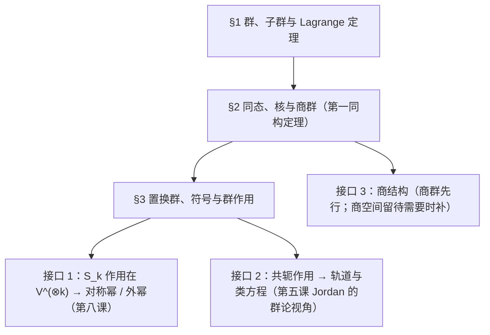
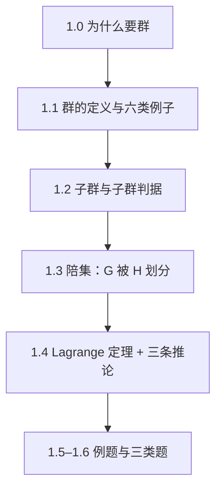
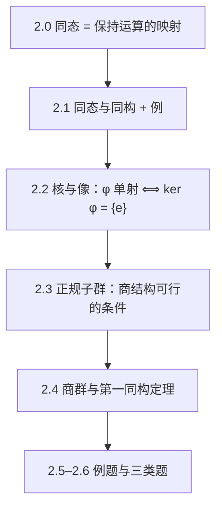
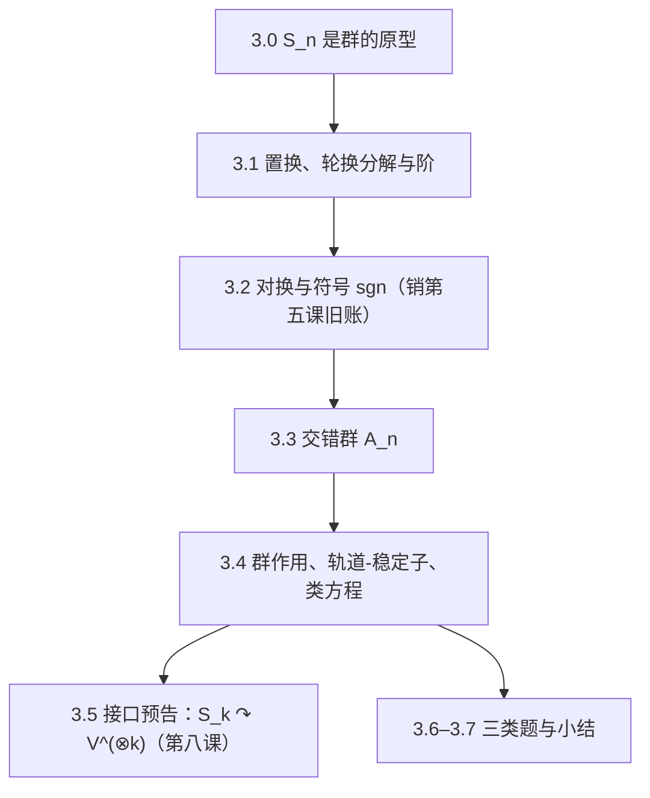

# 高等代数 第七课：群论基础（补）

> **课程**：高等代数 MA103（补充·前置）——为第八课"双线性形式与张量入门"与后续表示论（M10）提供平台 ｜ **讲师**：数学教授 Prof-Math-V2 ｜ **课程日期**：2026-10-06 ｜ **版本**：**v1.0（送审中，2026-10-06）**
> **交付形式**：单一讲义文件（分节写作 → 一次合并；审稿记录见 `lectures/math/review_reports/`）
> **勘误**：v1.0 初稿（2026-10-06 一次成稿；每章含章引言／概念讲解／示范例题＋**真算核验**／小结预告，并配三类题）。**遵循本课口径**：公式一律单美元配对；求和下标写全上下限；**未经审稿不得定稿**；引用一律点名到已学课程的节次。
> **未证输入**：本课结论**全部就地证明**，无新增登记表输入。用到的**元层**事实四条：$\mathbb Z$ 的良序性、数学归纳法、**整数的带余除法**（§1.6 答案 3 用）、**有限集的抽屉原理**（§3.3 独立习题 1 用）；均属已用元层，第五课同此口径。
> **旧账销号**：① 第五课 §5.1 的行列式置换展开式已使用 $S_n$ 与 $\mathrm{sgn}$，但当时**均未定义**（附录 A 只列记号）——本课 §3.2 补齐并销号；② $GL_n$ 共轭作用下的**轨道-稳定子**此前作为待学项登记（同学 2026-09-23 追问"轨道-稳定子与链分解的关系"）——本课 §3.4 正式讲。

## 目录

1. §1 群、子群与 Lagrange 定理
2. §2 同态、核与商群（第一同构定理）
3. §3 置换群、符号与群作用（轨道-稳定子）
4. 自测 T1／T2／T3
5. 附录 A 本课记号表

***

## §1 群、子群与 Lagrange 定理

> **本章**：建立"群"这一个对象与一件工具。工具只有一件——**陪集划分**：它把"$G$ 的大小"与"子群的大小"挂上钩，得到本课最有用的定量结论 Lagrange 定理。

### 1.0 章引言：为什么要造"群"

到目前为止我们手上有两类"结构"：**向量空间**（第一课）与**线性映射**（第二课）。它们的共同点是"运算"：向量可以加、可以乘数。

但数学里还有一批现象，它们**不是加法也不是数乘**，却具有同样的"可复合、可还原"的骨架：把一个正方形转 $90^\circ$、再转 $90^\circ$，等于转 $180^\circ$；把三个物体重新排列，再做一次重新排列，等于做第三次排列。这类现象的公共骨架就是**群**。

本课的三重目的：

1. **给第八课造平台**：$k$ 个变元的置换构成的群 $S_k$ 作用在张量空间 $V^{\otimes k}$ 上，"对称张量"与"反对称张量"正好是该作用的两个最基本成分。不先讲群，第八课的外代数只能"一瞥"；
2. **还一笔旧账**：第五课 §5.1 的行列式置换展开式 $\det A=\sum_{\sigma\in S_n}\mathrm{sgn}(\sigma)\prod_{i=1}^{n}a_{i,\sigma(i)}$ 里出现的 $S_n$ 与 $\mathrm{sgn}$，当时**只列了记号、没有定义**；本课把它们定义出来；
3. **打开一条新线**：**商结构**。此前两课（第五课 §3.2、第六课 Schur 定理）都特意避开了"商空间"；群里先做**商群**（只需集合层面的等价类，门槛最低），日后补商空间时就有现成经验。

### 1.1 群的定义与第一批例子

**定义 1（群）**。设 $G$ 是非空集合，$G\times G\to G$，$(a,b)\mapsto ab$ 是 $G$ 上的一个**运算**。若

1. **结合律**：$(ab)c=a(bc)$ 对一切 $a,b,c\in G$；
2. **单位元**：存在 $e\in G$ 使 $ea=ae=a$ 对一切 $a\in G$；
3. **逆元**：对每个 $a\in G$ 存在 $a^{-1}\in G$ 使 $aa^{-1}=a^{-1}a=e$，

则称 $G$（连同该运算）是一个**群**。若还满足

4. **交换律**：$ab=ba$ 对一切 $a,b\in G$，

则称 $G$ 是**阿贝尔群**（交换群）。$G$ 的元素个数 $|G|$ 称为**阶**（$|G|=\infty$ 时称无限群）。

> **注（公理可以更省）**：条件 2、3 中的"双侧"是冗余的——只要求**左**单位元 $e$ 与**左**逆（$ea=a$、$a^{-1}a=e$）就足以推出双侧（练习：$aa^{-1}=e$ 的推导要用到 $a^{-1}$ 自身的左逆）。本课按定义 1 使用，不再化简。

**例 1（必背的六类例子）**。

1. **加法群**：$(\mathbb Z,+)$、$(\mathbb Q,+)$、$(\mathbb R,+)$、$(\mathbb C,+)$；单位元 $0$，$a^{-1}=-a$；全部阿贝尔。
2. **模 $n$ 加法群**：$\mathbb Z/n\mathbb Z=\{0,1,\dots,n-1\}$，运算为"相加后取模 $n$"；单位元 $0$，$k^{-1}=n-k$（$k\neq0$）；阿贝尔，阶 $n$。（第三课特征值、第五课幂零块里已经用过它的加法，但那时没有"群"这个名字。）
3. **置换群**：$S_n$ ＝ $\{1,\dots,n\}$ 到自身的**全体双射**，运算为复合 $\sigma\tau$（**先做 $\tau$、后做 $\sigma$**）；单位元为恒等置换 $\mathrm{id}$。$|S_n|=n!$。$n\ge3$ 时**非阿贝尔**（例：(12)(13)$\neq$(13)(12)，见 §3.1）。
4. **一般线性群**：$GL_n(\mathbb F)=\{A\in M_n(\mathbb F):\det A\neq0\}$，运算为矩阵乘法；单位元 $I$；$A^{-1}$ 即逆矩阵（第五课 §5.3 可逆判据）。$n\ge2$ 时非阿贝尔。
5. **单位根群**：$\mu_n=\{z\in\mathbb C:z^n=1\}$，运算为复数乘法；$|\mu_n|=n$；阿贝尔。几何上它是复平面上正 $n$ 边形的**旋转对称**（第三课/第六课用过 $e^{2\pi i/n}$ 的相位）。
6. **二面体群** $D_n$：正 $n$ 边形的**对称**全体——$n$ 个**旋转**（含恒等，即转 $\frac{2\pi}{n}$ 的整数倍）与 $n$ 个**翻折**，故 $|D_n|=2n$。记 $r$ 为转 $\frac{2\pi}{n}$、$s$ 为一个翻折，则复合满足 $r^n=e$、$s^2=e$、$srs=r^{-1}$（这三条只作**刻画性说明**，本课不证明、也不用它做任何推理）；$n\ge3$ 时 $D_n$ 非阿贝尔。本课只在 §3.4 用它做一个群作用的核验。

**例 2（不是群的三个反例）**。

1. $(\mathbb N,+)$：**没有单位元**（$0\notin\mathbb N$ 按本课程约定），更谈不上逆元；
2. $(\mathbb Z,\times)$：有单位元 $1$，但 $2$ **没有乘法逆元**（$\frac12\notin\mathbb Z$）；
3. $(\mathbb R,\times)$：$0$ 没有逆元——去掉 $0$ 后才是群，记 $\mathbb R^\times$（同理 $\mathbb F^\times$）。

### 1.2 子群

**定义 2（子群）**。设 $H\subseteq G$ 非空。若 $H$ 在 $G$ 的运算下**自身成群**，则称 $H$ 是 $G$ 的**子群**，记 $H\le G$。

**定理 1（子群判据）**。设 $H\subseteq G$ 非空。则

$H\le G\iff\text{对一切 }a,b\in H:\ ab^{-1}\in H .$

*证明*。**（$\Rightarrow$）**$H$ 是群，故 $b^{-1}\in H$、$ab^{-1}\in H$。**（$\Leftarrow$）**逐条验证定义 1：① **结合律**：$H$ 的运算就是 $G$ 的运算，而 $G$ 满足结合律，故 $H$ 自动满足（**这一条永远不用查**）；② **单位元**：取 $a=b\in H$（$H$ 非空），得 $ab^{-1}=aa^{-1}=e\in H$（$e$ 是 $G$ 的单位元）；③ **逆元**：取 $a=e$、$b\in H$，得 $eb^{-1}=b^{-1}\in H$；④ **封闭**：取 $b\in H$，由 ③ 得 $b^{-1}\in H$，再取 $a\in H$ 与 $b$ 换成 $b^{-1}$，得 $a(b^{-1})^{-1}=ab\in H$。$\square$

**例 3**。① $n\mathbb Z=\{nk:k\in\mathbb Z\}\le\mathbb Z$；② $SL_n(\mathbb F)=\{A:\det A=1\}\le GL_n(\mathbb F)$（先记下，§2.4 会认出它就是 $\det$ 的核）；③ $\{e\}\le G$ 与 $G\le G$ 是**平凡子群**；④ $A_n=\{\sigma\in S_n:\mathrm{sgn}(\sigma)=1\}\le S_n$（§3.3）。

> **例 4（反例）**：$\{0,1\}\subseteq\mathbb Z/4\mathbb Z$ **不是**子群——$1+1=2\notin\{0,1\}$，封闭性失败。（但它"看起来像"$\mathbb Z/2\mathbb Z$；差别正是"阶与子群结构必须整除群阶"，见 §1.4。）

### 1.3 陪集：$G$ 被 $H$ 划分

**定义 3（陪集与指数）**。设 $H\le G$、$g\in G$。称

$gH=\{gh:h\in H\}\qquad(\text{左陪集}),\qquad Hg=\{hg:h\in H\}\qquad(\text{右陪集})$

为 $g$ 的**左（右）陪集**。$G$ 中**不同左陪集的个数**记为 $[G:H]$，称为 $H$ 在 $G$ 中的**指数**。

**定理 2（陪集是等价类）**。设 $H\le G$。在 $G$ 上定义关系

$a\sim b\iff a^{-1}b\in H .$

则 $\sim$ 是**等价关系**，且 $a$ 所在的等价类恰是左陪集 $aH$；于是 $G$ 被两两不交的左陪集**划分**。同理，右陪集也给出一个划分。

*证明*。**自反**：$a^{-1}a=e\in H$。**对称**：$a^{-1}b\in H\Rightarrow(a^{-1}b)^{-1}=b^{-1}a\in H$（子群对取逆封闭）。**传递**：$a^{-1}b,\,b^{-1}c\in H\Rightarrow(a^{-1}b)(b^{-1}c)=a^{-1}c\in H$（封闭）。故 $\sim$ 是等价关系。

再算等价类：$b\sim a\iff a^{-1}b\in H\iff b\in aH$（左乘 $a$）。故 $[a]_\sim=aH$。等价类两两不交且并集为 $G$ ⟹ 左陪集两两不交且并集为 $G$。右陪集同理（用关系 $ab^{-1}\in H$）。$\square$

**定理 3（陪集一样大）**。$H\le G$、$g\in G$，则映射 $h\mapsto gh$ 是 $H\to gH$ 的**双射**；故 $|gH|=|H|$。特别地，若 $H$ 有限，则每个左陪集都与 $H$ 等势。

*证明*。**满射**：$gH$ 的定义就是 $\{gh\}$。**单射**：若 $gh_1=gh_2$，左乘 $g^{-1}$ 得 $h_1=h_2$。$\square$

### 1.4 Lagrange 定理

**定理 4（Lagrange）**。设 $G$ 是**有限**群，$H\le G$。则

$|G|=[G:H]\cdot|H| .$

*证明*。由定理 2，$G$ 是 $[G:H]$ 个两两不交的左陪集之并；由定理 3，每个左陪集恰有 $|H|$ 个元素。两边数元素即可。$\square$

**推论 1**。$H\le G$（$G$ 有限）$\Rightarrow|H|$ 整除 $|G|$。

**推论 2（元素的阶整除群阶）**。设 $a\in G$、$G$ 有限。记 $a$ 的**阶**为 $\operatorname{ord}(a):=\min\{m\ge1:a^m=e\}$（良序性保证存在）。则 $|\langle a\rangle|=\operatorname{ord}(a)$，且 $\operatorname{ord}(a)$ 整除 $|G|$；特别地

$a^{|G|}=e .$

*证明*。$\langle a\rangle=\{e,a,a^2,\dots,a^{\operatorname{ord}(a)-1}\}$ 是子群（用定理 1 直接验），故 $|\langle a\rangle|=\operatorname{ord}(a)$（若 $a^i=a^j$，$0\le i<j<\operatorname{ord}(a)$，则 $a^{j-i}=e$ 与最小性矛盾）。由推论 1，$\operatorname{ord}(a)\mid|G|$，写 $|G|=\operatorname{ord}(a)\cdot t$，则 $a^{|G|}=(a^{\operatorname{ord}(a)})^{t}=e^t=e$。$\square$

**推论 3（素数阶群）**。若 $|G|=p$ 是素数，则 $G$ 循环：$G=\langle a\rangle\cong\mathbb Z/p\mathbb Z$（对任一 $a\neq e$）。

*证明*。取 $a\neq e$，则 $\operatorname{ord}(a)\neq1$ 且整除 $p$，故 $\operatorname{ord}(a)=p$，于是 $|\langle a\rangle|=p=|G|$，即 $\langle a\rangle=G$。$\square$

> **顺带（Fermat 小定理）**：取 $G=(\mathbb Z/p\mathbb Z)^\times$（非零元在乘法下成群，阶 $p-1$；逆元由第三课/第二课的可逆判据保证），推论 2 给出 $a^{p-1}\equiv1\pmod p$（$p\nmid a$）。**本课不把它当结论用**，只作"群论能立刻吐出数论定理"的例子。

**真算核验（Lagrange 的两处小规模实算）**。

① **$\mathbb Z/6\mathbb Z$ 的全部子群**：（此处先按 $n=6$ 直接列举；一般结论见 §1.6 独立习题 3）子群 ⟷ $6$ 的正因数，即 $d\in\{1,2,3,6\}$：$\{0\}$（阶 $1$）、$\langle3\rangle=\{0,3\}$（阶 $2$）、$\langle2\rangle=\{0,2,4\}$（阶 $3$）、$\mathbb Z/6\mathbb Z$（阶 $6$）。$1,2,3,6$ 全整除 $6$ ✓（推论 1）。
② **$S_3$ 的元素阶**：$|S_3|=6$。$\mathrm{id}$ 阶 $1$；三个对换 $(12),(13),(23)$ 阶 $2$；两个三循环 $(123),(132)$ 阶 $3$。$1,2,3$ 全整除 $6$ ✓（推论 2）。注意 $(12)(13)=(132)$（先做 $(13)$、后做 $(12)$，见 §3.1 的算法）阶 $3$，也整除 $6$ ✓。

### 1.5 示范例题

**例 5**。设 $G$ 有限且 $|G|=p$ 为素数，证明 $G$ 的**子群只有两个**：$\{e\}$ 与 $G$。

*解答*。设 $H\le G$。由 Lagrange，$|H|$ 整除 $p$，故 $|H|\in\{1,p\}$；$|H|=1\Rightarrow H=\{e\}$（单位元必在），$|H|=p\Rightarrow H=G$（子集且同势）✓。

**例 6**。求 $\mathbb Z/12\mathbb Z$ 中元素 $\bar 8$ 的阶，并核验它整除 $12$。

*解答*。$\bar 8$ 的阶是使 $8k\equiv0\pmod{12}$ 的最小 $k\ge1$，即 $\operatorname{lcm}(8,12)/8=24/8=3$。核验：$\bar8+\bar8=\bar{16}=\bar4$、$\bar4+\bar8=\bar{12}=\bar0$ ✓，最小性由 $k=1,2$ 分别给 $\bar8,\bar4\neq\bar0$ 确认 ✓。$3\mid12$ ✓（推论 2）。

**例 7（指数 2 的子群必正规——提前使用 §2.3 的术语）**。设 $[G:H]=2$，证明 $H\trianglelefteq G$（即左陪集＝右陪集）。

*解答*。$[G:H]=2$ 表示左陪集只有两个，其中一个必是 $H$ 本身，故 $G=H\cup gH$（$g\notin H$）且两两不交。同理由右陪集得 $G=H\cup Hg$。于是 $gH=G\setminus H=Hg$ ✓。（$S_3$ 中 $A_3$ 就是这样的例子：$|S_3|=6$、$|A_3|=3$，指数 $2$，故 $A_3\trianglelefteq S_3$。）

### 1.6 三类题

**引导练习**（带提示）：

1. 证明群中**单位元唯一**、每个元素的**逆唯一**。*提示*：设 $e,e'$ 都是单位元，比较 $ee'$；逆元用 $b=be=b(ac)=(ba)c=ec=c$。
2. 设 $a^2=e$ 对一切 $a\in G$ 成立，证明 $G$ 是**阿贝尔群**。*提示*：把 $(ab)^2=e$ 展开为 $abab=e$，先左乘 $a$、再右乘 $b$。

**独立习题**（无提示）：

1. 证明：有限群中 $\langle a\rangle$ 的阶等于 $\operatorname{ord}(a)$，并由此给出"$\operatorname{ord}(a)$ 整除 $|G|$"的一个新证明（不用推论 2）。
2. 设 $H\le G$、$[G:H]=2$。证明 $H\trianglelefteq G$；并给出一个 $[G:H]=2$ 但不是平凡情形的具体例子（写出两个群与 $H$）。
3. 证明：$\mathbb Z/n\mathbb Z$ 的子群与 $n$ 的正因数**一一对应**，对应为 $d\mapsto\langle\bar d\rangle$。

**答案与核对**：

1. $\langle a\rangle=\{a^m:m\in\mathbb Z\}$（先把 $a^{-k}:=(a^{-1})^k$ 定义好）。① **若 $a^i=a^j$（$i<j$）则 $a^{j-i}=e$**：两边左乘 $a^{-i}$ 得 $a^{j-i}=e$ ✓。② 由此 $\{e,a,\dots,a^{\operatorname{ord}(a)-1}\}$ 中元素两两不同（否则矛盾于阶的最小性），且它已是子群，故 $|\langle a\rangle|=\operatorname{ord}(a)$ ✓。③ 由 Lagrange（推论 1）得 $\operatorname{ord}(a)=|\langle a\rangle|$ 整除 $|G|$ ✓。
2. 见例 7；例子：$G=S_3$、$H=A_3$（$|A_3|=3$，指数 $2$）；或 $G=\mathbb Z/6\mathbb Z$、$H=\langle\bar2\rangle$（阶 $3$，指数 $2$，阿贝尔情形当然正规）✓。
3. **（$\subseteq$）**设 $H\le\mathbb Z/n\mathbb Z$，$H\neq\{\bar0\}$。取 $d:=\min\{k\in\{1,\dots,n\}:\bar k\in H\}$（有限非空集必有最小元）。由带余除法，任一 $k$ 写作 $k=qd+r$、$0\le r<d$；若 $\bar k\in H$ 则 $\bar r=\bar k-q\bar d\in H$，由 $d$ 的最小性得 $r=0$，即 $d\mid k$，故 $H=\langle\bar d\rangle$ ✓。**（整除性）**再证 $d\mid n$：对 $n$ 用同一除法算式，得 $\bar{n\bmod d}\in H$，故 $n\bmod d=0$ ✓。**（$\supseteq$）**反之每个正因数 $d\mid n$ 给出子群 $\langle\bar d\rangle$，且不同的 $d$ 给出不同的子群（$\langle\bar d\rangle$ 的阶为 $n/d$，$d$ 唯一）✓。**核验**：$n=6$ 给 $4$ 个子群，与 §1.4 的实算完全一致 ✓。

### 1.7 小结与预告

- **群**＝「可复合、有单位、可还原」的运算结构（定义 1）；六类例子必背（例 1）。
- **子群判据**只查一条：$ab^{-1}\in H$（定理 1）。
- **陪集划分**是唯一的工具（定理 2、3）⟹ **Lagrange** $|G|=[G:H]|H|$（定理 4）及其推论：子群阶、元素阶都整除群阶。
- **下一章**：把"结构"搬到映射上——**同态**；并第一次做**商**：$G/N$。

***

## §2 同态、核与商群（第一同构定理）

> **本章**：先说清"什么时候两个群**同构**"（这是分类问题的一半），再回答一个自然的问题：**若同态把一切都压扁，压扁之后剩下的东西还是群吗？**——答案是"当且仅当被压扁的是正规子群"，这就造出了**商群**。

### 2.0 章引言：同态是"保结构的映射"

线性代数里，"保结构的映射"是线性映射（第二课）。群论里对应物叫**同态**：它保的是"乘法"。一旦有了同态，就有两个天然的对象：**核**（被压成单位元的部分）与**像**（真正到达的部分）。第一同构定理说：**像 ≅ 群 / 核**——"商掉冗余，剩下的就是像"。这是第五课 §4 用 Bézout 造 $p_i(T)$ 那类"先造关系、再读结构"的操作的抽象原型（**注意**：第五课并未使用商空间——本课的**商群**是"商结构"在本系统内的第一次正式登场，见 §1.0 与 §2.4）。

### 2.1 同态与同构

**定义 4（同态、同构）**。设 $G,G'$ 是群，映射 $\varphi:G\to G'$。若

$\varphi(ab)=\varphi(a)\varphi(b)\qquad(\text{对一切 }a,b\in G),$

则称 $\varphi$ 是**同态**。若同态 $\varphi$ 还是**双射**，则称它是**同构**，记 $G\cong G'$。

**命题 5（同态的三件小事）**。设 $\varphi:G\to G'$ 是同态，$e,e'$ 分别是两边的单位元。则

1. $\varphi(e)=e'$；2. $\varphi(a^{-1})=\varphi(a)^{-1}$；3. $\varphi(a^k)=\varphi(a)^k$（$k\in\mathbb Z$）。

*证明*。① 由 $\varphi(e)=\varphi(ee)=\varphi(e)\varphi(e)$，两边**左乘 $\varphi(e)^{-1}$** 得 $e'=\varphi(e)$ ✓。② $\varphi(a)\varphi(a^{-1})=\varphi(aa^{-1})=\varphi(e)=e'$，同理 $\varphi(a^{-1})\varphi(a)=e'$；而"若 $ba=ab=e$ 则 $b$ 唯一"——**就地一行**：设 $c$ 也满足 $ca=ac=e$，则 $b=be=b(ac)=(ba)c=ec=c$ ✓，故 $\varphi(a^{-1})=\varphi(a)^{-1}$ ✓。③ 对 $k\ge0$ 用归纳（$k=0$ 即 ①），$k<0$ 用 ② 与 $a^k=(a^{-1})^{-k}$ ✓。$\square$

**例 8（三个典型同态）**。

1. $\det:GL_n(\mathbb F)\to\mathbb F^\times$，$A\mapsto\det A$；同态性即**行列式的乘性**（第五课 §5.2）。像＝$\mathbb F^\times$；核＝$SL_n(\mathbb F)$。
2. $\varphi:\mathbb Z\to\mathbb Z/n\mathbb Z$，$k\mapsto\bar k$；同态；核＝$n\mathbb Z$。
3. $\mathrm{sgn}:S_n\to\{\pm1\}$（§3.2 证明它是同态）——**这就是第五课"用而未定义"的那个符号**。
4. $\exp:(\mathbb R,+)\to\mathbb R^\times$，$x\mapsto e^x$：同态（$e^{x+y}=e^xe^y$）、单射，但**不是同构**（$e^x>0$，不满射）——反例提醒"同态＋单射 ≠ 同构"。

### 2.2 核与像

**定义 5（核与像）**。设 $\varphi:G\to G'$ 是同态。$\ker\varphi:=\{g\in G:\varphi(g)=e'\}$ 称为**核**；$\operatorname{im}\varphi:=\{\varphi(g):g\in G\}$ 称为**像**。

**命题 6**。$\ker\varphi\le G$ 且 $\operatorname{im}\varphi\le G'$。

*证明*。**核**：用子群判据（定理 1）：$a,b\in\ker\varphi\Rightarrow\varphi(ab^{-1})=\varphi(a)\varphi(b)^{-1}=e'e'^{-1}=e'\Rightarrow ab^{-1}\in\ker\varphi$ ✓（第二个等号用了命题 5②）。**像**：$\varphi(a)\varphi(b)^{-1}=\varphi(ab^{-1})\in\operatorname{im}\varphi$ ✓。$\square$

**定理 7（单射判据）**。同态 $\varphi$ **单射** $\iff\ker\varphi=\{e\}$。

*证明*。**（$\Rightarrow$）**若 $g\in\ker\varphi$，则 $\varphi(g)=e'=\varphi(e)$，单射给 $g=e$。**（$\Leftarrow$）**若 $\varphi(a)=\varphi(b)$，则 $\varphi(ab^{-1})=\varphi(a)\varphi(b)^{-1}=e'$，故 $ab^{-1}\in\ker\varphi=\{e\}$，即 $a=b$ ✓。$\square$

### 2.3 正规子群

**定义 6（正规子群）**。设 $N\le G$。若对一切 $g\in G$ 有

$gN=Ng\qquad(\text{等价地：}gNg^{-1}=N,\ \text{即 }gng^{-1}\in N\ \forall n\in N),$

则称 $N$ 是 $G$ 的**正规子群**，记 $N\trianglelefteq G$。

> **为什么是"左右陪集相等"而不是"相等就完事"**：§2.4 要在一个**陪集集合**上定义乘法 $(gN)(hN):=(gh)N$——这要求"换代表元不换结果"，而第 2.4 节的反例会显示：正是正规性保证这一点。

**定理 8（正规性的三个等价刻画）**。设 $N\le G$。以下等价：

(a) $N\trianglelefteq G$； (b) $N$ 是某个从 $G$ 出发的同态的核； (c) 对一切 $g\in G$：$gNg^{-1}\subseteq N$。

*证明*。**(a)$\Rightarrow$(c)** 显然。**(c)$\Rightarrow$(a)**：由 $gNg^{-1}\subseteq N$ 得 $gN\subseteq Ng$；把 $g$ 换成 $g^{-1}$ 得 $g^{-1}Ng\subseteq N$，即 $Ng\subseteq gN$。两向合成 $gN=Ng$ ✓。**(a)$\Rightarrow$(b)**：取 $\varphi:G\to G/N$（§2.4 的自然投射 $g\mapsto gN$），则 $\ker\varphi=N$（**就地验证**：$gN=N\iff g\in N$，故 $\ker\varphi=\{g:gN=N\}=N$ ✓）。**(b)$\Rightarrow$(c)**：设 $N=\ker\varphi$，则对 $n\in N$：$\varphi(gng^{-1})=\varphi(g)e'\varphi(g)^{-1}=e'$，故 $gng^{-1}\in N$ ✓。$\square$

**例 9**。① **阿贝尔群的每个子群都正规**（因为 $gn=ng$，故 $gNg^{-1}=N$）；② $SL_n(\mathbb F)\trianglelefteq GL_n(\mathbb F)$（它是 $\det$ 的核，用 (b)）；③ $A_n\trianglelefteq S_n$（它是 $\mathrm{sgn}$ 的核，§3.3）。

> **例 10（不正规的子群）**：$H=\{e,(12)\}\le S_3$ **不正规**。核验：$(13)H=\{(13),(13)(12)\}=\{(13),(123)\}$（用 §3.1 的算法算 $(13)(12)$：$1\to2\to2$、$2\to1\to3$、$3\to3\to1$，故 $=(123)$），而 $H(13)=\{(13),(12)(13)\}=\{(13),(132)\}$；两者不等（$(123)\neq(132)$）✗。**这正是 §2.4 反例的引信。**

### 2.4 商群与第一同构定理

**定义 7（商群）**。设 $N\trianglelefteq G$。在**陪集集合** $G/N:=\{gN:g\in G\}$ 上定义

$(gN)(hN):=(gh)N .$

则 $G/N$ 在此运算下成群，称 $G$ 对 $N$ 的**商群**；其单位元是 $N$，$(gN)^{-1}=g^{-1}N$。

*证明（必须点出"良定义"这一步）*。**① 良定义**：设 $gN=g'N$、$hN=h'N$，要证 $(gh)N=(g'h')N$。由 $gN=g'N$ 得 $g'=gn_1$（某 $n_1\in N$）；由 $hN=h'N$ 得 $h'=hn_2$。于是

$g'h'=gn_1hn_2=g\,(n_1h)\,n_2=g\,h\,(h^{-1}n_1h)\,n_2\in ghN$

（**这里用了正规性**：$n_1h=h(h^{-1}n_1h)$ 且 $h^{-1}n_1h\in N$）。故 $g'h'\in ghN$，即 $(g'h')N=(gh)N$ ✓。**② 结合律**：直接由 $G$ 的结合律与定义的 $(gN)(hN)=(gh)N$ 得 ✓。**③ 单位元**：$(gN)(eN)=(ge)N=gN$ ✓。**④ 逆元**：$(gN)(g^{-1}N)=(gg^{-1})N=eN=N$ ✓。$\square$

> **顺带（前面 §2.3 定理 8 的 (a)$\Rightarrow$(b) 已用到）**：$\pi:G\to G/N$、$\pi(g):=gN$ 是**满同态**——$\pi(gh)=ghN=(gN)(hN)=\pi(g)\pi(h)$（用定义 7 的乘法），满射显然；且 $\ker\pi=N$（由 $gN=N\iff g\in N$）✓。

> **例 11（非正规则商集不成群——§2.3 例 10 的引信炸开）**：仍取 $H=\{e,(12)\}\le S_3$。陪集 $H$ 与 $(13)H=\{(13),(123)\}$。按定义算 $(13)H\cdot(13)H=((13)(13))H=eH=H$；但若换代表元 $(123)\in(13)H$（因 $(123)\in(13)H$），则 $(123)(13)=(23)$（核验：$1\to3\to1$、$2\to2\to3$、$3\to1\to2$，故 $=(23)$），于是该乘积 $=(23)H\ne H$ ✗。**同一对陪集、两组代表元，乘积不同** ⟹ 运算不良定义。

**定理 9（第一同构定理）**。设 $\varphi:G\to G'$ 是同态。则 $\ker\varphi\trianglelefteq G$，且

$G/\ker\varphi\ \cong\ \operatorname{im}\varphi,\qquad\text{同构由 }\ \bar\varphi:g\ker\varphi\mapsto\varphi(g)\ \text{给出}.$

*证明*。**① 核正规**：定理 8 的 (b)（取 $\varphi$ 自己）✓。**② $\bar\varphi$ 良定义**：若 $g\ker\varphi=g'\ker\varphi$，则 $g^{-1}g'\in\ker\varphi$，故 $\varphi(g)^{-1}\varphi(g')=\varphi(g^{-1}g')=e'$，即 $\varphi(g)=\varphi(g')$ ✓。**③ 同态**：$\bar\varphi\big((g\ker\varphi)(h\ker\varphi)\big)=\bar\varphi(gh\ker\varphi)=\varphi(gh)=\varphi(g)\varphi(h)$ ✓。**④ 单射**：若 $\bar\varphi(g\ker\varphi)=e'$，即 $\varphi(g)=e'$，则 $g\in\ker\varphi$，故 $g\ker\varphi=\ker\varphi$＝商群的单位元 ✓（用定理 7）。**⑤ 满射**：对 $\varphi(g)\in\operatorname{im}\varphi$ 取 $g\ker\varphi$ 即可 ✓。$\square$

**真算核验（三处）**。

① $\mathbb Z/n\mathbb Z$ 的名字：取 $\varphi:\mathbb Z\to\mathbb Z/n\mathbb Z$、$k\mapsto\bar k$。$\ker\varphi=n\mathbb Z$，$\operatorname{im}\varphi=\mathbb Z/n\mathbb Z$，定理 9 给出 $\mathbb Z/n\mathbb Z\cong\mathbb Z/n\mathbb Z$ ✓（**"模 $n$"这个名字本身就是一次商**）。
② $GL_n/\ker\det\cong\mathbb F^\times$，即 $GL_n(\mathbb F)/SL_n(\mathbb F)\cong\mathbb F^\times$ ✓（$\det$ 满射：取 $\mathrm{diag}(\lambda,1,\dots,1)$ 即得 $\lambda$）。
③ 小规模实算：$G=\mathbb Z/6\mathbb Z$、$N=\langle\bar3\rangle=\{\bar0,\bar3\}$（阶 $2$、正规因阿贝尔）。商群 $G/N$ 有三个元素：$\{\bar0,\bar3\}$、$\{\bar1,\bar4\}$、$\{\bar2,\bar5\}$，阶 $3$ ⟹ $G/N\cong\mathbb Z/3\mathbb Z$ ✓（与 Lagrange 一致：$|G/N|=[G:N]=3$）。

### 2.5 示范例题

**例 12**。证明：$GL_n(\mathbb F)/SL_n(\mathbb F)\cong\mathbb F^\times$。

*解答*。取例 8 的 $\det$，它是同态、$\ker\det=SL_n$、$\operatorname{im}\det=\mathbb F^\times$（② 的核验）。由定理 9 即得 ✓。

**例 13**。设 $G$ 有限、$\varphi:G\to G'$ 同态。证明 $|\operatorname{im}\varphi|$ 整除 $|G|$，且 $=\,[G:\ker\varphi]$。

*解答*。由定理 9，$G/\ker\varphi\cong\operatorname{im}\varphi$，故 $|\operatorname{im}\varphi|=|G/\ker\varphi|=[G:\ker\varphi]$；再由 Lagrange（定理 4）$|G|=[G:\ker\varphi]|\ker\varphi|$，故它整除 $|G|$ ✓。

**例 14（"商群循环 ⟹ 群阿贝尔"）**。证明：若 $G/Z(G)$ 是**循环**群（$Z(G)$ 为 $G$ 的中心：与一切元素交换的元素全体），则 $G$ 是阿贝尔群。

*解答*。设 $G/Z(G)=\langle gZ(G)\rangle$。任取 $x,y\in G$，则 $xZ(G)=g^iZ(G)$、$yZ(G)=g^jZ(G)$（某 $i,j$），即 $x=g^iz_1$、$y=g^jz_2$（$z_1,z_2\in Z(G)$）。于是

$xy=g^iz_1g^jz_2=g^{i+j}z_1z_2=g^jg^iz_2z_1=g^jz_2g^iz_1=yx$

（中间用了 $z_i$ 与一切元素交换、$g^i$ 与 $g^j$ 交换）✓。**推论**：若 $[G:Z(G)]$ 是素数，则 $G/Z(G)$ 阶为素数从而是循环群（推论 3），故 $G$ 阿贝尔。

### 2.6 三类题

**引导练习**（带提示）：

1. 证明命题 5 的三条（$e\mapsto e'$、逆↦逆、幂↦幂）。*提示*：① 用 $\varphi(e)=\varphi(ee)$ 并左乘 $\varphi(e)^{-1}$；② 用逆元唯一性；③ 对 $k\ge0$ 归纳。
2. 证明 $\ker\varphi\trianglelefteq G$，**不用**定理 9（即按定义 6 直接验）。*提示*：对 $n\in\ker\varphi$，算 $\varphi(gng^{-1})$。

**独立习题**（无提示）：

1. 求 $\det:GL_2(\mathbb R)\to\mathbb R^\times$ 的核与像，写出 $GL_2(\mathbb R)/SL_2(\mathbb R)$ 的同构对象，并给一个具体的陪集代表元例子。
2. 证明 §2.3 例 10 的 $H=\{e,(12)\}$ 不正规，并**具体算出**在哪一对陪集、哪两组代表元上乘法不良定义。
3. 证明：若 $[G:Z(G)]$ 是素数，则 $G$ 是阿贝尔群。（用命题：$G/Z(G)$ 循环 $\Rightarrow G$ 阿贝尔。）

**答案与核对**：

1. $\ker\det=\{A:\det A=1\}=SL_2(\mathbb R)$；$\operatorname{im}\det=\mathbb R^\times$（取 $\mathrm{diag}(\lambda,1)$，$\det=\lambda$，$\lambda\neq0$ 任意）⟹ $GL_2/SL_2\cong\mathbb R^\times$ ✓。陪集例子：$\mathrm{diag}(2,1)SL_2=\{$ 一切 $\det=2$ 的矩阵 $\}\ni\begin{pmatrix}2&0\\0&1\end{pmatrix},\begin{pmatrix}0&2\\1&0\end{pmatrix}$（后者 $\det=-2$，**不属于**该陪集——这类"抓一个看行列式"的自检就是本条的核验方式）✓。
2. 已在例 10 与例 11 中逐步算出：$(13)H=\{(13),(123)\}$、$H(13)=\{(13),(132)\}$，两者不等故不正规；不良定义处＝$(13)H\cdot(13)H$，代表元 $(13)$ 给 $H$，代表元 $(123)$ 给 $(23)H$，两者不同 ✓。
3. 见例 14；素数情形由推论 3（素数阶群循环）搭桥 ✓。

### 2.7 小结与预告

- **同态**保乘法，于是自动保单位元与逆（命题 5）；**单射 ⟺ 核平凡**（定理 7）。
- **正规子群**是"能商"的充要条件（定理 8）；商群的乘法是**良定义**的，这一步必须显式验证（定义 7 的①）。
- **第一同构定理**：$G/\ker\varphi\cong\operatorname{im}\varphi$（定理 9）——"商掉冗余＝像"。
- **下一章**：拿最重要的例子 $G=S_n$ 具体算一遍，并引入**群作用**——它是第八课"对称/反对称张量"的入口。

***

## §3 置换群、符号与群作用（轨道-稳定子）

> **本章**：把 $S_n$ 算清楚（轮换分解、阶、符号），再引入本课最有生产性的概念——**群作用**。轨道-稳定子定理 $|G|=|G\cdot x|\cdot|G_x|$ 是"数数"的万能工具；第八课的对称/外幂、第五课 Jordan 形的"共轭轨道"都由它统一。

### 3.0 章引言：$S_n$ 是群的原型

置换群 $S_n$ 是"对称性"最原始的例子：一个有限集合上的任何对称结构，都可以用"重排元素"来描述。本章先把它**算清楚**——轮换分解、阶、符号；这同时销掉第五课留下的一笔旧账：行列式置换展开式 $\det A=\sum_{\sigma\in S_n}\mathrm{sgn}(\sigma)\prod_{i=1}^{n}a_{i,\sigma(i)}$ 里的 $\mathrm{sgn}$ 当时只列了记号、**没有定义**（本课 §3.2 补齐）。

随后引入本课最有生产性的概念——**群作用**，用它统一两类看似无关的现象：**共轭轨道**（第五课 Jordan 形的"相似类"）与**对称/反对称**（第八课将讲的外幂 $\Lambda^kV$）。§3.5 只给方向：$S_k$ 作用在第八课的 $V^{\otimes k}$ 上，把张量空间切成"对称"与"反对称"两块。

### 3.1 置换、轮换分解与阶

**定义 8（置换、轮换）**。$S_n$ 的元素称**置换**。若存在互不相同的 $i_1,\dots,i_k$ 使

$\sigma(i_1)=i_2,\ \sigma(i_2)=i_3,\ \dots,\ \sigma(i_{k-1})=i_k,\ \sigma(i_k)=i_1,\quad\text{其余元素不动},$

则称 $\sigma$ 是一个 **$k$-轮换**，记 $\sigma=(i_1i_2\cdots i_k)$；$k=2$ 时称**对换**。

**约定**：乘积 $\sigma\tau$ 表示**先做 $\tau$、后做 $\sigma$**（与第二课"映射复合"的读法一致：$(\sigma\tau)(i)=\sigma(\tau(i))$）。

**定理 10（不交轮换分解）**。任一 $\sigma\in S_n$（$\sigma\neq\mathrm{id}$）可唯一地（不计次序）写成**互不相交**的轮换之积；若这些轮换的长度为 $k_1,\dots,k_r$，则

$\operatorname{ord}(\sigma)=\operatorname{lcm}(k_1,\dots,k_r).$

*证明*。**存在性**：取 $i_1$，令 $i_{t+1}:=\sigma(i_t)$；因 $S_n$ 有限，序列必首度重复，且重复者只能是 $i_1$（若 $i_{s+1}=i_{t+1}$、$s<t$，则作用 $\sigma^{-1}$ 得 $i_s=i_t$，与"首次重复"矛盾），于是得到轮换 $(i_1\cdots i_k)$；它对补集封闭（若 $\sigma(j)$ 落在该轮换内，则 $j$ 也在内），故可在补集上重复，得分解。**唯一性**：轮换的循环次序由 $\sigma$ 的作用唯一决定，且"同一条链"必出现在同一条轮换里 ✓。**阶**：不交轮换彼此交换，故 $\sigma^m=\mathrm{id}\iff$ 每个轮换的 $m$ 次幂皆为 $\mathrm{id}\iff$ 每个 $k_i\mid m$，最小正解即 $\operatorname{lcm}$ ✓。$\square$

**算法（不是定理，但必须会）**：算 $\sigma\tau$ 时**从右往左**逐个元素跟踪。例：$\tau=(12)$、$\sigma=(13)$。$1\overset{\tau}{\to}2\overset{\sigma}{\to}2$；$2\overset{\tau}{\to}1\overset{\sigma}{\to}3$；$3\overset{\tau}{\to}3\overset{\sigma}{\to}1$。故 $(13)(12)=(123)$ ✓。

### 3.2 对换与符号（销第五课的旧账）

**定理 11（对换生成）**。任一置换可写成若干**对换**之积；$(i_1i_2\cdots i_k)=(i_1i_k)(i_1i_{k-1})\cdots(i_1i_2)$。

*证明*。右端从右往左作用：$i_1\mapsto i_2$（最后一步 $(i_1i_2)$ 把它送到 $i_2$，此前各步只动 $i_1$），$i_2\mapsto i_1\mapsto i_3$，……，$i_k\mapsto i_1$。逐项核对即得 ✓。（**依据点名**：只用了"复合＝从右往左作用"这条约定。）

**定义 9（符号 $\mathrm{sgn}$）**。设 $\sigma\in S_n$，把它写成对换之积，若次数为 $t$ 则定义 $\mathrm{sgn}(\sigma):=(-1)^t$；偶数次称**偶置换**，奇数次称**奇置换**。

**定理 12（$\mathrm{sgn}$ 良定义，且是同态）**。$\mathrm{sgn}$ 不依赖对换分解的选法，且

$\mathrm{sgn}(\sigma\tau)=\mathrm{sgn}(\sigma)\,\mathrm{sgn}(\tau),\qquad \mathrm{sgn}(\sigma^{-1})=\mathrm{sgn}(\sigma);$
若 $\sigma$ 的不交轮换分解（含 $1$-轮换）共有 $c(\sigma)$ 个轮换，则
$\mathrm{sgn}(\sigma)=(-1)^{\,n-c(\sigma)} .$

*证明（要点）*。① **对换次数的奇偶性唯一**：记 $D(x_1,\dots,x_n):=\prod_{1\le i<j\le n}(x_j-x_i)$（$n$ 元多项式；取 $x_i=i$ 可见 $D\neq0$）。对 $\sigma\in S_n$ 定义 $\sigma\cdot D:=D(x_{\sigma(1)},\dots,x_{\sigma(n)})$，则 $(\tau\sigma)\cdot D=\tau\cdot(\sigma\cdot D)$（两边都等于 $D(x_{\tau(\sigma(1))},\dots)$——**逐项核对即可**）。两条核验：**(i)** 交换两个变量把 $D$ 变成 $-D$：含这两个变量"一内一外"的因子集合在交换下整体互换，而唯一"同时含两者"的因子 $(x_q-x_p)$ 变成 $(x_p-x_q)=-(x_q-x_p)$，故只差一个符号；于是**左乘一个对换把 $D$ 变成 $-D$**。**(ii)** 若把 $\mathrm{id}$ 写成 $t$ 个对换之积，则由 (i) 与 $(\tau\sigma)\cdot D=\tau\cdot(\sigma\cdot D)$ 得 $D=(-1)^tD$，由 $D\neq0$ 得 $(-1)^t=1$，即 $t$ 必为偶数。故**任何分解的对换个数的奇偶性相同**。**对一般的 $\sigma$**：若 $\sigma=\tau_t\cdots\tau_1$ 与 $\sigma=\rho_s\cdots\rho_1$ 是两个分解，把第一个**取逆**后与第二个**相乘**，得 $\mathrm{id}$ 的一个**长度为 $t+s$ 的分解**；由 (ii)（$\mathrm{id}$ 的任何分解长度为偶）得 $t+s$ 为偶 ⟹ $t,s$ 同奇偶 ⟹ $(-1)^t=(-1)^s$ ⟹ $\mathrm{sgn}$ 良定义 ✓。② **同态性**：若 $\sigma$ 用 $s$ 个对换、$\tau$ 用 $t$ 个对换写成，则 $\sigma\tau$ 用 $s+t$ 个对换写成，故 $\mathrm{sgn}(\sigma\tau)=(-1)^{s+t}=(-1)^s(-1)^t$ ✓。③ **逆**：$\sigma\sigma^{-1}=\mathrm{id}$ 给 $\mathrm{sgn}(\sigma)\mathrm{sgn}(\sigma^{-1})=1$，而取值 $\pm1$，故相等 ✓。④ **公式**：$k$-轮换 $=(i_1i_k)\cdots(i_1i_2)$ 用了 $k-1$ 个对换 ⟹ $k$-轮换的符号为 $(-1)^{k-1}$；不交轮换之积的符号＝各符号之积＝$(-1)^{\sum_{j=1}^{r}(k_j-1)}$，而 $\sum_{j=1}^{r}k_j=n$（含所有 $1$-轮换）故指数 $=n-c(\sigma)$ ✓。$\square$

> **第五课旧账销号**：第五课 §5.1 的置换展开式 $\det A=\sum_{\sigma\in S_n}\mathrm{sgn}(\sigma)\prod_{i=1}^{n}a_{i,\sigma(i)}$ 里用到的 $S_n$ 与 $\mathrm{sgn}$，其定义即本节的定理 11 与定义 9／定理 12。**至此该记号有了出处**（此前附录 A 只列记号、未定义）。

**真算核验**。取 $\sigma=(1234)(56)\in S_6$。① **阶** $=\operatorname{lcm}(4,2)=4$：$\sigma^2=(13)(24)$（$(56)^2=\mathrm{id}$）、$\sigma^4=\mathrm{id}$ ✓。② **符号**：$c(\sigma)=2$（两个轮换），$n=6$，故 $\mathrm{sgn}=(-1)^{6-2}=+1$；另算：$(1234)$ 用 $3$ 个对换、$(56)$ 用 $1$ 个，共 $4$ 个 ⟹ $(-1)^4=+1$ ✓ 两法一致。

### 3.3 交错群

**定义 10（交错群）**。$A_n:=\{\sigma\in S_n:\mathrm{sgn}(\sigma)=1\}$。

**定理 13**。$A_n\trianglelefteq S_n$，且 $n\ge2$ 时 $|A_n|=\dfrac{n!}{2}$。

*证明*。① 若 $s,t$ 都是偶置换，则 $st^{-1}$ 也偶（定理 12 的同态性与 ③），故 $A_n\le S_n$（定理 1）；② $A_n=\ker(\mathrm{sgn})$，由定理 8 的 (b) 得正规 ✓；③ 取对换 $\tau=(12)$，映射 $A_n\to S_n\setminus A_n$（奇置换集），$\sigma\mapsto\tau\sigma$ 是双射（逆映射同为左乘 $\tau$），故两集合等势，$|A_n|=\frac{n!}{2}$ ✓。$\square$

### 3.4 群作用与轨道-稳定子

**定义 11（群作用）**。设 $G$ 是群、$X$ 是集合。映射 $G\times X\to X$，$(g,x)\mapsto g\cdot x$ 若满足

$e\cdot x=x,\qquad (gh)\cdot x=g\cdot(h\cdot x)\qquad(\forall g,h\in G,\ \forall x\in X),$

则称 $G$ **作用**在 $X$ 上（$X$ 称 $G$-集）。

**例 15（三个必会的作用）**。① **标准作用**：$S_n$ 作用在 $\{1,\dots,n\}$ 上，$\sigma\cdot i:=\sigma(i)$；② **共轭作用**：$G$ 作用在自身（$X=G$）上，$g\cdot x:=gxg^{-1}$（这是第五课"$GL_n$ 共轭作用在矩阵上"的抽象版：矩阵相似类＝共轭轨道）；③ **几何作用**：$D_n$ 作用在正 $n$ 边形的顶点集上。

**定义 12（轨道、稳定子）**。设 $G$ 作用在 $X$ 上、$x\in X$。
$G\cdot x:=\{g\cdot x:g\in G\}\ (\textbf{轨道}),\qquad G_x:=\{g\in G:g\cdot x=x\}\ (\textbf{稳定子}).$

**命题 14**。$G_x\le G$；$X$ 被各轨道**划分**。

*证明*。**子群**：$e\in G_x$；$g,h\in G_x\Rightarrow(gh^{-1})\cdot x=g\cdot(h^{-1}\cdot x)=g\cdot x=x$（末步用 $h^{-1}\cdot x=x$，由 $h\cdot x=x$ 两边作用 $h^{-1}$ 得）✓（定理 1）。**划分**：定义 $x\sim y\iff\exists g:y=g\cdot x$；自反、对称（用 $g^{-1}$）、传递（用定义 11 的第二条）✓。$\square$

**定理 15（轨道-稳定子）**。设 $G$ 有限、作用于 $X$、$x\in X$。则 $[G:G_x]=|G\cdot x|$；特别地

$|G|=|G\cdot x|\cdot|G_x| .$

*证明*。构造 $\Phi:G/G_x\to G\cdot x$、$\Phi(gG_x)=g\cdot x$（**记号说明**：$G_x$ 一般**不正规**，故 $G/G_x$ 此处只表示"左陪集的**集合**"，不是商群；定理 15 只用它的**基数** $[G:G_x]$）。**① 良定义**：若 $gG_x=hG_x$，则 $h^{-1}g\in G_x$，故 $h^{-1}\cdot(g\cdot x)=(h^{-1}g)\cdot x=x$，即 $g\cdot x=h\cdot x$ ✓。**② 满射**：轨道的定义就是 $\{g\cdot x\}$ ✓。**③ 单射**：若 $g\cdot x=h\cdot x$，则 $(h^{-1}g)\cdot x=x$，即 $h^{-1}g\in G_x$，故 $gG_x=hG_x$ ✓。于是 $|G\cdot x|=|G/G_x|=[G:G_x]$，再由 Lagrange（定理 4）$|G|=[G:G_x]\cdot|G_x|$ ✓。$\square$

**推论 4（类方程）**。设 $G$ 有限，作用于自身（共轭作用 $g\cdot x=gxg^{-1}$）。则轨道＝**共轭类**，稳定子 $G_x=\{g:gx=xg\}=:C_G(x)$（**中心化子**），且

$|G|=\sum_{i=1}^{s}[G:C_G(x_i)]\qquad(\text{各类取一个代表元 }x_1,\dots,x_s),$

其中"$x$ 的共轭类只有自己"$\iff x\in Z(G)$（中心）。

*证明*。轨道-稳定子给出 $|G\cdot x|=[G:C_G(x)]$；§3.4 命题 14 说轨道划分 $G$，把各轨道的基数相加即得第一式 ✓。末句：$g\cdot x=x$ 对一切 $g$ $\iff$ $gx=xg$ 对一切 $g$ $\iff x\in Z(G)$，此时轨道 $=\{x\}$ ✓。$\square$

**真算核验（三处）**。

① $S_3$ 的共轭类与类方程：$|S_3|=6$；类 $\{e\}$（$1$ 个）、三个对换（$3$ 个，阶 $2$）、两个三循环（$2$ 个，阶 $3$）。核验 $6=1+3+2$ ✓（推论 4）。**另一读法**：共轭保持轮换型，故按轮换型分类 ✓。
② $D_4$ 作用在正方形顶点上（$|D_4|=8$）：取顶点 $v_0$，稳定子＝$\{e,\ $过 $v_0$ 与对顶点的对角线翻折$\}$，阶 $2$；故 $|G\cdot v_0|=8/2=4$＝全部顶点数 ✓（定理 15）。
③ $S_4$ 标准作用：$|S_4|=24$，稳定子 $=(S_4)_{1}$＝固定 $1$ 的置换全体 $\cong S_3$，阶 $6$；$24=4\times6$ ✓。

### 3.5 接口小节（📋 预告：为第八课铺路）

> **本节只给方向**：$V^{\otimes k}$ 属**第八课**，**本课不定义、不使用**它；下面出现的相关记号一律只作预告。

设 $V$ 是有限维向量空间，第八课将把"$V$ 与自身张量 $k$ 次"造成 $V^{\otimes k}$，并让 $S_k$ 作用其上：$\sigma\cdot(v_1\otimes\cdots\otimes v_k):=v_{\sigma^{-1}(1)}\otimes\cdots\otimes v_{\sigma^{-1}(k)}$。届时：

- **对称幂** $S^kV$ ＝该作用下的**不变量**（"平凡成分"）：所有 $\sigma$ 都不动的张量；
- **外幂** $\Lambda^kV$ ＝**符号成分**：满足 $\sigma\cdot T=\mathrm{sgn}(\sigma)T$ 的张量；
- 特别地 $\dim\Lambda^nV=1$（$n=\dim V$），而**行列式就是对这一维空间里"基象"的坐标读数**——第五课的置换展开式到那时会说清"为什么偏偏是 $\mathrm{sgn}$ 在当系数"。

**为什么本课先讲群**：上面这段"用 $S_k$ 把张量空间拆成两块"是第八课 §3 的骨架；不先有群作用与 $\mathrm{sgn}$，它只能写成"一瞥"。

### 3.6 三类题

**引导练习**（带提示）：

1. 计算 $\sigma=(12345)(67)\in S_7$ 的**阶**与**符号**。*提示*：阶＝长度的最小公倍数；符号用 $(-1)^{n-c}$。
2. 证明：共轭作用保持**元素的阶**（即 $\operatorname{ord}(gxg^{-1})=\operatorname{ord}(x)$），从而共轭类内元素的阶相同。*提示*：$(gxg^{-1})^m=gx^mg^{-1}$。

**独立习题**（无提示）：

1. 证明 $A_n\trianglelefteq S_n$ 且 $|A_n|=n!/2$（$n\ge2$）。
2. 用轨道-稳定子证明：$S_4$ 的标准作用满足 $24=4\times6$。
3. 写出 $S_3$ 的**共轭类**（列全）并核验类方程 $|S_3|=\sum_{i=1}^{s}[G:C_G(x_i)]$；再说明哪些元素属于 $Z(S_3)$。

**答案与核对**：

1. 阶 $=\operatorname{lcm}(5,2)=10$；$c=2$、$n=7$，故 $\mathrm{sgn}=(-1)^{7-2}=(-1)^5=-1$ ✓（另算：$(12345)$ 用 $4$ 个对换、$(67)$ 用 $1$ 个，共 $5$ 个 ⟹ $-1$ ✓ 两法一致）。
2. $(gxg^{-1})^m=gx^mg^{-1}$（可用归纳核验：$m=1$ 显然；$(gxg^{-1})^{m+1}=(gxg^{-1})^m(gxg^{-1})=gx^mg^{-1}gxg^{-1}=gx^{m+1}g^{-1}$ ✓）。故 $(gxg^{-1})^m=e\iff x^m=e$，最小正解相同 ✓。
3. 见 §3.4 的核验①：类 $\{e\}$（$1$）、$\{(12),(13),(23)\}$（$3$）、$\{(123),(132)\}$（$2$），$6=1+3+2$ ✓。中心化子：$C_G(e)=G$ 给 $[G:G]=1$；对换的 $C_G$ 阶 $2$（只有 $e$ 与它自己与其交换），故 $[G:C_G]=3$；三循环的 $C_G=\langle(123)\rangle$ 阶 $3$，故 $[G:C_G]=2$ ✓。$Z(S_3)=\{e\}$ ✓（因为非单位元的中心化子都真包含于 $G$）。

### 3.7 小结与预告

- **$S_n$ 是"对称性"的原型**：不交轮换分解唯一、阶＝长度 $\operatorname{lcm}$、符号 $\mathrm{sgn}$ 是同态、$A_n=\ker\mathrm{sgn}$（定理 10–13）。
- **群作用**把"群"与"集合"连起来；**轨道-稳定子** $|G|=|G\cdot x|\cdot|G_x|$（定理 15）是最常用的一把"数数"工具；共轭作用下它就是**类方程**（推论 4）。
- **回看第五课**：Jordan 形的"$GL_n$ 共轭轨道"、置换展开式里的 $\mathrm{sgn}$，现在都有了出处。
- **下一课（第八课）**：双线性形式与二次型 → 张量积（泛性质＋显式构造）→ 对称/外幂；§3.5 的预告将在那里落实。

***

## 自测 T1／T2／T3

**T1（必做·基础）**

1. 判断下列哪些是群，并给出理由：$(\mathbb Z,+)$；$(\mathbb N,+)$；$(\mathbb Q^\times,\times)$；$(\mathbb Z/8\mathbb Z,+)$；$(\{0,1,2,3\},$ 乘法模 $4)$。
2. 写出 $\mathbb Z/8\mathbb Z$ 的全部子群（用 §1.6 独立习题 3 的对应），并核验各自的阶整除 $8$。
3. 设 $\varphi:\mathbb Z\to\mathbb Z/12\mathbb Z$、$k\mapsto\bar k$。写出 $\ker\varphi$ 与 $\operatorname{im}\varphi$，并指出第一同构定理给出的同构。

**T2（必做·核心）**

1. 证明：有限群 $G$ 的每个元素满足 $a^{|G|}=e$；并据此说明 $\mathbb Z/7\mathbb Z$ 的非零元满足 $a^6\equiv1$。
2. 证明：$H\le G$、$[G:H]=2$ $\Rightarrow H\trianglelefteq G$；并给出一个具体例子。
3. 计算 $\sigma=(12)(345)\in S_5$ 的阶与符号；写出 $\sigma^{-1}$ 的不交轮换分解。

**T3（选做·进阶）**

1. 证明：若 $|G|=p^2$（$p$ 素数），则 $G$ 是阿贝尔群。（提示：先证 $Z(G)\neq\{e\}$——可先只用 Lagrange 处理 $|Z(G)|\in\{1,p,p^2\}$ 并说明 $|Z(G)|=p$ 时由例 14 得阿贝尔；$|Z(G)|=1$ 时用类方程排除。）
2. 用轨道-稳定子证明：$D_n$ 作用在正 $n$ 边形顶点上有 $|D_n|=n\cdot2$。
3. 说明 $\Lambda^k$（第八课将讲的外幂）"$\dim\Lambda^nV=1$"这一条为什么与"行列式是唯一的（相差一个因子）交错 $n$-线性形式"是同一句话。

**答案与核对**

- **T1**：① 是（阿贝尔，单位元 $0$）；② 不是（无单位元）；③ 是（$\mathbb Q^\times=\mathbb Q\setminus\{0\}$，逆元 $\frac1q$）；④ 是（阶 $8$）；⑤ **不是**——$0$ 虽在集合里，但 $2$ 无乘法逆元：$2x\equiv1\pmod 4$ 无解（因 $\gcd(2,4)=2\nmid1$）✗。
  ② 子群与 $8$ 的正因数对应：$\{0\}$（$1$）、$\langle\bar4\rangle=\{0,4\}$（$2$）、$\langle\bar2\rangle=\{0,2,4,6\}$（$4$）、$\mathbb Z/8$（$8$）✓（更一般地阶为 $8/d$，$d\in\{1,2,4,8\}$）。
  ③ $\ker\varphi=12\mathbb Z$、$\operatorname{im}\varphi=\mathbb Z/12\mathbb Z$，同构 $\mathbb Z/12\mathbb Z\cong\mathbb Z/12\mathbb Z$ ✓。
- **T2**：① 由推论 2 直接得；对 $\mathbb Z/7\mathbb Z$，非零元成群（阶 $6$，乘法群 $(\mathbb Z/7\mathbb Z)^\times$），故 $a^6\equiv1$（$a\not\equiv0$）✓（例如 $2^6=64\equiv1$：$64=9\cdot7+1$ ✓）。
  ② 见例 7；例子 $A_3\trianglelefteq S_3$（指数 $2$）✓。
  ③ $\sigma=(12)(345)$：两轮换不交，长度 $2,3$，阶 $=\operatorname{lcm}(2,3)=6$；$c=2$、$n=5$，$\mathrm{sgn}=(-1)^{5-2}=-1$；$\sigma^{-1}=(12)(354)$（对换自逆，$3$-轮换反向）✓。核验：$(345)(354)=\mathrm{id}$ ⟹ $(12)(345)\cdot(12)(354)=\mathrm{id}$ ✓。
- **T3**：① **$|Z(G)|\neq1$**：由类方程 $|G|=|Z(G)|+\sum_{i=1}^{s}[G:C_G(x_i)]$，每个非中心类的指标 $[G:C_G(x_i)]$ 是 $p^2$ 的**真**因数，**依据**：$x_i$ 与自身交换 ⟹ $x_i\in C_G(x_i)$；又 $x_i$ 不在中心里且 $e\in Z(G)$，故 $x_i\neq e$（若 $x_i=e$ 则它属于中心类），于是 $|C_G(x_i)|\ge2$，得 $[G:C_G(x_i)]=p^2/|C_G(x_i)|\le p^2/2$；而该指标整除 $|G|=p^2$，$p^2$ 的真因数只有 $p$ ⟹ 指标 $=p$，故被 $p$ 整除；于是 $|Z(G)|\equiv|G|\equiv0\pmod p$，即 $p\mid|Z(G)|$，故 $|Z(G)|\in\{p,p^2\}$。**$|Z(G)|=p$**：$[G:Z(G)]=p$ 为素数，由例 14（$G/Z(G)$ 循环 ⟹ 阿贝尔）得 $G$ 阿贝尔，与 $|Z(G)|=p$ 矛盾，故其实只能是 $p^2$，即 $G$ 阿贝尔 ✓。
  ② $D_n$ 有 $2n$ 个元素（$n$ 个旋转 $e,r,\dots,r^{n-1}$ 与 $n$ 个翻折）；作用在 $n$ 个顶点上，稳定子＝$\{e,\ $过该顶点的对称轴翻折$\}$ 阶 $2$（$n$ 为偶数时该轴过对面顶点，$n$ 为奇数时该轴过对边中点──两种情形稳定子都是阶 $2$），故轨道大小 $=2n/2=n$＝全部顶点 ✓。
  ③ 两者都在说"交错 $n$-线性形式的空间是一维"：$V$ 的 $n$-重外幂 $\Lambda^nV$ 与"行列式型函数"的空间同构（都要用第八课的泛性质；此处只作接口说明，不作证明）。

***

## 附录 A 本课记号表

| 记号 | 含义 | 定义处 |
| :--- | :--- | :--- |
| $G,\ \le,\ \trianglelefteq$ | 群；子群；正规子群 | §1.1、§1.2、§2.3 |
| $e,\ a^{-1},\ \operatorname{ord}(a)$ | 单位元；逆元；元素阶 | §1.1、§1.1、§1.4 |
| $|G|,\ [G:H]$ | 群的阶；子群指数 | §1.1、§1.3 |
| $gH,\ Hg$ | 左／右陪集 | §1.3 |
| $\ker\varphi,\ \operatorname{im}\varphi$ | 同态的核与像 | §2.2 |
| $G/N$ | 商群（要求 $N\trianglelefteq G$） | §2.4 |
| $S_n,\ \mathrm{sgn},\ A_n$ | $n$ 元置换群；符号；交错群 | §3.1、§3.2、§3.3 |
| $G\cdot x,\ G_x$ | 轨道；稳定子 | §3.4 |
| $Z(G),\ C_G(x)$ | 中心；中心化子 | §2.5、§3.4 |

**编号约定**：本课"定义／命题／定理／推论／例"**各自独立编号**，故会出现"定义 3"与"命题 3"并存（与第四～六课同例）。

**易混提醒**：① $\le$ 与 $\trianglelefteq$ 不同（子群不一定正规，例 10）；② 商群 $G/N$ 的元素是**陪集**，不是元素本身；③ $\mathrm{sgn}$ 是**同态**（乘法到乘法），不是"取绝对值"；④ 轨道-稳定子里的乘积是**群的阶的乘积**，不是集合的乘积。
