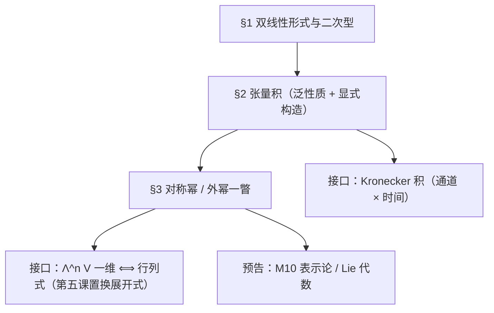
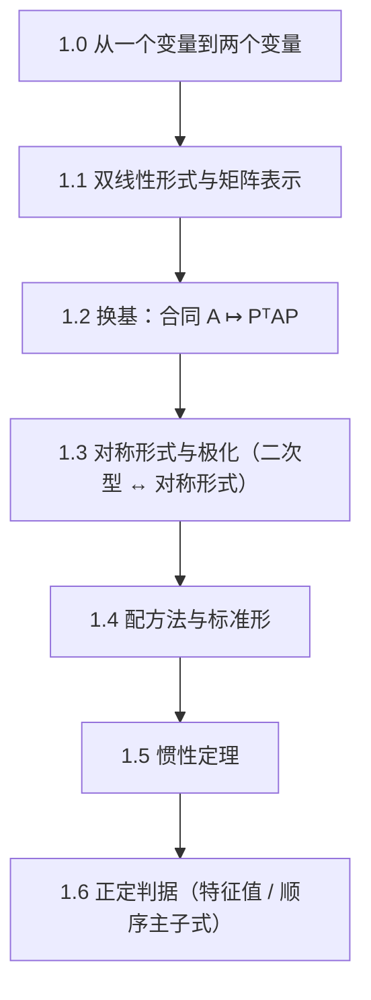
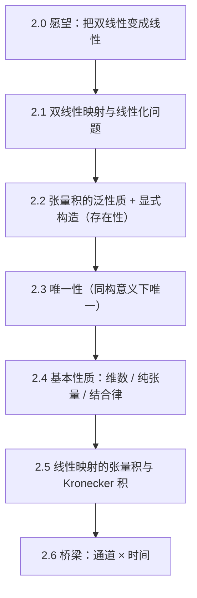
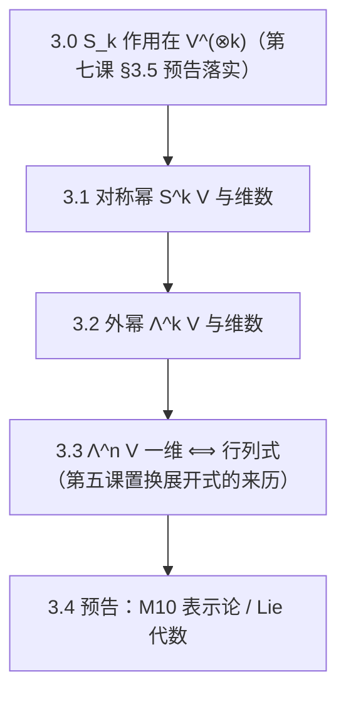

# 高等代数 第八课：双线性形式与张量入门

> **课程**：高等代数 MA103（补充；紧随第七课"群论基础"） ｜ **讲师**：数学教授 Prof-Math-V2 ｜ **课程日期**：2026-10-06 ｜ **版本**：**v1.0-fix1（已归档，2026-10-06）**
> **交付形式**：单一讲义文件（分节写作 → 一次合并；审稿记录见 `lectures/math/review_reports/`）
> **勘误**：v1.0 初稿（2026-10-06 一次成稿；每章含章引言／概念讲解／示范例题＋**真算核验**／小结预告，并配三类题）。**遵循本课口径**：公式一律单美元配对；求和下标写全上下限；**未经审稿不得定稿**；引用一律点名到已学课程的节次。
> **未证输入**：本课结论除**一处**外全部就地证明。① **元层**：良序性、归纳法（第五课同口径）；② **登记表 R10**（分块三角矩阵的行列式＝对角块之积，⏳未证）——本课**仅 §1.6 定理 7 的 $(c)\Rightarrow(a)$ 一处**使用，并按登记表口径**点名**。
> **依赖说明**：本课 §3 使用**第七课**的群论（$S_k$、$\mathrm{sgn}$、群作用与轨道-稳定子）。第七课与本课**同批送审**；**凡引用第七课处，一律以第七课 `approved/` 定稿版为准**——若第七课在归档前有改动，本课 §3 按定稿版对读并同步；若第七课未通过，本课 §3 冻结待改。
> **课程进度**：本课原名"第七课"，因同学 2026-09-29 指示"先超前讲群论"而**顺延为第八课**（`本科开课总清单.md` 已同步）。

## 目录

1. §1 双线性形式与二次型
2. §2 张量积：泛性质与显式构造
3. §3 对称幂与外幂一瞥（通向 M10）
4. 自测 T1／T2／T3
5. 附录 A 本课记号表

***

## §1 双线性形式与二次型

> **本章**：把第二课的"一个变量的线性"扩成"两个变量各自线性"。核心现象是：**同一个对象有两种坐标面貌**——矩阵（可算）与几何（可分类），而"换基"只允许做 **合同变换** $A\mapsto P^{\mathsf T}AP$（不是相似！），分类的不变量就是**惯性指数**。

### 1.0 章引言：为什么要"两个变量"

第二课的线性映射 $T:V\to W$ 是"一个输入"的线性。但很多量天然吃**两个**输入：内积 $\langle u,v\rangle$（第四课）、二次型 $q(x)=x^{\mathsf T}Ax$（中学的圆锥曲线）、协方差 $\mathrm{Cov}(X,Y)$、行列式作为 $n$ 个向量的函数（第五课）。

本书只做**最简的一层**：两个输入都来自同一个空间、对每个变量分别线性。这样得到的对象叫**双线性形式**。它同时是：

- **计算对象**：取一组基就是一张矩阵 $A$，$B(u,v)=x^{\mathsf T}Ay$；
- **分类对象**：换基下 $A\mapsto P^{\mathsf T}AP$，实对称情形的完全不变量就是**正负惯性指数**（定理 5）——它把"椭圆／双曲线／抛物"这类中学结论变成一条定理。

**与第四课的差别（务必分清）**：内积 ＝ **对称**双线性形式 **＋ 正定性**。本课把"正定"这一条拿掉单看对称形式，于是出现"不定"的新现象（如 $x^2-y^2$）。

### 1.1 双线性形式与矩阵表示

**定义 1（双线性形式）**。设 $V$ 是 $\mathbb F$ 上的有限维向量空间。映射 $B:V\times V\to\mathbb F$ 若满足

$B(\lambda u+\mu u',v)=\lambda B(u,v)+\mu B(u',v),\qquad B(u,\lambda v+\mu v')=\lambda B(u,v)+\mu B(u,v')$

（即**对每个变量分别线性**），则称 $B$ 是 $V$ 上的**双线性形式**。

**定理 1（矩阵表示）**。取 $V$ 的基 $\mathcal B=(e_1,\dots,e_n)$，令 $A=(a_{ij})$、$a_{ij}:=B(e_i,e_j)$。则对 $u=\sum_{i=1}^{n}x_ie_i$、$v=\sum_{j=1}^{n}y_je_j$：

$B(u,v)=\sum_{i=1}^{n}\sum_{j=1}^{n}x_ia_{ij}y_j=x^{\mathsf T}Ay .$

反之，任给矩阵 $A$，$B(u,v):=x^{\mathsf T}Ay$ 都是双线性形式。故 **$\{$双线性形式$\}\leftrightarrow\{n\times n$ 矩阵$\}$ 是一一对应**（给定基）。

*证明*。把 $u,v$ 代入并逐次用双线性（对第一变量线性：先拆和、再提系数；对第二变量同理）：

$B\Big(\sum_{i=1}^{n}x_ie_i,\sum_{j=1}^{n}y_je_j\Big)=\sum_{i=1}^{n}x_iB\Big(e_i,\sum_{j=1}^{n}y_je_j\Big)=\sum_{i=1}^{n}\sum_{j=1}^{n}x_iy_jB(e_i,e_j)$

最后一项即 $x^{\mathsf T}Ay$（依据：矩阵乘法的定义）✓。反方向直接由"$x\mapsto x^{\mathsf T}Ay$ 对 $x$ 线性、对 $y$ 线性"验证 ✓。一一对应：$A$ 的第 $(i,j)$ 元 $=B(e_i,e_j)$，由 $B$ 唯一决定；反之由 $A$ 唯一决定 $B$ ✓。$\square$

### 1.2 换基：合同变换

**定理 2（换基公式）**。设 $\mathcal B'=(f_1,\dots,f_n)$ 是另一组基，$P$ 是**过渡矩阵**（第 $j$ 列＝$f_j$ 在 $\mathcal B$ 下的坐标）。若 $B$ 在 $\mathcal B$ 下矩阵为 $A$、在 $\mathcal B'$ 下为 $A'$，则

$A'=P^{\mathsf T}AP .$

*证明*。记 $A'=(a'_{ij})$、$a'_{ij}=B(f_i,f_j)$。由 $f_i=\sum_{k=1}^{n}p_{ki}e_k$、$f_j=\sum_{l=1}^{n}p_{lj}e_l$ 与双线性：

$a'_{ij}=\sum_{k=1}^{n}\sum_{l=1}^{n}p_{ki}\,a_{kl}\,p_{lj}=(P^{\mathsf T}AP)_{ij}$

（末步用矩阵乘法定义与 $(P^{\mathsf T})_{ik}=p_{ki}$）✓。$\square$

> **和第四课 §6.2 的关系**：第四课换 ONB 时是 $Q\mapsto P^{\mathsf T}QP$，那里 $P$ 正交（$P^{-1}=P^{\mathsf T}$）；这里 $P$ 只要可逆。**同一个公式、两套限制**——这就是"合同"与"正交合同"的差别。
> **别混**：$B$ 的矩阵换基用 $P^{\mathsf T}AP$；**算子** $T$ 的矩阵换基用 $P^{-1}AP$（相似）。两者**不通用**。

**定义 2（合同）**。称 $A$ 与 $A'$ **合同**，若存在可逆 $P$ 使 $A'=P^{\mathsf T}AP$。（合同是等价关系：自反 $P=I$；对称 $A=P^{-\mathsf T}A'P^{-1}$；传递用 $P^{\mathsf T}(Q^{\mathsf T}AQ)P=(QP)^{\mathsf T}A(QP)$。）

### 1.3 对称形式与二次型：极化

**定义 3（对称／交错）**。$B$ 称**对称**，若 $B(u,v)=B(v,u)$ 对一切 $u,v$；称**交错**，若 $B(v,v)=0$ 对一切 $v$。

**命题 3**。$B$ 对称 $\iff$ 其矩阵 $A$ 对称（$A^{\mathsf T}=A$）；$B$ 交错 $\iff A^{\mathsf T}=-A$ 且对角元为 $0$。

*证明*。$B(e_j,e_i)=a_{ji}$、$B(e_i,e_j)=a_{ij}$，对称性即 $a_{ij}=a_{ji}$ ✓。交错：$0=B(e_i+e_j,e_i+e_j)=a_{ii}+a_{ij}+a_{ji}+a_{jj}$ 对一切 $i,j$（取 $i=j$ 得 $2a_{ii}=0$），由此得结论（这一步在**特征 $\neq2$** 时等价于 $A^{\mathsf T}=-A$；本课主线 $\mathbb F=\mathbb R,\mathbb C$ 恒可）✓。$\square$

**定义 4（二次型）**。$B$ 对称时，函数 $q(v):=B(v,v)$ 称为 $B$ 对应的**二次型**；在坐标下 $q(x)=x^{\mathsf T}Ax$（$A$ 对称）。

**定理 4（极化：二次型 $\leftrightarrow$ 对称形式）**。设 $\operatorname{char}\mathbb F\neq2$（本课 $\mathbb R/\mathbb C$ 满足）。则对称形式由它的二次型唯一决定：

$B(u,v)=\tfrac12\big(q(u+v)-q(u)-q(v)\big).$

*证明*。$q(u+v)=B(u,u)+B(u,v)+B(v,u)+B(v,v)=q(u)+2B(u,v)+q(v)$（用了对称性；中间两项都等于 $B(u,v)$）✓。两边整理并除以 $2$（$\operatorname{char}\neq2$ 保证 $2\neq0$ 可逆）即得。$\square$

> **反例（条件不可去）**：$\operatorname{char}\mathbb F=2$ 时 $2=0$，上式无意义，且确实有**不同的对称形式给出同一个二次型**：取 $B(u,v):=u_1v_2+u_2v_1$（矩阵 $\begin{pmatrix}0&1\\1&0\end{pmatrix}$——**对称**、对角元全 $0$，在 $\operatorname{char}2$ 下还是**交错**的：$B(v,v)=2v_1v_2=0$），则其二次型 $q(v)=2v_1v_2\equiv0$，与 $B=0$ 的二次型完全相同，但 $B\neq0$ ✓。**易错提醒**：不能取 $B(u,v)=u_1v_1$——它在 $\mathbb F_2$ 上的二次型是 $v_1^2=v_1$，取 $v=(1,0)$ 得 $1\neq0$，**并非恒零**。**本课主线避开这一情形**（一般域与特征 2 归 📋 待学旁注）。

### 1.4 配方法与标准形

**定理 5（配方法化标准形）**。设 $q(x)=x^{\mathsf T}Ax$（$A$ 对称，$\mathbb F=\mathbb R$）。则存在可逆 $P$ 使

$P^{\mathsf T}AP=\operatorname{diag}(d_1,\dots,d_r,0,\dots,0)\qquad(d_1,\dots,d_r\neq0),$

即经可逆线性代换 $x=Py$ 后 $q$ 只含平方项：$q=\sum_{i=1}^{r}d_iy_i^2$。

*证明（配方算法的归纳法，逐步点名）*。**① 若某 $a_{ii}\neq0$**：把含 $x_i$ 的项全部配成完全平方。以 $i=1$ 为例，$q=a_{11}\big(x_1+\sum_{j\ge2}\frac{a_{1j}}{a_{11}}x_j\big)^2+\tilde q(x_2,\dots,x_n)$（依据：展开比对 $x_1$ 的一次项与平方项）——第一步用**可逆**代换 $y_1=x_1+\sum_{j=2}^{n}\frac{a_{1j}}{a_{11}}x_j$、$y_j=x_j$（$j\ge2$），其过渡矩阵为上三角、对角元全 $1$，故可逆；剩下 $\tilde q$ 只含 $x_2,\dots,x_n$，对维数归纳。**② 若所有 $a_{ii}=0$ 但某 $a_{ij}\neq0$（$i<j$）**：作可逆代换 $x_i=y_i+y_j$、$x_j=y_i-y_j$（其余不变），则 $x_ix_j=y_i^2-y_j^2$ 型的项变成平方之差 ⟹ 新的 $a'_{ii}=2a_{ij}\neq0$，回到 ①。**③ 若 $A=0$**：已是标准形。归纳终止即得对角形，把对角元中的 $0$ 排在后面、丢弃重复的 $0$ 即得 $r=\operatorname{rank}A$（**顺带的事实**：合同不改变秩，因为 $P,Q$ 可逆）✓。$\square$

**例 1（配方 + 合同公式，一条算到底）**。$q(x,y)=x^2+2xy+2y^2$，$A=\begin{pmatrix}1&1\\1&2\end{pmatrix}$。

**① 配方**：$q=(x+y)^2+y^2$，即坐标代换 $x=y_1-y_2$、$y=y_2$ 把 $q$ 化为 $y_1^2+y_2^2$。
**② 写出对应的基**：由 $(x,y)=y_1(1,0)+y_2(-1,1)$，新基为 $g_1=e_1$、$g_2=e_2-e_1$，过渡矩阵 $P=\begin{pmatrix}1&-1\\0&1\end{pmatrix}$（**第 $j$ 列＝$g_j$ 在旧基下的坐标**，定理 2 的约定）。
**③ 用定理 2 核验**：$P^{\mathsf T}AP=\begin{pmatrix}1&0\\-1&1\end{pmatrix}\begin{pmatrix}1&1\\1&2\end{pmatrix}\begin{pmatrix}1&-1\\0&1\end{pmatrix}=\begin{pmatrix}1&1\\0&1\end{pmatrix}\begin{pmatrix}1&-1\\0&1\end{pmatrix}$；逐步算出为 $\begin{pmatrix}1&0\\0&1\end{pmatrix}$ ✓ **对角**。
**④ 逐项核对（直接算 $B$ 在这组基下的矩阵）**：$q(g_1)=1$、$B(g_1,g_2)=a_{12}-a_{11}=1-1=0$、$q(g_2)=a_{22}-a_{21}-a_{12}+a_{11}=2-1-1+1=1$ ⟹ 该基下矩阵 $=\operatorname{diag}(1,1)$ ✓ **与配方的结果一致**。
**⑤ 回代自检（配方法的通用自检）**：把 $x=y_1-y_2$、$y=y_2$ 代回 $(x+y)^2+y^2$ 展开得 $y_1^2+y_2^2$；反过来把 $y_1=x+y$、$y_2=y$ 代入 $y_1^2+y_2^2$ 得 $x^2+2xy+2y^2=q$ ✓ **两个方向都对**。

### 1.5 惯性定理

**定理 6（惯性定理 / Sylvester）**。设 $q$ 经可逆代换化为 $q=\sum_{i=1}^{p}y_i^2-\sum_{i=p+1}^{p+q}y_i^2$（$\mathbb F=\mathbb R$；等价地，标准形中正系数个数 $p$、负系数个数 $q$）。则 $p,q$ **不随代换改变**；$p$ 称**正惯性指数**、$q$ 称**负惯性指数**，$p-q$ 称**符号差**，$p+q=\operatorname{rank}A$。

*证明*。只需证 $p$ 不变（$q$ 用 $-q$ 同理）。**① 构造一个 $p$ 维正定子空间**：取**标准形所对应的基** $f_1,\dots,f_n$：即把 $x=\sum_{i=1}^{n}y_if_i$ 代入后 $q=\sum_{i=1}^{p}y_i^2-\sum_{i=p+1}^{p+q}y_i^2$ 的那组基，等价地 $q(f_1)=\cdots=q(f_p)=1$、$q(f_{p+1})=\cdots=q(f_{p+q})=-1$、$q(f_{p+q+1})=\cdots=q(f_n)=0$（存在性即定理 5），取 $U:=\operatorname{span}(f_1,\dots,f_p)$，则 $q|_{U\setminus\{0\}}>0$，故 $\dim U=p\le\max\{\dim W:W\subseteq V,\ q|_{W\setminus\{0\}}>0\}=:M$。**② 上界**：设 $W$ 满足 $q|_{W\setminus\{0\}}>0$，令 $Z:=\operatorname{span}(f_{p+1},\dots,f_n)$（即 $q\le0$ 的那些方向），则 $q|_{Z\setminus\{0\}}\le0$，故 $W\cap Z=\{0\}$（**关键一步**：非零向量不可能既正又非正）。由 $\dim W+\dim Z=\dim W+(n-p)\le n$ 得 $\dim W\le p$。于是 $M=p$，即 $p$ **只依赖 $q$**、与代换无关 ✓。$q$ 同理（把 $q$ 换成 $-q$）✓。$\square$

**推论 1（实对称矩阵的合同分类）**。实对称矩阵在**合同**下的完全不变量是 $(\operatorname{rank},p)$（即 $p,q$）：两个实对称矩阵合同 $\iff$ 秩相同且正惯性指数相同。

*证明*。$\Rightarrow$：定理 6 已给"不变量"。$\Leftarrow$：两者都可（各自配方）合同于 $\operatorname{diag}(1,\dots,1,-1,\dots,-1,0,\dots,0)$（正 $p$ 个、负 $q$ 个），由合同的传递性得彼此合同 ✓。$\square$

### 1.6 正定判据

**定义 5（正定／半正定）**。$q$（$A$ 对称实）称**正定**，若 $q(x)>0$ 对一切 $x\neq0$；称**半正定**，若 $q(x)\ge0$ 对一切 $x$。

**定理 7（正定判据）**。设 $A$ 实对称。以下等价：

(a) $q(x)=x^{\mathsf T}Ax$ 正定； (b) $A$ 的特征值全 $>0$； (c) $A$ 的顺序主子式全 $>0$（$k=1,\dots,n$）。

*证明*。**(a)$\Leftrightarrow$(b)**：由第四课实谱定理，存在正交 $Q$ 使 $Q^{\mathsf T}AQ=\operatorname{diag}(\lambda_1,\dots,\lambda_n)$（$\lambda_i$ 为实特征值）。取 $x=Qy$：$q=y^{\mathsf T}\operatorname{diag}(\lambda)y=\sum_{i=1}^{n}\lambda_iy_i^2$（依据：第四课 §7.3；正交代换是可逆代换）。于是"对一切 $y\neq0$ 有 $\sum_{i=1}^{n}\lambda_iy_i^2>0$" $\iff$ 全部 $\lambda_i>0$（取 $y=e_i$ 得必要，取全正得充分）✓。**(a)$\Rightarrow$(c)**：设 $A$ 正定，取前 $k$ 个坐标构成的子空间，$A$ 的 $k$ 阶顺序主子式所对应的子矩阵 $A_k$ 仍正定（限制仍是正定的双线性形式），故 $\det A_k>0$（正定矩阵的行列式＝全部特征值之积 $>0$）✓。**(c)$\Rightarrow$(a)**：按 §1.4 的配方法逐步进行；第 $k$ 步的主元恰好给出 $\det A_k/\det A_{k-1}$（约定 $\det A_0=1$）——**这一步的依据是"分块三角矩阵的行列式＝对角块之积"**，即**未证结论登记表 R10（⏳未证）**，本课按登记表口径**点名使用**（见讲义头部"未证输入"）。由 (c) 这些主元全 $>0$，故配方结果 $q=\sum_{i=1}^{n}d_iy_i^2$ 的系数全正 ⟹ 正定 ✓。$\square$

> **口径提醒**：(c) 只对"**顺序**主子式"（左上角 $k\times k$）成立；"全体主子式非负"才是半正定的判据——别混。

**真算核验（§1）**。

① $A=\begin{pmatrix}1&2\\2&3\end{pmatrix}$：顺序主子式 $1>0$、$\det A=3-4=-1<0$ ⟹ 不定（(c) 不成立）。配方：$q=x^2+4xy+3y^2=(x+2y)^2-y^2$ ⟹ 惯性指数 $(1,1)$、符号差 $0$ ✓ 与"不定"一致；特征值：$\lambda=(4\pm\sqrt{4+16})/2=(4\pm\sqrt{20})/2=2\pm\sqrt5$，一正一负 ✓ 与 (b) 一致。
② $A=\begin{pmatrix}2&1\\1&2\end{pmatrix}$：顺序主子式 $2>0$、$3>0$ ⟹ 正定 ✓；特征值 $1,3$ 全正 ✓（另：$q=2x^2+2xy+2y^2=(x+y)^2+x^2+y^2>0$ 对 $x,y$ 不全零 ✓）。
③ 秩与惯性指数：$A=\begin{pmatrix}0&1\\1&0\end{pmatrix}$：$q=2xy=\frac12\big((x+y)^2-(x-y)^2\big)$ ⟹ $p=q=1$、秩 $2$ ✓；顺序主子式 $a_{11}=0$ 不为正，故 (c) 失效（**注意**：$A$ 不定且 $a_{11}=0$，与 (c) 的必要性不冲突）✓。

### 1.7 三类题

**引导练习**（带提示）：

1. 写出 $B(u,v)=u_1v_1-u_2v_2$ 在标准基下的矩阵，并判断它的类型（对称？交错？正定？）。*提示*：算 $a_{ij}=B(e_i,e_j)$，再看对称性与配方。
2. 证明：合同关系是等价关系（自反、对称、传递）。*提示*：$P$ 可逆，逐条写。

**独立习题**（无提示）：

1. 化 $q(x,y,z)=x^2+y^2+z^2+2xy$ 为标准形，写出正负惯性指数与符号差，并判断是否正定。
2. 设 $B$ 是对称双线性形式、$B(u,v)=0$ 对一切 $v$ 成立。求使"$u=0$"必定成立的**充要条件**（用 $B$ 的矩阵表述），并给出条件不满足时的反例。
3. 举出两个**合同但不相似**的实对称矩阵；并证明：实对称矩阵"**相似 $\Rightarrow$ 合同**"（因此"相似但不合同"的例子**不存在**）。

**答案与核对**：

1. $q=x^2+y^2+z^2+2xy=(x+y)^2+z^2$。取代换 $y_1=x+y$、$y_2=y$、$y_3=z$（可逆：过渡矩阵上三角、对角元全 $1$），得**标准形 $q=y_1^2+y_3^2$** ⟹ 正惯性指数 $p=2$、负惯性指数 $0$、秩 $2$、符号差 $2$，**半正定但不正定**（取 $x=1,y=-1,z=0$ 得 $q=0$）✓。**核验（回代）**：把 $x=y_1-y_2$、$y=y_2$、$z=y_3$ 代入得 $(y_1-y_2+y_2)^2+y_3^2=y_1^2+y_3^2$ ✓。**注**：本例是"标准形里出现 $d_i=0$"（**退化**），与定理 5 证明的情形②（$A$ 的对角元全为 $0$、须先换元）不是同一件事。
2. **条件＝$B$ 非退化，等价地 $A$ 可逆**。依据：$B(u,v)=0$ 对一切 $v$ $\iff$ $Au=0$——取 $v=e_j$ 得 $0=B(u,e_j)=\sum_{i=1}^{n}x_ia_{ij}$ 对一切 $j$，即 $x^{\mathsf T}A=0$，转置得 $A^{\mathsf T}x=0$；而 $A$ 可逆 $\iff A^{\mathsf T}$ 可逆，故非退化时 $u=0$ ✓。**反例（退化时命题假）**：$B(u,v)=u_1v_1$（$A=\operatorname{diag}(1,0)$，秩 $1$）、$u=e_2$：$B(e_2,v)=0$ 对一切 $v$ 成立，但 $u\neq0$ ✓。**顺带**：只把 $v$ 取成 $u$ 得到的是 $B(u,u)=0$，**不足以**推出 $u=0$（除非 $B$ **正定**，如第四课内积情形）；本题要的是"对一切 $v$"这个更强的信息——这也正是 §2 泛性质里"张量积"要的形状。
3. **合同但不相似**：$A=\operatorname{diag}(1,1)$ 与 $B=\operatorname{diag}(1,2)$。两者**都正定** ⟹ 秩都是 $2$、正惯性指数都是 $2$ ⟹ 由推论 1 **合同** ✓；特征值 $\{1,1\}$ 与 $\{1,2\}$ 不同 ⟹ **不相似** ✓。**相似 $\Rightarrow$ 合同**：相似保特征值（第三课 §3.1／第五课谱刻画），故实对称相似时特征值相同；由第四课实谱定理，实对称矩阵正交相似于 $\operatorname{diag}(\lambda_1,\dots,\lambda_n)$，其**惯性指数只由特征值的符号个数决定**，而合同分类只由惯性指数决定（推论 1）⟹ 合同 ✓。**顺带（更精确的事实）**：实对称矩阵"相似 $\iff$ 正交相似 $\iff$ 特征值相同"，而"合同 $\iff$ 特征值符号个数相同"——**后者严格更弱**。

### 1.8 小结与预告

- **双线形式 ↔ 矩阵**（给定基，定理 1）；换基＝**合同** $A\mapsto P^{\mathsf T}AP$（定理 2）——与算子的"相似"是两码事。
- **对称形式 ↔ 二次型**（$\operatorname{char}\neq2$ 下由极化互推，定理 4）。
- **配方法**给标准形（定理 5）；**惯性定理**说 $p,q$ 是合同下的**完全不变量**（定理 6、推论 1）；**正定**有三套等价判据（定理 7）。
- **下一章**：把"双线性"这个想法推到极致——造一个对象 $V\otimes W$，使"双线性映射"全都变成"线性映射"（泛性质）。

***

## §2 张量积：泛性质与显式构造

> **本章**：造一个新对象 $V\otimes W$，它的全部用途可以压缩成一句话：**"$V\times W$ 上的双线性映射"与"$V\otimes W$ 上的线性映射"一一对应**。这就是"泛性质"式的定义——不描述内部构造，只描述它**被谁唯一地映出去**。

### 2.0 章引言：把双线性"线性化"

§1 的双线性形式 $B$ 是"两个变量"的。线性代数已经有整套理论处理"一个变量"的对象（线性映射、矩阵、秩）。自然的想法：**能不能造一个空间，把双线性对象变成线性对象**？答案是能——那就是**张量积** $V\otimes W$，代价是空间变大（$\dim(V\otimes W)=\dim V\cdot\dim W$）。

**为什么现在讲**：① 多线性现象到处都有（行列式是 $n$ 个向量的交错线性函数、协方差是双线性的）；② 第八课的 §3 要把 $S_k$ 作用搬到 $V^{\otimes k}$ 上，必须先有 $\otimes$；③ 这是"**泛性质／刻画式定义**"范式的第一次正式使用（此前的定义都是"给集合＋运算"，泛性质则是"给一个唯一性条件"）。

### 2.1 双线性映射与线性化问题

**定义 6（双线性映射）**。设 $V,W,U$ 是 $\mathbb F$ 上向量空间。映射 $\varphi:V\times W\to U$ 若对每个变量分别线性，则称**双线性映射**。（§1 的双线性形式是 $U=\mathbb F$ 的特例。）

**问题（线性化）**。给定双线性 $\varphi:V\times W\to U$，希望找到**一个**空间 $T$ 与**一个**双线性 $\iota:V\times W\to T$，使 $\varphi$ "因子化"为 $\varphi=\Phi\circ\iota$（$\Phi$ 线性），并且这种 $\Phi$ **唯一**。若这样的 $(T,\iota)$ 存在，就把双线性问题整体转化成了线性问题。

### 2.2 张量积：泛性质与显式构造

**定义 7（张量积的泛性质）**。设 $V,W$ 是 $\mathbb F$ 上有限维空间。若 $(T,\iota)$ 满足：$\iota:V\times W\to T$ 双线性，且对**任何**向量空间 $U$ 与**任何**双线性 $\varphi:V\times W\to U$，都存在**唯一**线性 $\Phi:T\to U$ 使 $\Phi\circ\iota=\varphi$，则称 $(T,\iota)$ 是 $V$ 与 $W$ 的**张量积**，记 $T=V\otimes W$、$\iota(v,w)=v\otimes w$。

**定理 8（存在性：显式基构造，避开商空间）**。设 $V$ 有基 $e_1,\dots,e_n$、$W$ 有基 $f_1,\dots,f_m$。取一个以符号 $e_i\otimes f_j$（$1\le i\le n$、$1\le j\le m$）为基的 $nm$ 维空间 $T$，并对 $v=\sum_{i=1}^{n}v_ie_i$、$w=\sum_{j=1}^{m}w_jf_j$ 定义

$\iota(v,w)=v\otimes w:=\sum_{i=1}^{n}\sum_{j=1}^{m}v_iw_j\,(e_i\otimes f_j)\in T .$

则 $(T,\iota)$ 满足定义 7。

*证明*。**① $\iota$ 双线性**：$v\mapsto v\otimes w$ 与 $w\mapsto v\otimes w$ 各自线性，直接由系数运算核验（如 $(v+v')\otimes w=\sum_{i,j}(v_i+v'_i)w_j(e_i\otimes f_j)=v\otimes w+v'\otimes w$）✓。**② 存在 $\Phi$**：设 $\varphi:V\times W\to U$ 双线性。**定义** $\Phi(e_i\otimes f_j):=\varphi(e_i,f_j)$（基上给值即可唯一延拓成线性映射——**依据：第二课"线性映射由基上的值唯一决定"**）。则对纯张量

$\Phi(v\otimes w)=\Phi\Big(\sum_{i=1}^{n}\sum_{j=1}^{m}v_iw_j(e_i\otimes f_j)\Big)=\sum_{i=1}^{n}\sum_{j=1}^{m}v_iw_j\varphi(e_i,f_j)=\varphi\Big(\sum_{i=1}^{n}v_ie_i,\sum_{j=1}^{m}w_jf_j\Big)=\varphi(v,w)$

（末步用 $\varphi$ 的双线性）✓，即 $\Phi\circ\iota=\varphi$。**③ 唯一性**：$\{e_i\otimes f_j\}$ 是 $T$ 的基，故线性映射由它们在基上的值唯一决定；而这些值必须等于 $\Phi(e_i\otimes f_j)=\varphi(e_i,f_j)$（由 $\Phi\circ\iota=\varphi$）⟹ 至多一个 ✓。$\square$

> **为什么这里不用商空间**：教科书的通用构造是"取 $V\times W$ 张成的自由空间，再商掉所有形如 $(v+v',w)-(v,w)-(v',w)$ 的关系"。本课程至今**没有讲商空间**（第五课 §3.2、第六课 Schur 都特意避开），因此本课改走**显式基构造**：有限维情形下它更短、更可算。**商空间路线**（以及一般模上的张量积）列为 📋 预告。

### 2.3 唯一性

**定理 9（同构意义下唯一）**。若 $(T,\iota)$ 与 $(T',\iota')$ 都满足定义 7，则存在**唯一**的同构 $\Phi:T\to T'$ 使 $\Phi\circ\iota=\iota'$。

*证明*。对泛性质使用两次：① 把 $T$ 的泛性质用于 $\varphi:=\iota'$，得唯一线性 $\Phi:T\to T'$ 使 $\Phi\circ\iota=\iota'$；② 把 $T'$ 的泛性质用于 $\varphi:=\iota$，得唯一线性 $\Psi:T'\to T$ 使 $\Psi\circ\iota'=\iota$。于是 $\Psi\Phi:T\to T$ 满足 $(\Psi\Phi)\circ\iota=\iota$；而**恒等映射** $\mathrm{id}_T$ 也满足 $\mathrm{id}_T\circ\iota=\iota$，由 $T$ 的泛性质中"$\Phi$ 唯一"这一条（取 $U=T$、$\varphi=\iota$）得 $\Psi\Phi=\mathrm{id}_T$ ✓；同理 $\Phi\Psi=\mathrm{id}_{T'}$ ⟹ $\Phi$ 是双射、$\Psi=\Phi^{-1}$ ⟹ 同构，且 $\Phi\circ\iota=\iota'$ ✓（唯一性已含在①的"唯一"里）。$\square$

### 2.4 基本性质

**定理 10（基本性质）**。设 $\dim V=n$、$\dim W=m$。

1. $\dim(V\otimes W)=nm$，且 $\{e_i\otimes f_j\}$ 是基（$e_i$、$f_j$ 为任意给定基）；
2. **纯张量** $v\otimes w$ 全体**张成** $V\otimes W$（但**不是**基：纯张量组成的集合有二次关系，如 $(v_1+v_2)\otimes w=v_1\otimes w+v_2\otimes w$）；一般元素写作有限和 $\sum_{k}v_k\otimes w_k$；
3. **分配律**：$(v+v')\otimes w=v\otimes w+v'\otimes w$、$v\otimes(w+w')=v\otimes w+v\otimes w'$、$(\lambda v)\otimes w=v\otimes(\lambda w)=\lambda(v\otimes w)$；
4. **结合律**（同构意义）：$(U\otimes V)\otimes W\cong U\otimes(V\otimes W)$；
5. $V\otimes\mathbb F\cong V$（取 $v\otimes\lambda\mapsto\lambda v$ 即同构）。

*证明（要点）*。① 由定理 8 的构造直接读出（基有 $nm$ 个元素）。② 任一元素按其基坐标写作 $x=\sum_{i=1}^{n}\sum_{j=1}^{m}c_{ij}(e_i\otimes f_j)$；按**行**分组：$\sum_{i=1}^{n}e_i\otimes\big(\sum_{j=1}^{m}c_{ij}f_j\big)$ —— 右边是纯张量之和，故纯张量张成整个空间 ✓。④⑤ 用泛性质造互逆映射（把另一个空间的双线性形式线性化），或用基逐项检验（有限维下最直接）✓。$\square$

### 2.5 线性映射的张量积与 Kronecker 积

**定理 11（线性映射的张量积）**。设 $S:V\to V'$、$T:W\to W'$ 线性。则存在唯一线性映射 $S\otimes T:V\otimes W\to V'\otimes W'$ 使

$(S\otimes T)(v\otimes w)=S(v)\otimes T(w)\qquad(\forall v,w).$

且在基 $\{e_i\otimes f_j\}$（按字典序排列）下，$S\otimes T$ 的矩阵是 $S$ 的矩阵 $A$ 与 $T$ 的矩阵 $B$ 的 **Kronecker 积** $A\otimes B$（分块矩阵 $(a_{ij}B)$）。

*证明*。**存在性**：映射 $\varphi(v,w):=S(v)\otimes T(w)$ 是双线性的（$S,T$ 线性 ＋ $\otimes$ 双线性），故由泛性质（定义 7）得唯一线性 $S\otimes T$ 使它在纯张量上等于 $\varphi$ ✓。**矩阵**：设 $Se_i=\sum_{k}a_{ki}e'_k$、$Tf_j=\sum_{l}b_{lj}f'_l$，则

$(S\otimes T)(e_i\otimes f_j)=\Big(\sum_{k=1}^{p}a_{ki}e'_k\Big)\otimes\Big(\sum_{l=1}^{q}b_{lj}f'_l\Big)=\sum_{k=1}^{p}\sum_{l=1}^{q}a_{ki}b_{lj}\,(e'_k\otimes f'_l)$

即第 $(i,j)$ 列填入的块恰是 $a_{ki}b_{lj}$ ⟹ 矩阵为 $(a_{ij}B)$，这正是 Kronecker 积的定义 ✓。$\square$

**真算核验（§2）**。取 $A=\begin{pmatrix}1&2\\3&4\end{pmatrix}$、$B=\begin{pmatrix}0&1\\1&0\end{pmatrix}$。

- **维数**：$\dim(V\otimes W)=\dim V\cdot\dim W=2\cdot2=4$ ✓。
- **Kronecker 积**：$A\otimes B=\begin{pmatrix}1B&2B\\3B&4B\end{pmatrix}=\begin{pmatrix}0&1&0&2\\1&0&2&0\\0&3&0&4\\3&0&4&0\end{pmatrix}$（基序 $e_1\otimes f_1,e_1\otimes f_2,e_2\otimes f_1,e_2\otimes f_2$）✓。
- **逐项核验 $(S\otimes T)(x\otimes y)=(Sx)\otimes(Ty)$**：取 $x=(1,1)$、$y=(1,0)$，则 $Sx=Ax=(3,7)$、$Ty=By=(0,1)$，故 $(Sx)\otimes(Ty)=(0,3,0,7)$。另一方面 $x\otimes y=(1,0,1,0)$，代入 $A\otimes B$：第 1 行 $=0$、第 2 行 $=1\cdot1+2\cdot1=3$、第 3 行 $=0$、第 4 行 $=3\cdot1+4\cdot1=7$ ⟹ $(0,3,0,7)$ ✓ **两边一致**。

### 2.6 桥梁小节：通道 × 时间（📋 概念级）

神经科学里最普通的数据形状是**"通道 × 时间"**：一次记录得到 $C$ 个通道、每通道 $T$ 个采样点，于是数据是 $C\times T$ 的矩阵 $X$，其协方差结构常写作 $\Sigma=\Sigma_c\otimes\Sigma_t$（通道方向的协方差 ⊗ 时间方向的协方差）。这一步把参数从 $(CT)^2$ 降到 $C^2+T^2$——这就是**Kronecker 结构**在信号处理与神经数据建模里的基本用途。

- 严格版本（何时可以这样分解、如何估计）属于后续课程（统计学习／数值线）；本课只需要知道：**"$C\times T$ 上的双线性对象"与"两个小空间上的对象"由泛性质联系起来**，而矩阵表示就是 Kronecker 积（定理 11）。
- 同一条线路还能解释"低秩近似"为什么省算力（把大矩阵写成 $A\otimes B$ 再算）——**完整版挂待学**。

### 2.7 三类题

**引导练习**（带提示）：

1. 证明纯张量 $v\otimes w=0\iff v=0$ 或 $w=0$。*提示*：取 $v,w$ 在基下的坐标，看 $\sum_{i,j}v_iw_j(e_i\otimes f_j)$ 何时为 $0$（基的线性无关性）。
2. 证明 $V\otimes\mathbb F\cong V$。*提示*：构造 $v\otimes\lambda\mapsto\lambda v$，用泛性质或基验证它是线性双射。

**独立习题**（无提示）：

1. 设 $\dim V=3$、$\dim W=2$。写出 $V\otimes W$ 的维数与一组基；并说明"纯张量"组成的集合是否等于整个 $V\otimes W$。
2. 用泛性质证明：$S\otimes T$ 存在唯一（不要用基）。
3. 举一个具体的 $v\otimes w\neq0$ 但 $\{v\otimes w\}$ 不能张成 $V\otimes W$（$\dim(V\otimes W)\ge2$）的例子。

**答案与核对**：

1. $v\otimes w=\sum_{i=1}^{3}\sum_{j=1}^{2}v_iw_j(e_i\otimes f_j)=0$ $\iff$ 所有系数 $v_iw_j=0$ $\iff$（**依据：基的线性无关性**）对一切 $i,j$ 有 $v_iw_j=0$ $\iff$ $v=0$ 或 $w=0$ ✓（"或"而非"且"：$v=0$ 时系数全零，无论 $w$）。
2. 存在：$\varphi(v,w):=S(v)\otimes T(w)$ 双线性 ⟹ 泛性质给唯一线性 $\Phi$；唯一：$\Phi$ 在张成集合 $\{v\otimes w\}$ 上的值被 $S(v)\otimes T(w)$ 强制，而线性映射由张成集合上的值唯一决定 ✓（**依据**：定理 10②＋第二课"线性映射由张成集上的值唯一决定"）。
3. 例：$\dim(V\otimes W)=4$（$2\times2$），取任意一个非零纯张量（如 $e_1\otimes f_1$），它只张成一维子空间，当然不能张成 $4$ 维空间 ✓。（更本质：纯张量集是**二次簇**，一般元素如 $e_1\otimes f_1+e_2\otimes f_2$ **不是**纯张量——这一点与 §2.6 的"低秩"密切相关。）

### 2.8 小结与预告

- **张量积的用途一句话**：双线性 $\to$ 线性（定义 7 的泛性质）；存在性用**显式基构造**给出（定理 8），**避开商空间**；同构意义下唯一（定理 9）。
- **可算的形状**：$\dim=nm$、纯张量张成、线性映射张量化＝**Kronecker 积**（定理 10、11）。
- **下一章**：让 $S_k$ 作用在 $V^{\otimes k}=V\otimes\cdots\otimes V$ 上，把张量空间拆成**对称**与**反对称**两块——第七课 §3.5 的预告在此落实。

***

## §3 对称幂与外幂一瞥（通向 M10）

> **本章**：**一瞥**（不展开泛性质的完整证明；定理 12、定理 13 两处标"**要点**"的完整展开属**表示论／M10**——$V^{\otimes k}$ 在 $S_k$ 下的完全分解与 Young 图）。目的只有一个：让第五课的置换展开式 $\det A=\sum_{\sigma\in S_n}\mathrm{sgn}(\sigma)\prod_{i=1}^{n}a_{i,\sigma(i)}$ 里的 $\mathrm{sgn}$ **有出处**。

### 3.1 $S_k$ 作用在 $V^{\otimes k}$ 上

记 $V^{\otimes k}:=V\otimes\cdots\otimes V$（$k$ 个），其基为 $\{e_{i_1}\otimes\cdots\otimes e_{i_k}\}$（共 $n^k$ 个，其中 $n=\dim V$）。第七课 §3.4 的群作用在此落实：$S_k$ 作用为

$\sigma\cdot(v_1\otimes\cdots\otimes v_k):=v_{\sigma^{-1}(1)}\otimes\cdots\otimes v_{\sigma^{-1}(k)} .$

（用 $\sigma^{-1}$ 是为了让 $(gh)\cdot x=g\cdot(h\cdot x)$ 成立——**依据**：第七课定义 11 的结合性要求，逐项核对即可。）**这是第七课 §3.5 预告的正式兑现**。

**定义 8（对称幂）**。$S^kV:=\{x\in V^{\otimes k}:\sigma\cdot x=x\ \ \forall\sigma\in S_k\}$（**不变量**＝第七课 §3.5 说的"平凡成分"）。

**定理 12**。$\dim S^kV=\dbinom{n+k-1}{k}$，一组基为

$e_{i_1}\odot\cdots\odot e_{i_k}\qquad(1\le i_1\le i_2\le\cdots\le i_k\le n),\qquad e_{i_1}\odot\cdots\odot e_{i_k}:=\frac{1}{k!}\sum_{\sigma\in S_k}e_{i_{\sigma(1)}}\otimes\cdots\otimes e_{i_{\sigma(k)}} .$

*证明（要点）*。① 上式定义的 $\odot$ 对 $\sigma$ 不变（重排求和指标即可）；② 它们张成不变量集合（把 $x$ 的不变性与坐标比较，得"交换任意两个下标不改变系数"）；③ 线性无关（用"按多重下标字典序取首个非零系数的张量"论证）⟹ 维数＝**多重下标（不全同）的个数**＝$\dbinom{n+k-1}{k}$（组合计数：从 $n$ 类指标中可重复选 $k$ 个）✓。$\square$

> **注意**：$\frac{1}{k!}$ 需要 $k!$ 在 $\mathbb F$ 中可逆——本课主线 $\mathbb R/\mathbb C$ 恒成立（$\operatorname{char}=0$）；一般域（尤其 $\operatorname{char}\mathbb F\le k$）属 📋 待学旁注。

### 3.2 外幂

**定义 9（外幂）**。$v_1\wedge\cdots\wedge v_k:=\dfrac{1}{k!}\displaystyle\sum_{\sigma\in S_k}\mathrm{sgn}(\sigma)\,v_{\sigma(1)}\otimes\cdots\otimes v_{\sigma(k)}$；$\Lambda^kV$ 由全体这样的元素张成（**符号成分**＝第七课 §3.5 所说的"$\sigma\cdot T=\mathrm{sgn}(\sigma)T$"的那一块）。

**定理 13（外幂的三条基本性质）**。

1. $\wedge$ 对每个变量线性，且**交错**：交换两个变量变号；特别地，两个变量相等时结果为 $0$；
2. $\sigma\cdot(v_1\wedge\cdots\wedge v_k)=\mathrm{sgn}(\sigma)\,(v_1\wedge\cdots\wedge v_k)$；
3. $\dim\Lambda^kV=\dbinom{n}{k}$，一组基为 $\{e_{i_1}\wedge\cdots\wedge e_{i_k}:1\le i_1<i_2<\cdots<i_k\le n\}$；特别地 $\Lambda^nV$ **一维**。

*证明（要点）*。① 线性由定义中的求和与 $\otimes$ 的多线性得到；交错性：交换 $v_p,v_q$ 相当于把求和中的 $\sigma$ 换成 $\sigma\circ(pq)$，而 $\mathrm{sgn}(\sigma\circ(pq))=-\mathrm{sgn}(\sigma)$（第七课定理 12），求和整体变号 ✓；$v_p=v_q$ 时交换后表达式等于自身又等于负自身，故为 $0$（**依据**：$2\neq0$，即 $\mathbb R/\mathbb C$）✓。② 记 $P(x):=\frac{1}{k!}\sum_{\sigma\in S_k}\mathrm{sgn}(\sigma)\,\sigma\cdot x$（$x\in V^{\otimes k}$，作用约定见 §3.1），则 $v_1\wedge\cdots\wedge v_k=P(v_1\otimes\cdots\otimes v_k)$。由 $(\pi\sigma)\cdot x=\pi\cdot(\sigma\cdot x)$（§3.1 已核验）：$\tau\cdot P(x)=\frac{1}{k!}\sum_{\sigma\in S_k}\mathrm{sgn}(\sigma)(\tau\sigma)\cdot x$，**换指标 $\rho:=\tau\sigma$**（即 $\sigma=\tau^{-1}\rho$，此时 $\mathrm{sgn}(\sigma)=\mathrm{sgn}(\tau)\mathrm{sgn}(\rho)$，依据第七课定理 12），得 $=\mathrm{sgn}(\tau)\cdot\frac{1}{k!}\sum_{\rho\in S_k}\mathrm{sgn}(\rho)\rho\cdot x=\mathrm{sgn}(\tau)P(x)$ ✓。**注（换元方向的依据）**：本课用**左作用** $(\pi\sigma)\cdot x=\pi\cdot(\sigma\cdot x)$，故必须取 $\rho=\tau\sigma$ 才能把 $(\tau\sigma)\cdot x$ 写成 $\rho\cdot x$；若把作用改成"第 $i$ 个因子取 $v_{\sigma(i)}$"的相反约定，换元方向随之相反。③ 交错性 ⟹ 任何含重复下标的 $e_{i_1}\wedge\cdots\wedge e_{i_k}$ 为 $0$，而指标重排只改符号 ⟹ 由下标**递增**的那些张成；递增下标的组合数即 $\binom{n}{k}$；线性无关由"用坐标提取系数"核验（沿 §3.1③ 的字典序论证）✓。$k=n$ 时只有一组递增下标 $1<\cdots<n$，故 $\dim\Lambda^nV=1$ ✓。$\square$

### 3.3 $\Lambda^nV$ 一维与行列式的来历

**定理 14**。设 $\dim V=n$、$T:V\to V$ 线性，在基 $e_1,\dots,e_n$ 下矩阵为 $A$。则

$Te_1\wedge\cdots\wedge Te_n=\det(A)\,(e_1\wedge\cdots\wedge e_n).$

*证明*。记 $Te_i=\sum_{k=1}^{n}a_{ki}e_k$。用外积的多线性展开：

$Te_1\wedge\cdots\wedge Te_n=\sum_{k_1=1}^{n}\cdots\sum_{k_n=1}^{n}a_{k_11}\cdots a_{k_nn}\,e_{k_1}\wedge\cdots\wedge e_{k_n}.$

含重复下标的项为 $0$（定理 13①，交错性）；剩下的项由"$k_i$ 互不相同"给出，即存在唯一 $\sigma\in S_n$ 使 $k_i=\sigma(i)$，于是

$=\sum_{\sigma\in S_n}a_{\sigma(1)1}\cdots a_{\sigma(n)n}\,e_{\sigma(1)}\wedge\cdots\wedge e_{\sigma(n)}=\sum_{\sigma\in S_n}\mathrm{sgn}(\sigma)\,a_{\sigma(1)1}\cdots a_{\sigma(n)n}\,(e_1\wedge\cdots\wedge e_n)$

（第二步用定理 13①：$e_{\sigma(1)}\wedge\cdots\wedge e_{\sigma(n)}=\mathrm{sgn}(\sigma)e_1\wedge\cdots\wedge e_n$）。再把 $\prod_{i=1}^{n}a_{\sigma(i)i}$ 重排为 $\prod_{j=1}^{n}a_{j,\sigma^{-1}(j)}$、并令 $\tau:=\sigma^{-1}$（$\mathrm{sgn}(\tau)=\mathrm{sgn}(\sigma)$，第五课 §5.1 用过这条），即得

$=\Big(\sum_{\tau\in S_n}\mathrm{sgn}(\tau)\prod_{j=1}^{n}a_{j,\tau(j)}\Big)(e_1\wedge\cdots\wedge e_n)=\det(A)\,(e_1\wedge\cdots\wedge e_n)\ \checkmark$

**这正是第五课 §5.1 的置换展开式**——它如今有了两个解释：① 计算定义；② **"行列式＝$T$ 在 $\Lambda^nV$（一维空间）上的作用"读出的唯一系数**。第五课"用而未定义"的 $\mathrm{sgn}$ 也在此第二次落地（第一次在第七课 §3.2）。

**真算核验（§3）**。① $\dim\Lambda^2\mathbb R^3=\binom{3}{2}=3$，基 $e_1\wedge e_2,\ e_1\wedge e_3,\ e_2\wedge e_3$ ✓；$\dim\Lambda^3\mathbb R^3=1$ ✓。② $\dim S^2\mathbb R^2=\binom{2+2-1}{2}=3$，基 $e_1\odot e_1,\ e_1\odot e_2,\ e_2\odot e_2$ ✓。③ 取 $A=\begin{pmatrix}2&1\\0&3\end{pmatrix}$（$\det=6$）：$Te_1=2e_1$、$Te_2=e_1+3e_2$，故 $Te_1\wedge Te_2=2e_1\wedge(e_1+3e_2)=2\cdot3\,(e_1\wedge e_2)=6\,(e_1\wedge e_2)=\det A\cdot(e_1\wedge e_2)$ ✓（用了 $e_1\wedge e_1=0$ 与定理 13①）。

### 3.4 三类题

**引导练习**（带提示）：

1. 计算 $\dim\Lambda^2\mathbb R^4$ 与 $\dim S^3\mathbb R^2$，并写出各自的基。*提示*：$\binom{n}{k}$ 与 $\binom{n+k-1}{k}$。
2. 证明 $v\wedge w=0\iff\{v,w\}$ 线性相关。*提示*：一个方向用交错性；反向把 $w=\lambda v$ 代入。

**独立习题**（无提示）：

1. 证明 $\dim\Lambda^kV=0$ 当 $k>n=\dim V$。
2. 用定理 14 证明：$\det(AB)=\det A\cdot\det B$（**用外幂的语言**，不要用第五课的乘法性）。
3. 说明 $e_1\otimes e_2+e_2\otimes e_1$ 与 $e_1\otimes e_2-e_2\otimes e_1$ 分别属于 $S^2V$ 还是 $\Lambda^2V$（$V$ 以 $e_1,e_2$ 为基）。

**答案与核对**：

1. $n=4,k=2$：$\binom{4}{2}=6$；$n=2,k=3$：$\binom{2+3-1}{3}=\binom{4}{3}=4$ ✓。
2. 取 $v=\lambda w$：$(\lambda w)\wedge w=\lambda(w\wedge w)=0$ ✓；反之若 $v,w$ 线性无关，把它们扩成基（依据：**第二课 §4.1 引理 2**），则 $v\wedge w$ 在定理 13③ 的基下的坐标（适当重排）非零，故 $\neq0$ ✓。
3. $k>n$ 时任何 $e_{i_1}\wedge\cdots\wedge e_{i_k}$ 必含重复下标（鸽笼原理），故为 $0$；生成元全零 ⟹ 空间为 $0$、维数 $0$ ✓。
4. 设 $AB=:C$。由定理 14：$C(e_1\wedge\cdots\wedge e_n)=\det C\,(e_1\wedge\cdots\wedge e_n)$；另一方面 $C e_1\wedge\cdots\wedge C e_n=(ABe_1)\wedge\cdots\wedge(ABe_n)=A(Be_1)\wedge\cdots\wedge A(Be_n)=$（把 $A$ 提到每个变量上，用 $\wedge$ 的多线性与 \(A\) 的线性）$=\det A\cdot(Be_1\wedge\cdots\wedge Be_n)=\det A\det B\,(e_1\wedge\cdots\wedge e_n)$ ✓。**两边比较**（$e_1\wedge\cdots\wedge e_n\neq0$，依据定理 13③）得 $\det C=\det A\det B$ ✓。
5. 交换两个因子：$\sigma=(12)$ 作用下 $e_1\otimes e_2+e_2\otimes e_1$ 不变 ⟹ 属 $S^2V$ ✓；$e_1\otimes e_2-e_2\otimes e_1$ 变号 ⟹ 属 $\Lambda^2V$ ✓；且 $\dim S^2V=3$、$\dim\Lambda^2V=1$、$S^2V\oplus\Lambda^2V=V^{\otimes2}$（$\dim 4=3+1$）——**$k=2$ 时对称与反对称把整个张量平方拆完了，且对一切 $n$ 成立**（见 T3-2 的核验）；但 $k\ge3$ 时会出现"混合对称性"成分，那正是表示论（M10）的入口。

### 3.5 小结与预告

- $S_k$ 作用在 $V^{\otimes k}$ 上（§3.1，兑现第七课 §3.5 的预告）；**对称幂**＝不变量（$\dim\binom{n+k-1}{k}$）、**外幂**＝符号成分（$\dim\binom{n}{k}$）。
- **$\Lambda^nV$ 一维**，而"$T$ 在其上作用的系数"就是 **$\det T$**（定理 14）——第五课置换展开式里的 $\mathrm{sgn}$ 有了出处。
- **📋 预告（M10）**：$V^{\otimes k}$ 在 $S_k$ 下的**完整分解**（对称／反对称只是一般的两个极端成分）＝对称群的表示论（Young 图），进一步是 Lie 代数与张量场。**本课到此为止**。

***

## 自测 T1／T2／T3

**T1（必做·基础）**

1. 写出 $B(u,v)=3u_1v_1+2u_1v_2+2u_2v_1+u_2v_2$ 的矩阵；它对称吗？
2. 化 $q(x,y)=4xy$ 为标准形，写出惯性指数与秩。
3. 判断 $A=\begin{pmatrix}2&1\\1&2\end{pmatrix}$ 是否正定（用顺序主子式与特征值两条路），并写出对应二次型的配方。

**T2（必做·核心）**

1. 写出 $V\otimes W$ 的一组基，并说明它**张成且线性无关**（由此得 $\dim(V\otimes W)=\dim V\cdot\dim W$）。
2 写出 $A=\begin{pmatrix}1&0\\0&1\end{pmatrix}$ 与 $B=\begin{pmatrix}0&1\\1&0\end{pmatrix}$ 的 Kronecker 积 $A\otimes B$ 与 $B\otimes A$，说明两者一般**不等**，并核验 $(A\otimes B)(x\otimes y)=Ax\otimes By$（取 $x=(1,2)$、$y=(1,1)$）。
3. 证明 $\dim\Lambda^kV=\binom{n}{k}$ 且 $\dim S^kV=\binom{n+k-1}{k}$。

**T3（选做·进阶）**

1. 证明：实对称矩阵"**相似 $\Rightarrow$ 合同**"，并给出一对**合同但不相似**的实对称矩阵。
2. 证明 $V^{\otimes2}=S^2V\oplus\Lambda^2V$（对一切 $\dim V=n$ 成立）；并说明为什么 $k=3$ 时"$V^{\otimes3}=S^3V\oplus\Lambda^3V$"**不**成立。
3. 说明为什么"$\Lambda^nV$ 一维"可以直接用来定义**一般的域**上的行列式，而不需要引入 $\mathbb R$ 的序结构。

**答案与核对**

- **T1**：① $A=\begin{pmatrix}3&2\\2&1\end{pmatrix}$（由 $a_{ij}=B(e_i,e_j)$ 逐项读出：$a_{11}=3$、$a_{12}=2$、$a_{21}=2$、$a_{22}=1$）✓ **对称**（$a_{12}=a_{21}$）✓。② $q=4xy=(x+y)^2-(x-y)^2$ ⟹ 代换 $y_1=x+y$、$y_2=x-y$，$q=y_1^2-y_2^2$，故 $p=1,q=1$、秩 $2$、不定 ✓。③ 顺序主子式 $2>0$、$3>0$ ⟹ 正定 ✓；特征值 $1,3$ 全正 ✓；配方 $q=2x^2+2xy+2y^2=(x+y)^2+x^2+y^2>0$（$(x,y)\neq0$ 时）✓ 三者一致。
- **T2**：① 取 $V$ 的基 $e_1,\dots,e_n$、$W$ 的基 $f_1,\dots,f_m$。按定理 8 的**显式构造**，$V\otimes W$ 就是以 $\{e_i\otimes f_j\}$（$1\le i\le n$、$1\le j\le m$）为基的空间 ⟹ 这 $nm$ 个元素**按定义**既张成又线性无关 ⟹ $\dim(V\otimes W)=nm$ ✓。（若走泛性质路线，还需补一句"张成"：任一元素 $=\sum_{i=1}^{n}\sum_{j=1}^{m}c_{ij}(e_i\otimes f_j)$，已是它们的线性组合 ✓。）
  ② $A\otimes B=\begin{pmatrix}0&1&0&0\\1&0&0&0\\0&0&0&1\\0&0&1&0\end{pmatrix}$、$B\otimes A=\begin{pmatrix}0&0&1&0\\0&0&0&1\\1&0&0&0\\0&1&0&0\end{pmatrix}$（按 §2.5 的分块规则逐个写出）⟹ 一般不等 ✓（基序不同，本质上是同一个张量映射在**重排过的基**下的矩阵）。核验：$x=(1,2)\Rightarrow Ax=(1,2)$、$y=(1,1)\Rightarrow By=(1,1)$，故 $Ax\otimes By=(1,1,2,2)$；$x\otimes y=(1,1,2,2)$，代入 $A\otimes B$：第 1 行 $=0+1\cdot1=1$、第 2 行 $=1$、第 3 行 $=2$、第 4 行 $=2$ ⟹ $(1,1,2,2)$ ✓ 一致。
  ③ 见 §3.1／§3.2 的定理 12、13。
- **T3**：① 充要条件见推论 1（$\Rightarrow$ 用惯性定理；$\Leftarrow$ 用"两者都合同于同一个 $\operatorname{diag}(1,\dots,1,-1,\dots,-1,0,\dots,0)$"＋合同的传递性）✓。**相似 $\Rightarrow$ 合同**：相似保特征值（第三课 §3.1／第五课谱刻画）⟹ 特征值的符号个数相同；由第四课实谱定理，实对称矩阵正交相似于 $\operatorname{diag}(\lambda_1,\dots,\lambda_n)$，故惯性指数只由符号个数决定，而合同分类只由惯性指数决定（推论 1）⟹ 合同 ✓。**合同但不相似**的例子：$\operatorname{diag}(1,1)$ 与 $\operatorname{diag}(1,2)$：两者都正定 ⟹ 合同；特征值不同 ⟹ 不相似 ✓。**注意**："相似但不合同"的**实对称**例子**不存在**——先算不变量就不必去找（这正是本题的陷阱）。
  ② **$k=2$（对一切 $n$ 成立）**：$\dim S^2V+\dim\Lambda^2V=\binom{n+1}{2}+\binom{n}{2}=\frac{n(n+1)}{2}+\frac{n(n-1)}{2}=n^2=\dim V^{\otimes2}$ ✓；又 $S^2V\cap\Lambda^2V=\{0\}$（若 $x$ 同时在两块中，交换两个因子后 $x$ 既不变又变号 ⟹ $x=-x$，由 $2\neq0$ 得 $x=0$）✓ ⟹ **直和＝全空间** ✓。**$k=3$（不成立）**：$\dim S^3V+\dim\Lambda^3V=\binom{n+2}{3}+\binom{n}{3}=\frac{n(n^2+2)}{3}$，而 $\dim V^{\otimes3}=n^3$，差 $=n^3-\frac{n(n^2+2)}{3}=\frac{2n(n^2-1)}{3}>0$（$n\ge2$）⟹ 两块之和是**真子空间**，还存在"混合对称性"成分 ✓（它们由 $S_3$ 的其余不可约表示标号——**M10 的入口**）。核验：$n=2$ 时 $4+0=4<8$ ✓；$n=3$ 时 $10+1=11<27$ ✓。
  ③ 因为 $\Lambda^nV$ 一维是**纯代数**事实（只需 $\mathbb F$ 上向量空间与外幂，不需要 $\mathbb R$ 的序、连续、极限等结构），而 $\det$ 只需定义为"$T$ 在这条一维直线上的比例系数"（定理 14 的论证只用了交替性与线性）⟹ 行列式可在任意域上定义 ✓（第五课 §5.1 的置换展开式也正因如此是"纯代数"的）。

***

## 附录 A 本课记号表

| 记号 | 含义 | 定义处 |
| :--- | :--- | :--- |
| $B(u,v)$ | 双线性形式（对每个变量线性） | §1.1 |
| $A=(a_{ij})$、$a_{ij}=B(e_i,e_j)$ | $B$ 在基下的矩阵；$B(u,v)=x^{\mathsf T}Ay$ | §1.1 |
| $P^{\mathsf T}AP$ | **合同**变换（换基） | §1.2 |
| $q(v)=B(v,v)$ | 二次型（$B$ 对称） | §1.3 |
| $(p,q)$、符号差（signature）$p-q$ | 正／负惯性指数；符号差 | §1.5 |
| $A\otimes B$ | Kronecker 积（$S\otimes T$ 的矩阵） | §2.5 |
| $V\otimes W$、$v\otimes w$ | 张量积；纯张量 | §2.2 |
| $V^{\otimes k}$ | $k$ 重张量幂 | §3.1 |
| $S^kV$、$\odot$ | 对称幂；对称积 | §3.1 |
| $\Lambda^kV$、$\wedge$ | 外幂；外积 | §3.2 |

**编号约定**：本课"定义／命题／定理／推论／例"**各自独立编号**，故会出现"定义 3"与"命题 3"并存（与第四～七课同例）。

**易混提醒**：① **合同** $P^{\mathsf T}AP$（双线性形式换基）≠ **相似** $P^{-1}AP$（算子换基）；② 内积＝对称双线性形式 **＋ 正定**，本课只做前半；③ 纯张量**张成**但不构成基（§2.4②）；④ $S^2V\oplus\Lambda^2V=V^{\otimes2}$ 是 $k=2$ 的巧合，$k\ge3$ 还有别的成分（§3.4 答案⑤与 T3-2）；⑤ 数学的"张量"**不是**深度学习里"多维数组"的意思——前者由**泛性质**定义、带变换律，后者只是数组。
